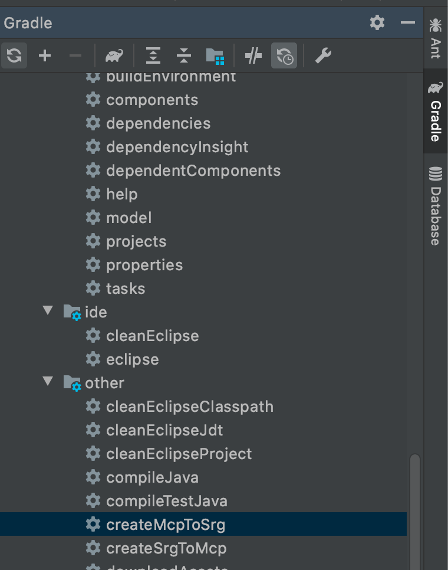
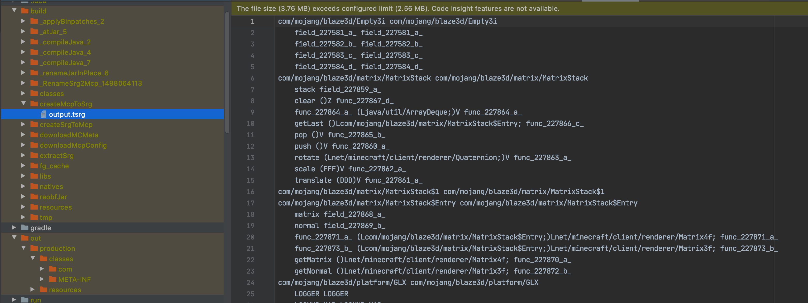
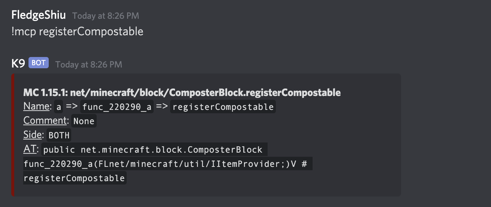
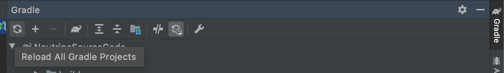

# Access Transformer

**请注意，在没有确定你必须要使用AT的情况下，请务必不要随意使用AT，会有兼容性风险**

虽然Forge已经为我们做了绝大多数的工作来方便我们开发mod，但是在极少数的情况下，我们会发现Forge没有提供给我们接口让我来修改原版的内容，而原版的方法、字段等又是`private`的，我们没法调用它们。

在这种情况下，Forge提供给我了一种叫做`Access Transformer`（简称`AT`）的工具，让我们能够修改原版内容的调用权限，把`private`改成`public`。

这里我们以给堆肥桶添加新的物品为例。

如果你查看过原版`ComposterBlock`的代码，你会注意到，原版调用了`registerCompostable`函数来添加堆肥桶运行添加进入的物品，但是这个方法是`private`的，我们没法直接调用。

```java
private static void registerCompostable(float chance, IItemProvider itemIn) {
  CHANCES.put(itemIn.asItem(), chance);
}
```

这时我们就可以使用AT来把这个`private`变成`public`，来向堆肥桶里添加新的物品。

首先我们需要编辑我们的`build.gralde`中，如下这部分，将`AT`相关的注释删除。

```groovy
minecraft {
    // The mappings can be changed at any time, and must be in the following format.
    // snapshot_YYYYMMDD   Snapshot are built nightly.
    // stable_#            Stables are built at the discretion of the MCP team.
    // Use non-default mappings at your own risk. they may not always work.
    // Simply re-run your setup task after changing the mappings to update your workspace.
    mappings channel: 'snapshot', version: '20200512-1.15.1'
    // makeObfSourceJar = false // an Srg named sources jar is made by default. uncomment this to disable.

    accessTransformer = file('src/main/resources/META-INF/accesstransformer.cfg')
```

然后在`META-INF`文件夹下，创建`accesstransformer.cfg`文件。

```
.
├── META-INF
│   ├── accesstransformer.cfg
│   └── mods.toml
├── assets
├── data
└── pack.mcmeta
```

在`accesstransformer.cfg`里填入的就是你的`AT`指令。

具体的格式如下，内容出自[Sponge 文档](https://docs.spongepowered.org/stable/zh-CN/plugin/internals/access-transformers.html)

> 有三种不同类型的 AT，分别用于对类、字段、和方法作出修改。Access Transformer配置中的每一行由两个（对于类而言）或三个（对于方法和字段而言）部分，部分与部分之间使用空格隔开。
>
> - 用于修改方法或字段的访问级标识符，如 `public` 或 `protected` 等。如果你还想同时去除 `final` 修饰符，你可以在其后添加 `-f` 标记，如 `public-f`
> - 一个类的全名，如 `net.minecraft.server.MinecraftServer`
> - 字段或方法的 Searge 名（方法需要添加相应的方法签名），如 `field_54654_a` 或 `func_4444_a()V`
>
> 你可以通过添加 `#` 前缀以添加注释。一个良好的习惯是为每行 AT 都写相应的注释，这样每一个字段或方法的引用就一目了然。
>
> 下面是几行 Access Transformer 的示例：
>
> ```
> public-f net.minecraft.server.MinecraftServer field_71308_o # anvilFile
> public net.minecraft.server.MinecraftServer func_71260_j()V # stopServer
> public-f net.minecraft.item.ItemStack
> ```

如果你需要获取原版的SRG和MCP映射，你可以运行ForgeGradle提供的`creteMcpToSrg`task.

运行结束后，你就可以在`build/createSrgToMcp`目录下，找到对应的表了。



但其实，我们不需要直接写`AT`，在discord 上有个叫做`K9`的机器，你可以在MCP Bot的[Discord Server](https://discord.gg/h4whGT9 )中的`#bot-spam`找到它，建议是直接私聊它。

输入`!mcp 你要查询的内容`，在我们的例子里就是`!mcp registerCompostable`，它会自动返回相关的SRG名等信息，其中就包括了AT。



其中最下面的这一行就是AT。

然后我们将其复制到`accesstransformer.cfg`中:

```
public net.minecraft.block.ComposterBlock func_220290_a(FLnet/minecraft/util/IItemProvider;)V # registerCompostable
```

接下来，我们需要刷新我们的Gradle。



点击Gradle面板中的`Reload All Gradle Projects`，等待刷新完成。

在刷新完成后，你再次查看`ComposterBlock`的代码，你就会发现`registerCompostable`这个静态方法变成`public`的了。

接下来我们就可以来添加新的物品了。

```java
@Mod.EventBusSubscriber(bus = Mod.EventBusSubscriber.Bus.MOD)
public class ATDemo {
    @SubscribeEvent
    public static void addNewItemToComposterBlock(FMLLoadCompleteEvent event) {
        ComposterBlock.registerCompostable(0.3F, Items.OAK_LEAVES);
        ComposterBlock.registerCompostable(0.3F, Items.SPRUCE_LEAVES);
        ComposterBlock.registerCompostable(0.3F, Items.BIRCH_LEAVES);
        ComposterBlock.registerCompostable(0.3F, Items.JUNGLE_LEAVES);
        ComposterBlock.registerCompostable(0.3F, Items.ACACIA_LEAVES);
        ComposterBlock.registerCompostable(0.3F, Items.DARK_OAK_LEAVES);
    }
}
```

这里我们将原版的一些树叶添加了进去，启动游戏，现在你应该就可以向堆肥器里塞入树叶了。

[源代码](https://github.com/FledgeXu/NeutrinoSourceCode/tree/master/src/main/java/com/tutorial/neutrino/at)