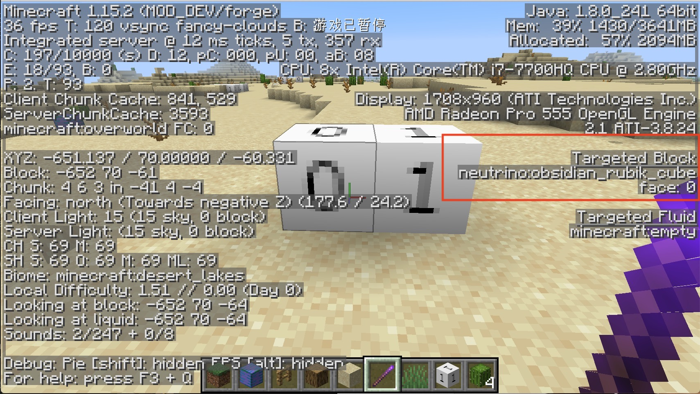
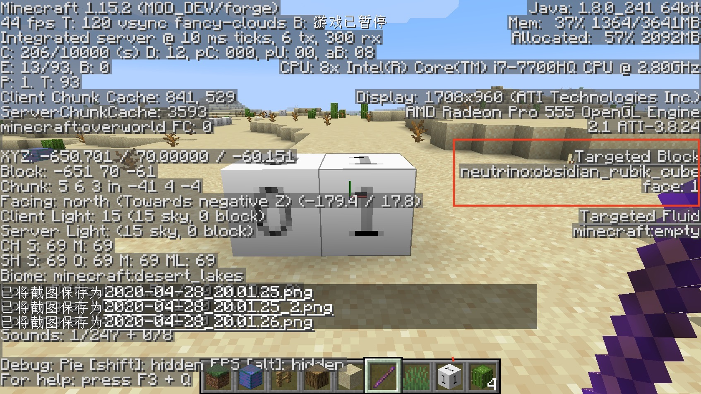

# 方块状态

在之前我们已经稍微地提及了BlockState，但是我们的第一个方块显然是没有状态的，这一节我们将以黑曜石魔方举例来创建一个带有状态的方块。

首先创建一个叫做`ObsidianRubikCube`的类，内容如下:

```java
public class ObsidianRubikCube extends Block {
    private static IntegerProperty STATE = IntegerProperty.create("face", 0, 1);

    public ObsidianRubikCube() {
        super(Properties.create(Material.ROCK).hardnessAndResistance(5));
        this.setDefaultState(this.stateContainer.getBaseState().with(STATE, 1));
    }

    @Override
    protected void fillStateContainer(StateContainer.Builder<Block, BlockState> builder) {
        builder.add(STATE);
        super.fillStateContainer(builder);
    }
}
```

这里有三个和之前我创建方块不一样的地方，首先就是：

```java
private static IntegerProperty STATE = IntegerProperty.create("face", 0, 1);
```

在这句话里，我们创建了一个新的方块状态，正如`IntegerProperty`这个名字暗示的那样，这个是一个整数类型的方块状态，除了`IntegerProperty`原版还实现了`BooleanProperty`和`EnumProperty`，并且原版还在`BlockStateProperties`类下实现了很多预设的方块状态，可以按需使用。如果这些类型都不满足你的需求，你还可以继承`Property`自己创建一个新的种类的方块状态。

```java
IntegerProperty.create("face", 0, 1)
```

的意思是，这个方块状态的名字叫做`face`，最小值是`0`，最大值是`1`。

```java
@Override
protected void fillStateContainer(StateContainer.Builder<Block, BlockState> builder) {
  builder.add(STATE);
  super.fillStateContainer(builder);
}
```

然后我们在`fillStateContainer`里调用传入的`builder`变量中的`add`方法给我的方块添加了一个状态。

最后，我们在构造方法里设置了默认状态（可以不用设置）。

```java
this.setDefaultState(this.stateContainer.getBaseState().with(STATE, 1));
```

注册方块

```java
public static RegistryObject<Block> obsidianRubikCube = BLOCKS.register("obsidian_rubik_cube", () -> {
  return new ObsidianRubikCube();
});
```

注册物品

```java
public static RegistryObject<Item> obsidianRubikCube = ITEMS.register("obsidian_rubik_cube", () -> {
  return new BlockItem(BlockRegistry.obsidianRubikCube.get(), new Item.Properties().group(ModGroup.itemGroup));
});
```

接下来在`blockstates`文件夹下创建你和方块注册名相同的json文件，我们创建`obsidian_rubik_cube.json`，内容如下:

```json
{
  "variants": {
    "face=0": { "model": "neutrino:block/obsidian_rubik_cube_model_0" },
    "face=1": { "model": "neutrino:block/obsidian_rubik_cube_model_1" }
  }
}
```

可以看到，我们在这里为不同的`face`值指定了不同的模型，分别是`obsidian_rubik_cube_model_0`和`obsidian_rubik_cube_model_1`。请注意，如果你要定义多个blockstate的值，请用半角逗号隔开，中间不要有空格。具体的要求也请参考Wiki中关于[模型](https://minecraft-zh.gamepedia.com/index.php?title=%E6%A8%A1%E5%9E%8B&variant=zh)的章节。

然后我们在`models/block`下创建`obsidian_rubik_cube_model_0.json`和`obsidian_rubik_cube_model_1.json`这两个模型文件。

`obsidian_rubik_cube_model_0.json`:

```json
{
  "parent": "block/cube_all",
  "textures": {
    "all": "neutrino:block/obsidian_rubik_cube_texture_0"
  }
}
```

`obsidian_rubik_cube_model_1.json`:

```json
{
  "parent": "block/cube_all",
  "textures": {
    "all": "neutrino:block/obsidian_rubik_cube_texture_1"
  }
}
```

可以看见它分别加载了两个不同的材质。

然后添加材质。

`obsidian_rubik_cube_texture_0.png`


`obsidian_rubik_cube_texture_1.png`


最后给我们的物品模型`obsidian_rubik_cube`添加内容：

```json
{
  "parent": "neutrino:block/obsidian_rubik_cube_model_1"
}
```





可以看到，随着我们用debug stick改变了方块的状态，方块的模型和材质也发生了改变。

[源代码](https://github.com/FledgeXu/NeutrinoSourceCode/tree/master/src/main/java/com/tutorial/neutrino/blockstate)

