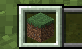
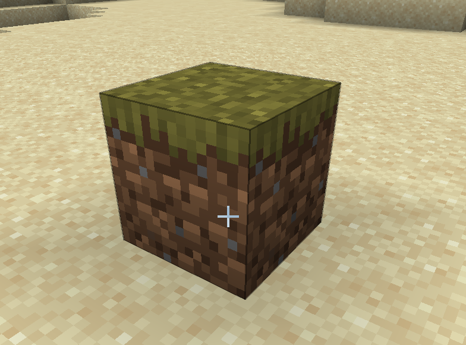
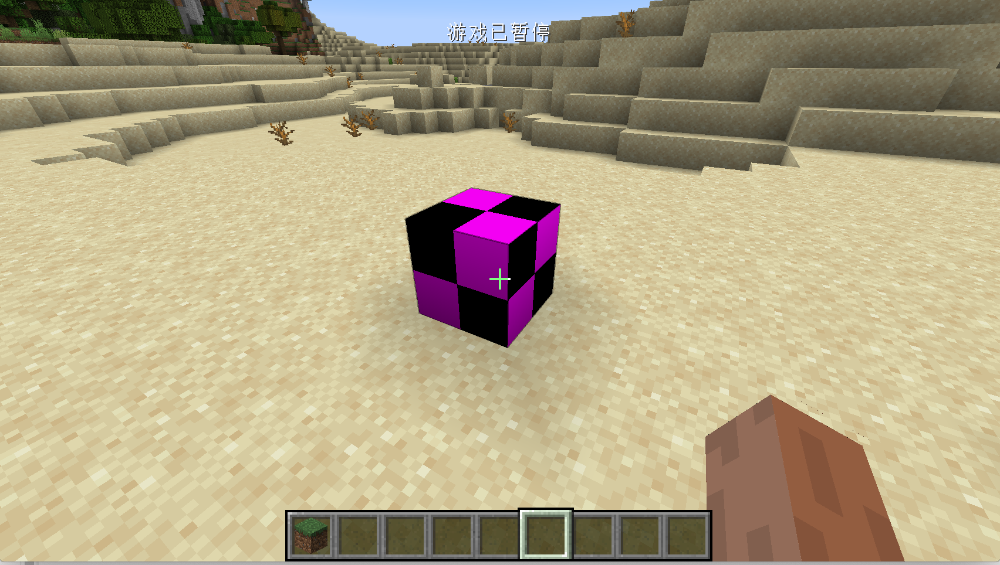
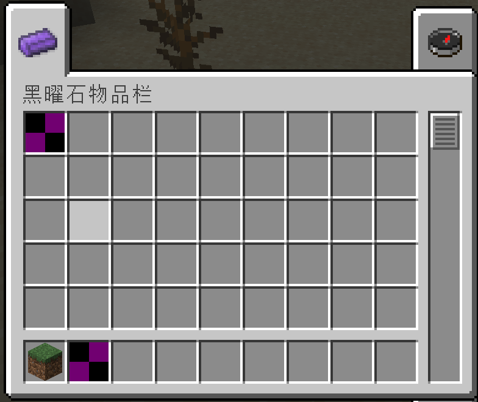
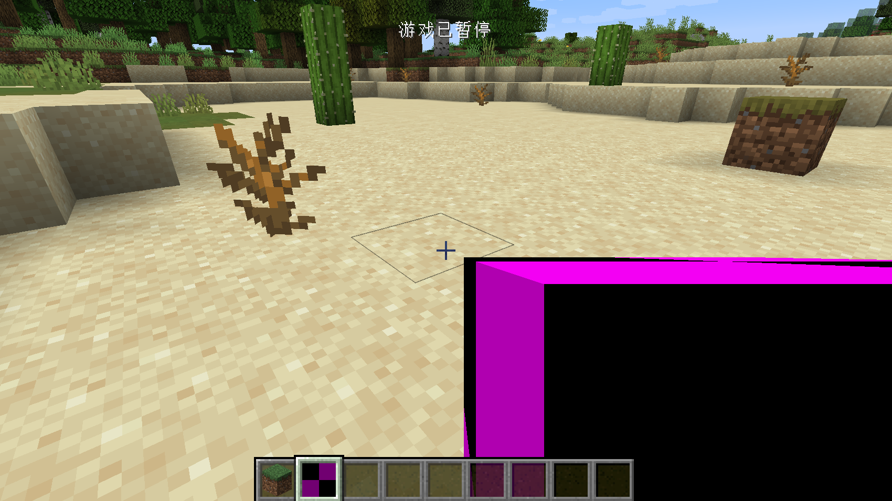

# 第一个方块

在这一节中，我们将会创建一个最简单的方块，一个什么功能也没有的方块，甚至连模型和材质也没有。在开始之前我必须做一个概念上的区分，关于物品和方块概念上的区分。任何你可在拿在手中的东西都是「物品」，只有放置在世界中才成为了「方块」。



这个是一个物品



这个才是一个方块。

好的，我们已经把物品和方块之间的区别说清楚了。接下来就开始创建第一个方块吧，这里我们以黑曜石块为例。

首先创建一个类，叫做`ObsidianBlock`，就和所有的自定义物品需要继承`Item`类一样，所有的自定义方法都需要继承`Block`类，请确保你的`Block`类是`net.minecraft.block.Block`这个类。

具体内容如下:

```java
public class ObsidianBlock extends Block {
    public ObsidianBlock() {
        super(Properties.create(Material.ROCK).hardnessAndResistance(5));
    }
}
```

内容非常简单，就和`Item`有`Properties`一样，方块也需要一个`Properties`，和物品的`Properties`不太一样的是，方块的`Propeteis`需要调用`create`方法创建。请注意虽然这两个`Properties`名字相同，但是它们不在同一个包内，这其实是两个不同的类，`create`方法需要一个参数，这个参数是一个`Material`（材料），`Material`帮你预设了一些方块的特质，比如是否是实心的，是否是流体等，你可以通过调用`Properties`的方法来覆盖`Material`带来的特征，这里我们用的是原版的`Material.ROCK`，如果你想自己创建一个`Material`也非常简单，请参考原版的实现。最后我们调用`hardnessAndResistance`方法来为我的方块设置硬度。

至此我们的黑曜石方块类已经创建完毕。就如物品需要注册一样，我的方块也需要注册。

创建一个新的注册类`BlockRegistry`，内容如下:

```java
public class BlockRegistry {
    public static final DeferredRegister<Block> BLOCKS = new DeferredRegister<>(ForgeRegistries.BLOCKS, "neutrino");
    public static RegistryObject<Block> obsidianBlock = BLOCKS.register("obsidian_block", () -> {
        return new ObsidianBlock();
    });
}
```

相信之前已经写过注册类的你对这些内容应该相对熟悉了。我们把`DeferredRegister<Item> `换成了`DeferredRegister<Block>`（当然后面的实例化参数也需要修改），这样我们就创建了一个方块的注册器。注册方式也和物品注册如出一辙，这里就不多加阐述了。

你还需要在你的主类构造方法里，将这个注册器注册到`mod`总线中。

```java
@Mod("neutrino")
public class Neutrino {
    public Neutrino() {
        ItemRegistry.ITEMS.register(FMLJavaModLoadingContext.get().getModEventBus());
        BlockRegistry.BLOCKS.register(FMLJavaModLoadingContext.get().getModEventBus());
    }
}
```

到此，我们就已经完成了我们的方块，现在启动游戏，输入如下命令，你就可以放置你自己的方块了。

```
/setblock ~ ~ ~ <你的modID>:<你的方块的注册名>
以我们的例子来说
/setblock ~ ~ ~ neutriono:obsidian_block
```



但是，只能通过命令放置的方块显然不符合我们的胃口，我们希望有一个物品可以和方块相对应，这样我们就不需要使用命令放置方块了，对于这个常见的需求，Minecraft 也提供了一个方便的类来满足，这个类就是`BlockItem`，我们只需要创建并实例化这个类就行了。

我们回到我们的`ItemRegistry`，添加如下一行

```java
public static RegistryObject<Item> obsidianBlock = ITEMS.register("obsidian_block", () -> {
  return new BlockItem(BlockRegistry.obsidianBlock.get(), new Item.Properties().group(ModGroup.itemGroup));
});
```

可以看见我们创建了一个BlockItem的实例，它的构造方法需要两个参数，第一个参数是你注册好的方块的实例，我们可以通过`BlockRegistry.obsidianBlock.get()`获取到之前注册好的方块实例，第二个参数是一个Item的`Properties`，这里的`Properties`非常简单，我们将其添加到我们之前创建的创造模式物品栏里。

此时打开游戏，你就可以在我们的创造模式物品栏里看见我们的方块了。





[源代码](https://github.com/FledgeXu/NeutrinoSourceCode/tree/master/src/main/java/com/tutorial/neutrino/first_block)