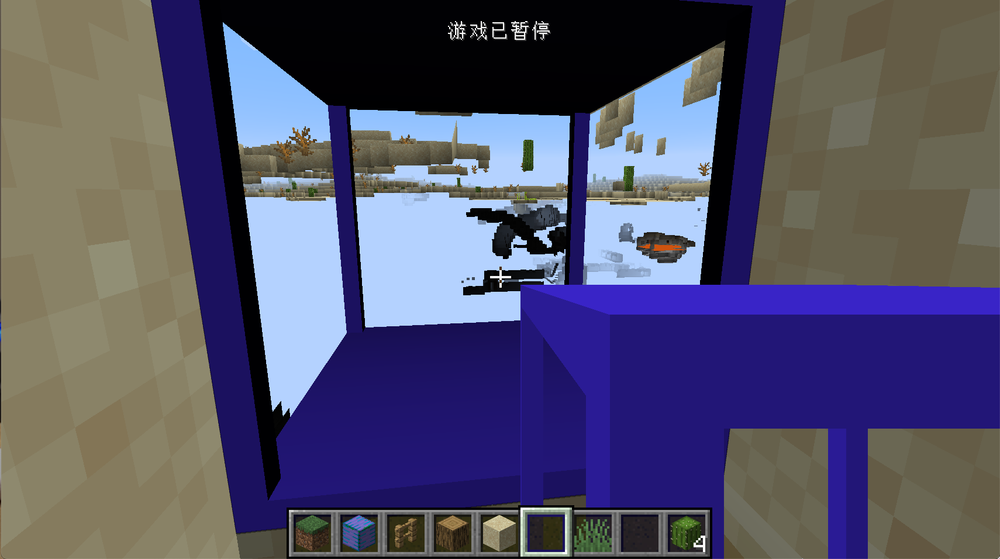
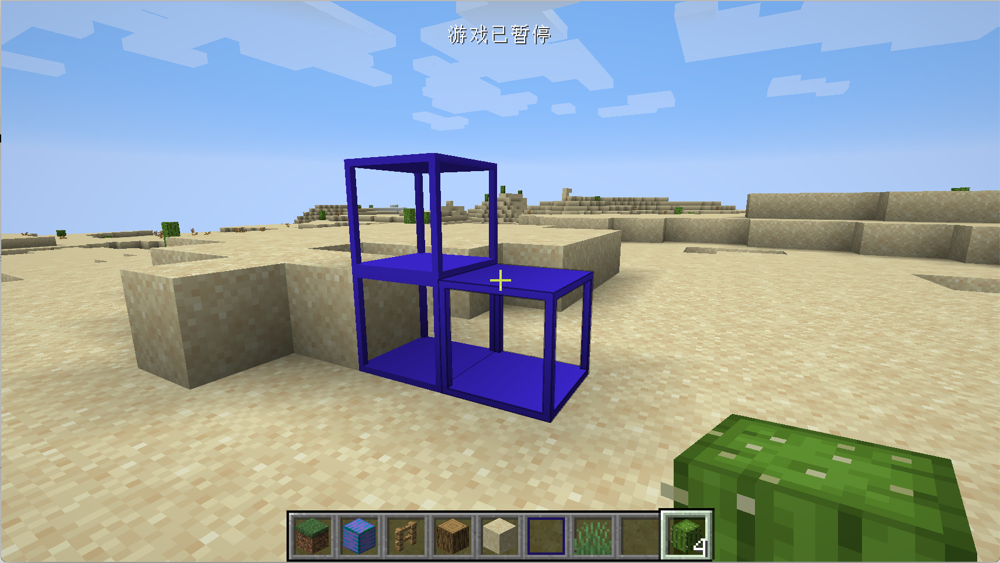

# 非实心方块与自定义模型

在这一节中，我们将创建一个有着特殊外形且是透明的方块，这里我们以黑曜石框架举例。

首先我们创建一个叫做`ObsidianFrame`的类，内容如下：

```java
public class ObsidianFrame extends Block {
    private static VoxelShape shape;

    static {
        VoxelShape base = Block.makeCuboidShape(0, 0, 0, 16, 1, 16);
        VoxelShape column1 = Block.makeCuboidShape(0, 1, 0, 1, 15, 1);
        VoxelShape column2 = Block.makeCuboidShape(15, 1, 0, 16, 15, 1);
        VoxelShape column3 = Block.makeCuboidShape(0, 1, 15, 1, 15, 16);
        VoxelShape column4 = Block.makeCuboidShape(15, 1, 15, 16, 15, 16);
        VoxelShape top = Block.makeCuboidShape(0, 15, 0, 16, 16, 16);
        shape = VoxelShapes.or(base, column1, column2, column3, column4, top);
    }

    public ObsidianFrame() {
        super(Properties.create(Material.ROCK).hardnessAndResistance(5).notSolid());
    }

    @Override
    public VoxelShape getShape(BlockState state, IBlockReader worldIn, BlockPos pos, ISelectionContext context) {
        return shape;
    }
}
```

在最上方我们创建了一个`VoxelShape`，我们将在`getShape`方法中返回这个形状，这个``VoxelShape``就是我们方块的碰撞箱，很不幸的是Minecraft的碰撞箱子只能由方块组成，这个方块的大小是`16*16*16`，所以我们在静态代码块中自己创建了一系列的长方体和立方体，拼成了我们方块的碰撞箱，其中`Block.makeCuboidShape`的6个参数分别是起始点的XYZ和结束点的XYZ。最后我们用`VoxelShapes`的`or`方法将这些东西拼在了一起。`VoxelShapes` 下还有很多好用的空间操作方法，请自行选用。如果你不给你的方块设置合适的的碰撞箱的话，你的方块内部空间会显得非常的暗。

可以看见这里最为特别的是调用了`notSoild`方法，这个方法是告知Minecraft我们的方块不是一个「实心」方块，需要进行特殊的对待。之所以这么做，是因为Minecraft的世界里有非常多的方块，如果方块的每一个面都要渲染，包括那些被遮挡的面和遮挡起来的方块，那么会非常地耗费性能，所以出于优化的考虑，Minecraft只会渲染那些没有被遮挡起来的面。而`noSoild`的作用就是告诉Minecraft，要渲染这个方块遮挡的那些面。

如果不开启这个就会出现这样效果。



如果对Minecraft方块渲染相关的内容感兴趣，可以阅读这篇博客[文章](https://greyminecraftcoder.blogspot.com/2020/04/block-rendering-1144.html)，以及这个博客下其他文章（如果你打不开这个页面，说明你所在的国家或地区封锁了这个网站）。

注册方块:

```java
public static RegistryObject<Block> obsidianFrame = BLOCKS.register("obsidian_frame", () -> {
  return new ObsidianFrame();
});
```

注册物品:

```java
public static RegistryObject<Item> obssidianFrame = ITEMS.register("obsidian_frame", () -> {
  return new BlockItem(BlockRegistry.obsidianFrame.get(), new Item.Properties().group(ModGroup.itemGroup));
});
```


然后是方块状态文件`obsidian_frame.json`:

```json
{
  "variants": {
    "": { "model": "neutrino:block/obsidian_frame" }
  }
}
```

模型文件`obsidian_frame.json`:

```json
{
	"credit": "Made with Blockbench",
	"texture_size": [64, 64],
	"textures": {
		"0": "neutrino:block/obsidian_frame",
		"particle": "neutrino:block/obsidian_frame"
	},
	"elements": [
		{
			"from": [0, 0, 0],
			"to": [16, 1, 16],
			"faces": {
				"north": {"uv": [4, 8.25, 8, 8.5], "texture": "#0"},
				"east": {"uv": [0, 8.25, 4, 8.5], "texture": "#0"},
				"south": {"uv": [12, 8.25, 16, 8.5], "texture": "#0"},
				"west": {"uv": [8, 8.25, 12, 8.5], "texture": "#0"},
				"up": {"uv": [8, 8.25, 4, 4.25], "texture": "#0"},
				"down": {"uv": [12, 4.25, 8, 8.25], "texture": "#0"}
			}
		},
		{
			"from": [0, 15, 0],
			"to": [16, 16, 16],
			"faces": {
				"north": {"uv": [4, 4, 8, 4.25], "texture": "#0"},
				"east": {"uv": [0, 4, 4, 4.25], "texture": "#0"},
				"south": {"uv": [12, 4, 16, 4.25], "texture": "#0"},
				"west": {"uv": [8, 4, 12, 4.25], "texture": "#0"},
				"up": {"uv": [8, 4, 4, 0], "texture": "#0"},
				"down": {"uv": [12, 0, 8, 4], "texture": "#0"}
			}
		},
		{
			"from": [0, 1, 0],
			"to": [1, 15, 1],
			"faces": {
				"north": {"uv": [2.25, 0.25, 2.5, 3.75], "texture": "#0"},
				"east": {"uv": [2, 0.25, 2.25, 3.75], "texture": "#0"},
				"south": {"uv": [2.75, 0.25, 3, 3.75], "texture": "#0"},
				"west": {"uv": [2.5, 0.25, 2.75, 3.75], "texture": "#0"},
				"up": {"uv": [2.5, 0.25, 2.25, 0], "texture": "#0"},
				"down": {"uv": [2.75, 0, 2.5, 0.25], "texture": "#0"}
			}
		},
		{
			"from": [15, 1, 0],
			"to": [16, 15, 1],
			"faces": {
				"north": {"uv": [1.25, 0.25, 1.5, 3.75], "texture": "#0"},
				"east": {"uv": [1, 0.25, 1.25, 3.75], "texture": "#0"},
				"south": {"uv": [1.75, 0.25, 2, 3.75], "texture": "#0"},
				"west": {"uv": [1.5, 0.25, 1.75, 3.75], "texture": "#0"},
				"up": {"uv": [1.5, 0.25, 1.25, 0], "texture": "#0"},
				"down": {"uv": [1.75, 0, 1.5, 0.25], "texture": "#0"}
			}
		},
		{
			"from": [0, 1, 15],
			"to": [1, 15, 16],
			"faces": {
				"north": {"uv": [0.25, 0.25, 0.5, 3.75], "texture": "#0"},
				"east": {"uv": [0, 0.25, 0.25, 3.75], "texture": "#0"},
				"south": {"uv": [0.75, 0.25, 1, 3.75], "texture": "#0"},
				"west": {"uv": [0.5, 0.25, 0.75, 3.75], "texture": "#0"},
				"up": {"uv": [0.5, 0.25, 0.25, 0], "texture": "#0"},
				"down": {"uv": [0.75, 0, 0.5, 0.25], "texture": "#0"}
			}
		},
		{
			"from": [15, 1, 15],
			"to": [16, 15, 16],
			"faces": {
				"north": {"uv": [3.25, 0.25, 3.5, 3.75], "texture": "#0"},
				"east": {"uv": [3, 0.25, 3.25, 3.75], "texture": "#0"},
				"south": {"uv": [3.75, 0.25, 4, 3.75], "texture": "#0"},
				"west": {"uv": [3.5, 0.25, 3.75, 3.75], "texture": "#0"},
				"up": {"uv": [3.5, 0.25, 3.25, 0], "texture": "#0"},
				"down": {"uv": [3.75, 0, 3.5, 0.25], "texture": "#0"}
			}
		}
	]
}
```

材质文件`obsidian_frame.png`：


这里我的模型和材质都是用BlockBench制作的。

物品模型`obsidian_frame.json`:

```json
{
  "parent": "neutrino:block/obsidian_frame"
}
```

打开游戏，你应该就能看见我们的黑曜石框架了。



[源代码](https://github.com/FledgeXu/NeutrinoSourceCode/tree/master/src/main/java/com/tutorial/neutrino/nonesoildblock)

