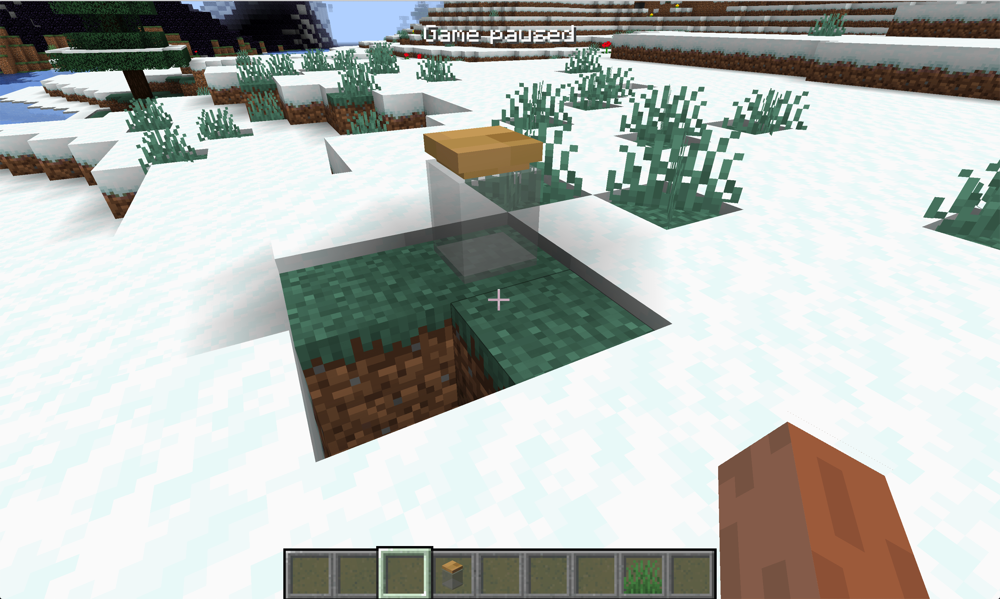

# 方块的渲染类型

在这一节中，我们将会聊一下渲染类型（RenderType)。


> 图片出自[TheGreyGhost博客](https://greyminecraftcoder.blogspot.com/2020/04/block-rendering-1144.html)

在Minecraft中，方块的渲染模型有四种，分别是`translucent`、`solid`、`cutout`和`cutout_mipped`。

大概的区别大家一样就能看出来。这里我们要详细讲一下`translucent`和`cutout*`之间的区别。它们的区别其实很简单，`translucent`是半透明，而`cutout*`是要不全透明，要不不透明。大家可以注意看这玻璃上的白色部分和冰块上白色部分的区别。

而`cutout`和`cutout_mipped`直接的区别涉及到游戏优化的地方，`cutout_mipped`是开启了Mipmapping的`cutout`。

> 在三维计算机图形的贴图渲染中有一个常用的技术被称为**Mipmapping**。为了加快渲染速度和减少图像锯齿，贴图被处理成由一系列被预先计算和优化过的图片组成的文件,这样的贴图被称为 MIP map 或者 mipmap。这个技术在三维游戏中被非常广泛的使用。“MIP”来自于拉丁语 *multum in parvo* 的首字母，意思是“放置很多东西的小空间”。Mipmap 需要占用一定的内存空间，同时也遵循[小波压缩规则](https://zh.wikipedia.org/w/index.php?title=小波压缩规则&action=edit&redlink=1) （wavelet compression）。
>
> ——[Wikipedia](https://zh.wikipedia.org/wiki/Mipmap)

我们将以玻璃罐为例，来教大家如何设置方块的RenderType。

首先我们来创建方块，`GlassJar.java`:

```java
public class GlassJar extends Block {
    public GlassJar() {
        super(Properties.create(Material.ROCK).hardnessAndResistance(5).notSolid());
    }
}
```

当然别忘了注册。

```java
public class BlockRegistry {
    public static final DeferredRegister<Block> BLOCKS = new DeferredRegister<>(ForgeRegistries.BLOCKS, "neutrino");
    public static final RegistryObject<GlassJar> glassJar = BLOCKS.register("glass_jar", () -> {
        return new GlassJar();
    });
}
```

接下来就是设置我们方块的RenderType的地方，`RenderTypeRegistry`：

```java
@Mod.EventBusSubscriber(bus = Mod.EventBusSubscriber.Bus.MOD,value = Dist.CLIENT)
public class RenderTypeRegistry {
    @SubscribeEvent
    public static void onRenderTypeSetup(FMLClientSetupEvent event) {
        RenderTypeLookup.setRenderLayer(BlockRegistry.glassJar.get(), RenderType.getTranslucent());
    }
}
```

因为渲染相关的内容都是在客户端发生，所以我们在`FMLClientSetupEvent`事件下注册我们的RenderType。

物理服务器是没发设置`RenderType`的，为了物理服务器的兼容性，在这里我们添加了`value = Dist.CLIENT`使它只会在物理客户端上监听事件。Forge提供了很多和物理端打交道的东西，除了我们看到的`value = Dist.CLIENT`，还有`@OnlyIn`注释，这个加了这个注释之后你就可以指定一个类只存在于物理客户端，或者物理服务端。当然还有`DistExecutor`，这里类下面有很多方法用来在在不同的物理端来执行不同的代码。

一个非常常见的问题就是，在物理服务端调用了只有在物理客户端存在的类，比如加了`@OnlyIn(Dist.CLIENT)`的类或者方法，当你在物理服务端调用它时，它相当于是不存在的，这时就是出现错误。

你在注意你调用的代码究竟是处于哪一个「逻辑端」的同时，你也得注意你的代码就行执行在哪一个「物理端」。

这一切的努力都是为了在服务器上和在本地游戏中能共用一个jar文件。

这里我们调用了`RenderTypeLookup.setRenderLayer`来设置我们方块的RenderType，`RenderType.getTranslucent()`指定了我们的RenderType是`translucent`，在`RenderType`类下有着原版所有的RenderType，你也可以自定义RenderType从而使用自定义shader等高级功能。

具体的模型和材质请看Github。

打开游戏你就能看见我们的玻璃罐了。



[源代码](https://github.com/FledgeXu/NeutrinoSourceCode/tree/master/src/main/java/com/tutorial/neutrino/special_render_type)

