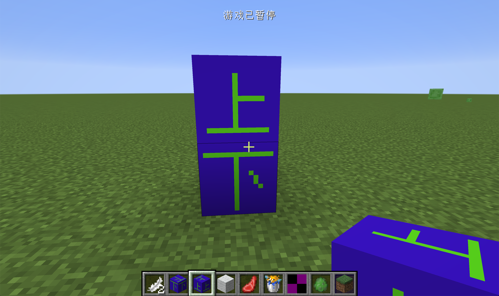
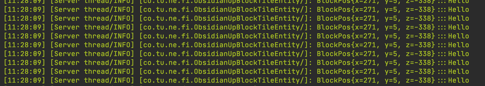

# 从零构建与使用能力

在这一节中，我们将会从0开始构建与使用Capability。在开始之前我们必须要解释一下，什么是Capability。

Capability 的诞生起源于在写程序时出现的一个问题。考虑如下一种情况，你正在写一个能量转换器，你的能量转换器需要可以转换不同mod中的不同能量：EU、RF，Forge Energy等等。每一个能量都提供了一个接口用来实现输入输出的方法，那么你很快就会发现你的类定义会变成下面这个样子:

```java
class MyTileEntity extends TileEntity implements EnergyInterface1,  EnergyInterface2, EnergyInterface3, FluidsInterface1, FluidsInterface2, FluidsInterface3, ItemsApi1, ItemsApi2, ItemsApi3, ComputerApi1, ComputerApi2, ...
```

这样的代码简直是地狱级别的可怕。而Capability（能力系统）出现解决了这个问题，再用了能力系统之后你的类定义就可以简化成类似下面的形式:

```java
class MyTileEntity extends CapabilityProvider
```

这里是演示代码，但是你可以立马发现，你的代码简化了很多。请注意Capability系统并不是Minecraft原版提供的，而是Forge提供的。

在Capability系统主要由两部分构成，Capability（能力）本身以及CapabilityProvider（能力提供者）。请注意务必要区分清楚Capability和CapabilityProvider，在很多的教程中，这两者都被混为一谈。当然在实际使用的过程中还会牵涉到调用CapabilityProvider的一方。这里我讲一个简单比喻来帮助大家理解这三方的关系。

> 假设，你是一个投资商，想要投资建一栋商务楼。一般情况下，你就会去找一个建筑方案提供商。如果这个建筑方案提供商拿不出这个建筑方案，你可能就不建了，如果这个建筑方案提供商拿的出建筑方案，你就可以从这个方法中获取一些信息或者直接按照这个方案建筑商务楼。

在Capability系统中，调用CapabilityProvider的方相当于「投资商」，CapabilityProvider相当于是「建筑方案提供商」，而Capability本身就是「建筑方案」。

而在代码层面，首先调用方会调用CapabilityProvider的`getCapability`方法并传入一个具体的Capability。然后在实现了`CapbilityProvider`接口的类中，判断传入的能力是不是自己可以完成的，如果不能换成就会返回一个空值，如果可以完成就会返回传入的Capability所指定类或接口的一个实例。

接下来我们会创建两个特殊的方块，分为「上方块」和「下方块」。当你把「上方块」放在「下方块」的上方时，「上方块会输出下方块传来的信息」。

介于篇幅的原因，这里就直接从TilEntity开始了，相关的方块也没什么内容，就只是关联的方块实体而已。

`ObsidianUpBlockTileEntity`

```java
public class ObsidianUpBlockTileEntity extends TileEntity implements ITickableTileEntity {
    public ObsidianUpBlockTileEntity() {
        super(TileEntityTypeRegistry.obsidianUpTileEntity.get());
    }

    private static Logger logger = LogManager.getLogger();

    @Override
    public void tick() {
        if (!world.isRemote) {
            BlockPos pos = this.pos.down();
            TileEntity tileEntity = world.getTileEntity(pos);
            if (tileEntity != null) {
                LazyOptional<ISimpleCapability> simpleCapabilityLazyOptional = tileEntity.getCapability(ModCapability.SIMPLE_CAPABILITY);
                simpleCapabilityLazyOptional.ifPresent((s) -> {
                    String context = s.getString(this.pos);
                    logger.info(context);
                });
            }
        }

    }
}
```

可以看见这里的内容并不艰深。我们先获取了下方方块的方块实体。

```java
LazyOptional<ISimpleCapability> simpleCapabilityLazyOptional = tileEntity.getCapability(ModCapability.SIMPLE_CAPABILITY);
```

然后就是调用这里的`getCapbility`并传入了我们自定义的`ModCapability.SIMPLE_CAPABILITY`这个能力，来询问我们下方的方块是否可以完成这件事。

这里有个很奇怪的类型，叫做`LazyOptional<ISimpleCapability>`我们必须要稍微解释一下。简单来说你在读这个类的名字时可以忽视`Lazy`，它其实就是一个特殊的`Optional`类。那么什么是`Optioanl`类呢？`Optinal` 类其实是对`null`和`有值`这两个状态的封装。简单来说，当`LazyOptional.isPresent`为真时，代表这个变量里有值，如果为假，代表这个变量的值为`null`。

```java
simpleCapabilityLazyOptional.ifPresent((s) -> {
  String context = s.getString(this.pos);
  logger.info(context);
});
```

这里的`ifPresent`的意思就是当返回值不是`null`时需要做什么。这里的lambda表达式参数`s`就是之前`getCapbility`调用的返回值。而且它的类型就是我们写在`LazyOptional<T>`这个泛型中的类型，在我们的例子里就是`ISimpleCapability`这个接口的实例。

然后我们就调用了`ISimpleCapability`规定的方法`getString`，并且把值输出了出来。

读完这里希望读者能稍微停一下，然后思考这个过程和之前比喻之间的关系。

接下来我们就要来看看我们的「方案提供商人 / CapabilityProvider 」了。

`ObsidianDownBlockTileEntity.java`

```java
public class ObsidianDownBlockTileEntity extends TileEntity {
    public ObsidianDownBlockTileEntity() {
        super(TileEntityTypeRegistry.obsidianDownTileEntity.get());
    }

    @Nonnull
    @Override
    public <T> LazyOptional<T> getCapability(@Nonnull Capability<T> cap, @Nullable Direction side) {
        if (cap == ModCapability.SIMPLE_CAPABILITY) {
            return LazyOptional.of(() -> {
                return new SimpleCapability("Hello");
            }).cast();
        }
        return LazyOptional.empty();
    }
}
```

可以看见我们这里就简单的复写了`getCapability`方法，你可能会好奇`getCapability`明明是`CapabilityProvider`规定的方法，我们却可以直接复写。

如果你查看TileEntity类的定义，你应该可以看到如下内容:

```java
public abstract class TileEntity extends net.minecraftforge.common.capabilities.CapabilityProvider<TileEntity> implements net.minecraftforge.common.extensions.IForgeTileEntity
```

可以看见TileEntity类默认继承了CapabilityProvider（知道Capability对于方块实体多么重要了吧），这就是为什么我们可以直接复写`getCapability`的原因。

这里的内容，非常简单，我们就是判断传入的能力是不是我们可以完成的，如果不可以完成就返回一个`LazyOptional.empty()`（你可以当成返回了一个`null`)，如果可以完成就返回了一个相对应的实例。

```java
return LazyOptional.of(() -> {
  return new SimpleCapability("Hello");
}).cast();
```

这里的意思是将`SimpleCapability`的实例塞入`LazyOptinal`中。请注意，最后的这里的`cast`方法是必须要调用的，不然会出现类型错误。

这里的`SimpleCapability`就是实现了我们之前提到的`ISimpleCapability`接口的类。所以这里返回的实例也是`ISimpleCapability`的实例。

接下来我们来看`SimpleCapability.java`和`ISimpleCapability.java`

```java
public class SimpleCapability implements ISimpleCapability {
    private String context;

    public SimpleCapability(String context) {
        this.context = context;
    }

    @Override
    public String getString(BlockPos pos) {
        return pos.toString() + ":::" + this.context;
    }
}
```

```java
public interface ISimpleCapability {
    String getString(BlockPos pos);
}
```

在你写自定义Capability（这里指的不是CapabilityProvider）时，你应该也要遵循这个形式，把规定的操作抽象成一个接口，这样你就可以你就可以在Mod的API中向别人提供这个接口，别人就可以在它们的Mod中使用你定义的Capability了。

接下来是注册，首先我们得声明一个实例。

`ModCapability.java`

```java
public class ModCapability {
    @CapabilityInject(ISimpleCapability.class)
    public static Capability<ISimpleCapability> SIMPLE_CAPABILITY;
}
```

在这里我们使用了`@CapabilityInject`注解，来表示我们的定义的变量是Capability，并且会在正式注册完这个Capability后给下面的变量赋值。这里的参数和下方的泛型，都应该是你之前定义的Capability的接口。

最后我们来正式注册它。

```java
@Mod.EventBusSubscriber(bus = Mod.EventBusSubscriber.Bus.MOD)
public class CommonSetupEventHandler {
    @SubscribeEvent
    public static void onSetupEvent(FMLCommonSetupEvent event) {
        CapabilityManager.INSTANCE.register(
                ISimpleCapability.class,
                new Capability.IStorage<ISimpleCapability>() {
                    @Nullable
                    @Override
                    public INBT writeNBT(Capability<ISimpleCapability> capability, ISimpleCapability instance, Direction side) {
                        return null;
                    }

                    @Override
                    public void readNBT(Capability<ISimpleCapability> capability, ISimpleCapability instance, Direction side, INBT nbt) {

                    }
                },
                () -> null
        );
    }
}
```

 你需要在`Mod`总线的`FMLCommonSetupEvent`（通用启动设置）这个生命周期事件发生时，调用` CapabilityManager.INSTANCE.register`注册你的Capability，这里第一个参数就是你写好的Capability，后面两个参数你是用来规定默认情况下的储存和创建方法的，我们不需要这些功能，所以留空。你可直接像上面的代码一样写最后两个参数。

然后就是方块，方块实体等的注册，这里就不多加解释了。

打开游戏。



当像这样叠放时。



控制台里输出了相对应的内容了。

这部分的概念有些抽象，大家可以结合源代码自己思考整个调用过程。只要你理解了调用过程，Capability系统其实没有想象的那么难以理解。

[源代码](https://github.com/FledgeXu/NeutrinoSourceCode/tree/master/src/main/java/com/tutorial/neutrino/first_cap)

