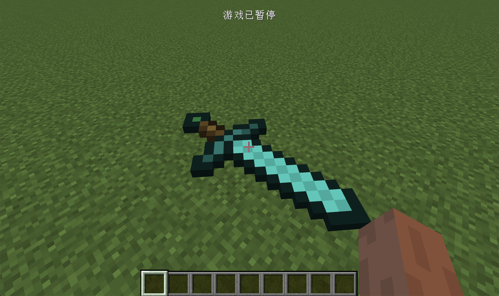
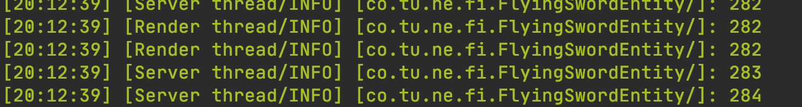

# 从零构建一个实体和数据同步

在这节中，我们将从零构建出一个实体，并将学习实体是如何进行数据同步的。我们将以「飞剑」作为例子。首先我们得要知道构建出一个实体需要那些东西。

构建一个实体我们需要以下这些东西:

- 实体类，直接或者间接的继承`Entity`类，这个类决定了实体的是如何工作的
- 渲染类，直接或者间接的继承`EntityRenderer<T extends Entity>`，这个类决定了实体是如何渲染的。
- 模型类，直接或者间接的继承`EntityModel<T extends Entity>`，这个类规定的实体的模型是什么。

因为我们要从零开始，所以自然也需要实现从零实现这些类。

我们先从最核心的实体类开始，创建名叫`FlyingSwordEntity`并继承`Entity`:

```java
public class FlyingSwordEntity extends Entity {
    private Logger logger = LogManager.getLogger();
    private static final DataParameter<Integer> COUNTER = EntityDataManager.createKey(FlyingSwordEntity.class, DataSerializers.VARINT);

    public FlyingSwordEntity(EntityType<?> entityTypeIn, World worldIn) {
        super(entityTypeIn, worldIn);
    }

    @Override
    protected void registerData() {
        this.dataManager.register(COUNTER, 0);
    }

    @Override
    protected void readAdditional(CompoundNBT compound) {
        this.dataManager.set(COUNTER, compound.getInt("counter"));
    }

    @Override
    protected void writeAdditional(CompoundNBT compound) {
        compound.putInt("counter", this.dataManager.get(COUNTER));
    }

    @Override
    public void tick() {
        if (world.isRemote) {
            logger.info(this.dataManager.get(COUNTER));
        }
        if (!world.isRemote) {
            logger.info(this.dataManager.get(COUNTER));
            this.dataManager.set(COUNTER, this.dataManager.get(COUNTER) + 1);
        }
        super.tick();
    }

    @Override
    public IPacket<?> createSpawnPacket() {
        return NetworkHooks.getEntitySpawningPacket(this);
    }
}
```

可以看到这里并没有非常艰深的内容。首先我们从一个非常值得注意的地方说起。

```java
@Override
public IPacket<?> createSpawnPacket() {
  return NetworkHooks.getEntitySpawningPacket(this);
}
```

因为实体是在服务端创建以后再通知客户端创建，所以这里涉及到了发包操作，我们不能再这里复用Minecraft原版提供的方法，这里必须使用Forge提供的`NetworkHooks.getEntitySpawningPacket(this);`来在客户端创建实体。

接下去，就是和数据同步相关的内容。

```java
private static final DataParameter<Integer> COUNTER = EntityDataManager.createKey(FlyingSwordEntity.class, DataSerializers.VARINT);
```

所有你想要同步的数据，都得像上面一样先声明好，请注意这里的变量类型必须是`static`的，你可以通过改变泛型的方式来修改你需要同步值的类型。然后调用`EntityDataManager.createKey`来创建这个需要同步的数据。这里有两个参数，第一个参数一般是填入你实体的类，第二个参数是控制了你的变量是如何序列化成字节流，对于`Integer`类型来说用`DataSerializers.VARINT`就行了，但是对于`Float`类型就需要特殊的序列化方式（这和浮点数的表示有关，这属于计算机科学基础知识），`DataSerializers` 下面已经帮我们写好了许多方便的实例，大家可以拿来用。

创建完成还不够，你还得注册它。

```java
@Override
protected void registerData() {
  this.dataManager.register(COUNTER, 0);
}
```

在这里我们将数据注册进了`this.dataManager`中，并且设置了初始值`0`。你所有需要同步的数据都需要注册进`this.dataManager`中。

```java
@Override
public void tick() {
  if (world.isRemote) {
    logger.info(this.dataManager.get(COUNTER));
  }
  if (!world.isRemote) {
    logger.info(this.dataManager.get(COUNTER));
    this.dataManager.set(COUNTER, this.dataManager.get(COUNTER) + 1);
  }
  super.tick();
}
```

同样的，在实体的`tick`方法中我们在服务端更新了值，然后同时在客户端和服务端打印。注意实体是肯定实现了`tick`方法的。`tick`是实体最为重要的方法，没有之一。

接下来就是保持和恢复数据。

```java
@Override
protected void readAdditional(CompoundNBT compound) {
  this.dataManager.set(COUNTER, compound.getInt("counter"));
}

@Override
protected void writeAdditional(CompoundNBT compound) {
  compound.putInt("counter", this.dataManager.get(COUNTER));
}
```

这就没什么好说的了，相信大家可以一眼看懂。

因为实体可能是Minecraft中最为复杂的对象了，与实体相关的内容非常多，希望读者能养成查看原版实体实现逻辑的习惯。

接下来我们来创建模型`FlyingSwordModel`，继承`EntityModel`:

```java
public class FlyingSwordModel extends EntityModel<FlyingSwordEntity> {
    private final ModelRenderer body;

    public FlyingSwordModel() {
        textureWidth = 128;
        textureHeight = 128;

        body = new ModelRenderer(this);
        body.setRotationPoint(13.0F, 24.0F, -13.0F);
        body.setTextureOffset(0, 50);
        body.addBox(-1.1053F, -16.0F, -2.7368F, 4, 2, 6, 0.0F, false);
        body.setTextureOffset(60, 40);
        body.addBox(-3.1053F, -16.0F, -2.7368F, 2, 2, 8, 0.0F, false);
        body.setTextureOffset(52, 50);
        body.addBox(-5.1053F, -16.0F, 1.2632F, 2, 2, 6, 0.0F, false);
        body.setTextureOffset(60, 0);
        body.addBox(-7.1053F, -16.0F, 3.2632F, 2, 2, 12, 0.0F, false);
        body.setTextureOffset(40, 40);
        body.addBox(-5.1053F, -16.0F, 9.2632F, 2, 2, 8, 0.0F, false);
        body.setTextureOffset(12, 58);
        body.addBox(-3.1053F, -16.0F, 13.2632F, 2, 2, 4, 0.0F, false);
        body.setTextureOffset(20, 40);
        body.addBox(-9.1053F, -16.0F, 5.2632F, 2, 2, 8, 0.0F, false);
        body.setTextureOffset(32, 0);
        body.addBox(-11.1053F, -16.0F, 3.2632F, 2, 2, 12, 0.0F, false);
        body.setTextureOffset(0, 0);
        body.addBox(-13.1053F, -16.0F, 3.2632F, 2, 2, 14, 0.0F, false);
        body.setTextureOffset(36, 50);
        body.addBox(-15.1053F, -16.0F, 1.2632F, 2, 2, 6, 0.0F, false);
        body.setTextureOffset(0, 58);
        body.addBox(-17.1053F, -16.0F, 1.2632F, 2, 2, 4, 0.0F, false);
        body.setTextureOffset(48, 28);
        body.addBox(-15.1053F, -16.0F, 9.2632F, 2, 2, 10, 0.0F, false);
        body.setTextureOffset(24, 28);
        body.addBox(-17.1053F, -16.0F, 11.2632F, 2, 2, 10, 0.0F, false);
        body.setTextureOffset(0, 28);
        body.addBox(-19.1053F, -16.0F, 13.2632F, 2, 2, 10, 0.0F, false);
        body.setTextureOffset(48, 16);
        body.addBox(-21.1053F, -16.0F, 15.2632F, 2, 2, 10, 0.0F, false);
        body.setTextureOffset(24, 16);
        body.addBox(-23.1053F, -16.0F, 17.2632F, 2, 2, 10, 0.0F, false);
        body.setTextureOffset(0, 16);
        body.addBox(-25.1053F, -16.0F, 19.2632F, 2, 2, 10, 0.0F, false);
        body.setTextureOffset(0, 40);
        body.addBox(-27.1053F, -16.0F, 21.2632F, 2, 2, 8, 0.0F, false);
        body.setTextureOffset(20, 50);
        body.addBox(-29.1053F, -16.0F, 23.2632F, 2, 2, 6, 0.0F, false);
    }

    @Override
    public void setRotationAngles(FlyingSwordEntity entityIn, float limbSwing, float limbSwingAmount, float ageInTicks, float netHeadYaw, float headPitch) {
    }

    @Override
    public void render(MatrixStack matrixStackIn, IVertexBuilder bufferIn, int packedLightIn, int packedOverlayIn, float red, float green, float blue, float alpha) {
        body.render(matrixStackIn, bufferIn, packedLightIn, packedOverlayIn);
    }
}
```

这就是实体模型，在Minecraft所有的实体模型都是通过方块构成的，每一个实体模型可分成很多的「组」，每一个「组」都有一个属于自己的旋转点。之所以有旋转点，是为了实现类似生物行走时类似腿部运动的动画。

请注意这里类的泛型，请填入你实体的类名。

在计算机科学的传统中，我一般把三个方向的旋转称为:`Yaw`、`Roll`和`Pitch`。


Minecraft中比较特别，`Roll`被叫做了替换成了`limbSwing`和`limbSwingAmount`两个变量（我不确定这是不是MCP翻译的问题）。

因为我们的模型不涉及到旋转问题，所以`setRotationAngles`留空。

接下来我们来正式来讲如何创建模型，因为内容过长，我们就节选一段。

```java
textureWidth = 128;
textureHeight = 128;
body = new ModelRenderer(this);
body.setRotationPoint(13.0F, 24.0F, -13.0F);
body.setTextureOffset(0, 50);
body.addBox(-1.1053F, -16.0F, -2.7368F, 4, 2, 6, 0.0F, false);
```

首先我们线设定了材质的大小，然后创建了一个「组」，这里「组」的名字叫做`body`。接下来为组设置了旋转原点。

然后设置了模型中一个方块的UV位置（UV就是材质中的XY，之所以叫做UV也是计算机图形学的传统）。

接下来就是正式创建一个模型中的方块，前三个值是空间中的位置，然后三个值是方块的大小，最后两个，一个是用来控制透明度的，还有一个是用来控制是否镜像的。

最后我们来看看`render`方法，这个方法是用来控制模型的要怎么渲染的，一般情况下，你只需要在这里调用你创建的「组」自带的`render`方法就行。

这些就是模型文件的全部内容，我们接下来来看渲染文件，`FlyingSwordRender`，继承`EntityRenderer`:

```java
public class FlyingSwordRender extends EntityRenderer<FlyingSwordEntity> {
    private EntityModel<FlyingSwordEntity> flyingSwordModel;

    public FlyingSwordRender(EntityRendererManager renderManager) {
        super(renderManager);
        flyingSwordModel = new FlyingSwordModel();
    }

    @Override
    public ResourceLocation getEntityTexture(FlyingSwordEntity entity) {
        return new ResourceLocation("neutrino", "textures/entity/flying_sword.png");
    }

    @Override
    public void render(FlyingSwordEntity entityIn, float entityYaw, float partialTicks, MatrixStack matrixStackIn, IRenderTypeBuffer bufferIn, int packedLightIn) {
        super.render(entityIn, entityYaw, partialTicks, matrixStackIn, bufferIn, packedLightIn);
        matrixStackIn.push();
        matrixStackIn.rotate(Vector3f.YN.rotationDegrees(45));
        IVertexBuilder ivertexbuilder = bufferIn.getBuffer(this.flyingSwordModel.getRenderType(this.getEntityTexture(entityIn)));
        this.flyingSwordModel.render(matrixStackIn, ivertexbuilder, packedLightIn, OverlayTexture.NO_OVERLAY, 1.0F, 1.0F, 1.0F, 1.0F);
        matrixStackIn.pop();
    }
}
```

这里有三个方法，首先是构建方法，我们在里面创建了我们模型的实例，这没什么好说的，非常简单。

接下来是,`getEntityTexture`方法。

```java
@Override
public ResourceLocation getEntityTexture(FlyingSwordEntity entity) {
  return new ResourceLocation("neutrino", "textures/entity/flying_sword.png");
}
```

我们在这里绑定了渲染模型需要的材质。

然后就是`render`方法:

```java
@Override
public void render(FlyingSwordEntity entityIn, float entityYaw, float partialTicks, MatrixStack matrixStackIn, IRenderTypeBuffer bufferIn, int packedLightIn) {
  super.render(entityIn, entityYaw, partialTicks, matrixStackIn, bufferIn, packedLightIn);
  matrixStackIn.push();
  matrixStackIn.rotate(Vector3f.YN.rotationDegrees(45));
  IVertexBuilder ivertexbuilder = bufferIn.getBuffer(this.flyingSwordModel.getRenderType(this.getEntityTexture(entityIn)));
  this.flyingSwordModel.render(matrixStackIn, ivertexbuilder, packedLightIn, OverlayTexture.NO_OVERLAY, 1.0F, 1.0F, 1.0F, 1.0F);
  matrixStackIn.pop();
}
```

首先我们调用了父类的渲染方法，注意这里必须得调用。

然后你的具体渲染方法应该要包括在` matrixStackIn.push()`和`matrixStackIn.pop()`之间，之所以要这么做的原因是，关于模型的移动，渲染和放大的信息都会存放在`matrixStackIn`中，你必须要保存上一层调用所使用的`matrixStackIn`，然后在你的渲染结束时恢复它，不然可能会出现不可预料的渲染错误。

```java
matrixStackIn.rotate(Vector3f.YN.rotationDegrees(45));
```

我们在这里将我们的模型旋转来45度。

```java
IVertexBuilder ivertexbuilder = bufferIn.getBuffer(this.flyingSwordModel.getRenderType(this.getEntityTexture(entityIn)));
```

这句话是用来构建顶点用的，模型在渲染的过程中会被分解成一个个的顶点，这节顶点会构成最终的模型，所有渲染需要的数据都需要存放在这些顶点中。

```java
this.flyingSwordModel.render(matrixStackIn, ivertexbuilder, packedLightIn, OverlayTexture.NO_OVERLAY, 1.0F, 1.0F, 1.0F, 1.0F);
```

最后我们调用了模型的`render`方法来渲染模型，这里的`OverlayTexture`下面有很多的类型，大家可以按需选用。

接下来我们需要注册我们的实体:

```java
public class EntityTypeRegistry {
    public static final DeferredRegister<EntityType<?>> ENTITY_TYPES = new DeferredRegister<>(ForgeRegistries.ENTITIES, "neutrino");
    public static RegistryObject<EntityType<FlyingSwordEntity>> flyingSwordEntity = ENTITY_TYPES.register("flying_sword", () -> {
        return EntityType.Builder.create((EntityType<FlyingSwordEntity> entityType, World world) -> {
            return new FlyingSwordEntity(entityType, world);
        }, EntityClassification.MISC).size(3, 0.5F).build("flying_sword");
    });
}
```

`size(3, 0.5F)`，这里我们设置了的实体的碰撞箱，请注意实体的碰撞箱的上下两面永远是一个正方形，这也就是为什么只有两个参数的原因。

同样的，这里的注册方式和方块实体基本相同。同样别忘了在构建函数里将实体的注册器添加进入`Mod`总线中。

然后是注册我们实体的渲染。

```java
@Mod.EventBusSubscriber(bus = Mod.EventBusSubscriber.Bus.MOD, value = Dist.CLIENT)
public class ClientEventHandler {
    @SubscribeEvent
    public static void onClientSetUpEvent(FMLClientSetupEvent event) {
        RenderingRegistry.registerEntityRenderingHandler(EntityTypeRegistry.flyingSwordEntity.get(), (EntityRendererManager manager) -> {
            return new FlyingSwordRender(manager);
        });
    }
}
```

这里应该也挺好理解的。也就不多说什么了，同样的别忘了`value = Dist.CLIENT`。

打开游戏使用:

```
/summon neutrino:flying_sword
```

召唤我们的实体，可以看见钻石剑已经成功的出现了。





并且数据也已经同步了。

[源代码](https://github.com/FledgeXu/NeutrinoSourceCode/tree/master/src/main/java/com/tutorial/neutrino/first_entity)

## 编程小课堂

[MinecraftByExample](https://github.com/TheGreyGhost/MinecraftByExample)项目的作者[TheGreyGhost](https://github.com/TheGreyGhost/MinecraftByExample/commits?author=TheGreyGhost)的[博客](http://greyminecraftcoder.blogspot.com/p/list-of-topics-1144.html)里有非常多关于Minecraft渲染相关的内容，大家可以自行阅读。

如果你打不开这个博客，可能是由于你的国家封锁了这个网站，请自行寻找方法解决。
