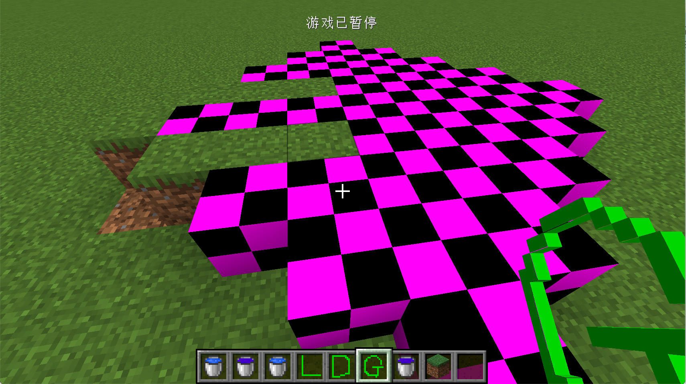
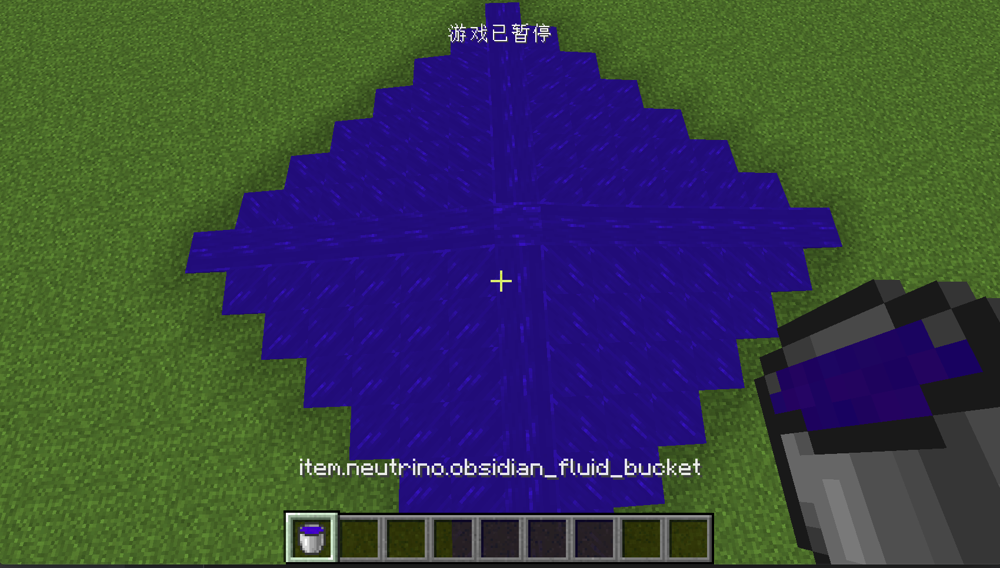

# 流体

在这节我们将来学习如何创建一个简单的流体。

首先我们要明确流体究竟是什么。你在游戏中接触的流体不外乎于两种形式，一种是装在「桶」里，另一个是在世界里不断流动。

当流体装在桶中，它属于一个叫做`BucketItem。`它流体在世界中不断流动，它属于的一种特殊的方块，这个方块和流体关联。（就像是方块和TileEntity关联）。



 这是一张调整过渲染模型的流体在世界中存在的情况，从这张图里，你应该能很明显的感觉到在世界中的流体也是以方块的形式存在的。

不过比起方块需要自己手动实现，Minecraft提供了一个叫做`FlowingFluidBlock`类，我们可以直接使用。

当然我还需要流体，流体有两种状态，一种是「Source（源）」，一种是「Flowing（流动）」，想想水源的流动的水，你应该就能区分它们了。Forge提供给我们了一个叫做`ForgeFlowingFluid`继承`FlowingFluid`，来方面我们创建流体。

接下来的内容可能会互相缠绕。我大家需要仔细梳理。

首先我们来看流体的注册。

```java
public class FluidRegistry {
    public static final ResourceLocation STILL_OIL_TEXTURE = new ResourceLocation("block/water_still");
    public static final ResourceLocation FLOWING_OIL_TEXTURE = new ResourceLocation("block/water_flow");

    public static final DeferredRegister<Fluid> FLUIDS = new DeferredRegister<>(ForgeRegistries.FLUIDS, "neutrino");
    public static RegistryObject<FlowingFluid> obsidianFluid = FLUIDS.register("obsidian_fluid", () -> {
        return new ForgeFlowingFluid.Source(FluidRegistry.PROPERTIES);
    });
    public static RegistryObject<FlowingFluid> obsidianFluidFlowing = FLUIDS.register("obsidian_fluid_flowing", () -> {
        return new ForgeFlowingFluid.Flowing(FluidRegistry.PROPERTIES);
    });
    public static ForgeFlowingFluid.Properties PROPERTIES = new ForgeFlowingFluid.Properties(obsidianFluid, obsidianFluidFlowing, FluidAttributes.builder(STILL_OIL_TEXTURE, FLOWING_OIL_TEXTURE).color(0x311cbb).density(10)).bucket(ItemRegistry.obsidianFluidBucket).block(BlockRegistry.obsidianRubikCube).slopeFindDistance(3).explosionResistance(100F);
}
```

可以看到，我们同样是使用了`DeferredRegister`来注册，这里只不过这里的泛型变成了`Fluid`。对于每一个流体你都需要做分别注册`Source`和`Flowing`。你可以看到我们分别调用了`ForgeFlowingFluid.Source`和`ForgeFlowingFluid.Flowing`来注册了这两部分。

注册流体时你需要传入一个`ForgeFlowingFluid.Properties`这里属性规定了，`Source`和`Flowing`作为一个整体时的属性，比如当水源没有之后水流消失的速度，相对应的桶是什么，对应的方块是什么等。`bucket(ItemRegistry.obsidianFluidBucket)`这里我们设置的桶，`block(BlockRegistry.obsidianRubikCube)`这里我们设置了相对应的方块，接下去的两个是水流消失速度和防爆等级。

这个函数的前两个参数就是我们注册的`Source`和`Flowing`相对应的材质，这里我们就直接服用了原版水流的材质（请注意流体的材质需要是「[动态材质](https://minecraft-zh.gamepedia.com/index.php?title=资源包)」才能表现出流动的效果）。最后一个参数是一个`FluidAttributes`，这个是规定了这个流体的一些固有属性，比如颜色，稠度，温度，这里我们调用了`FluidAttributes.builder`来创建。`color(0x311cbb)`这里我们设置了流体的颜色,调用`density(10)`设置了流体的稠度。

当然别忘了将`FLUIDS`添加进注册总线中。

接下来是流体方块的注册。

```java
public static RegistryObject<FlowingFluidBlock> obsidianRubikCube = BLOCKS.register("obsidian_fluid", () -> {
  return new FlowingFluidBlock(FluidRegistry.obsidianFluid, Block.Properties.create(Material.WATER).doesNotBlockMovement().hardnessAndResistance(100.0F).noDrops());
});
```

可以看见，我们直接新建了一个`FlowingFluidBlock`的实例，并将直接注册好的流体传了进去。后面的方块属性读者应该看的懂，这里就不多加解释了。

然后是相对应桶的注册。

```java
public static RegistryObject<Item> obsidianFluidBucket = ITEMS.register("obsidian_fluid_bucket", () -> {
  return new BucketItem(FluidRegistry.obsidianFluid, new Item.Properties().group(ModGroup.itemGroup));
});
```

和方块类似这里就不多加说明了。

当然别忘了给物品添加材质，大家可以按照原版水桶的材质进行修改。



打开游戏，你就能看到流体出现了。

但是这时的流体还不能推动实体，你必须为你之前注册的流体添加原版`water`的[Tag(标签)](https://minecraft-zh.gamepedia.com/index.php?title=标签&variant=zh)才能推动实体。

在你的`resources`目录下按如下结构创建。

```
resources
├── META-INF
│   └── mods.toml
├── assets
├── data
│   └── minecraft
│       └── tags
│           └── fluids
└── pack.mcmeta
```

然后在`fluids`文件夹下创建`water.json`，内容如下:

```json
{
  "replace": false,
  "values": [
    "neutrino:obsidian_fluid",
    "neutrino:obsidian_fluid_flowing"
  ]
}
```

这里的值就是你的流体的两个注册名。

然后重新启动游戏，你的流体应该就能推动实体了。