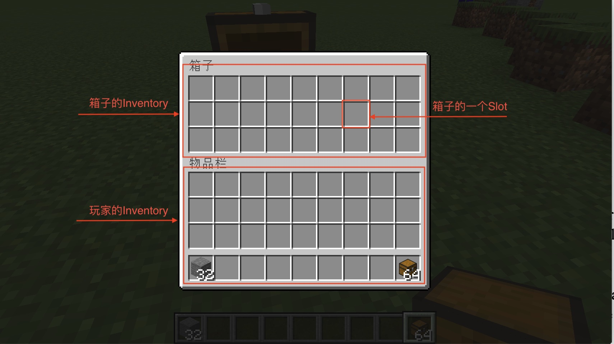
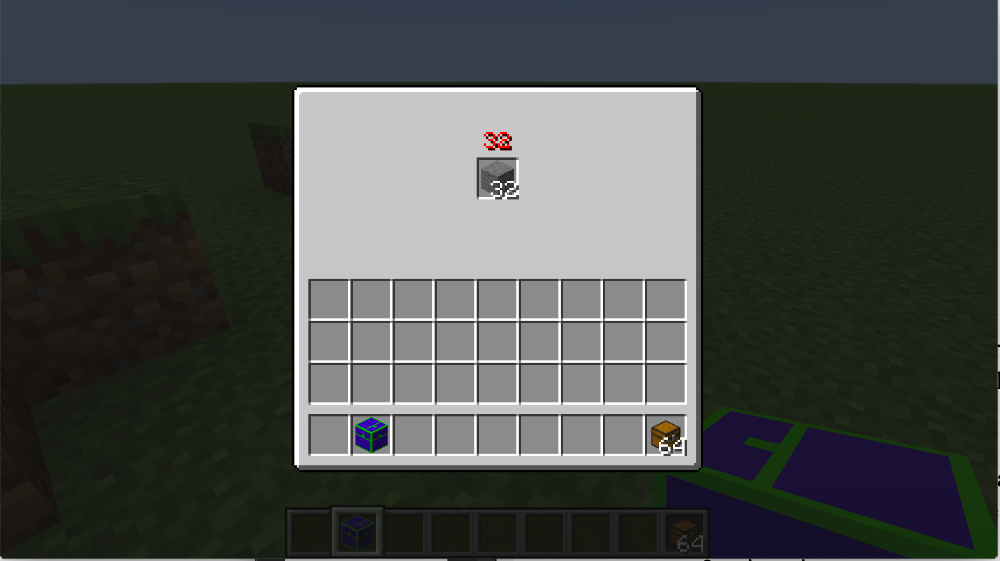

# Container

在上一节中，我们已经学习了如何创建一个非常简单的GUI，但是那个GUI显然有些功能是实现不了的。在这节中，我们将要来学习GUI中一个非常重要的类，Container。

在开始之前我们先要回答Container是什么，已经它的存在是为了什么。Container和Screen的关系有点像是，Block和TileEntity的关系，Container本身不会被渲染，它存在的意义就是用来临时的储存数据（Container没法把数据保存到硬盘上）以及数据同步。但是很可惜的是Container所能同步的数据非常有限，不过就是Inventory和IntArray而已，如果你需要更加复杂的数据同步，那只能自己手动发包了。



这里这张图是GUI操作中数据流向图，实线和虚线代表了数据流动的方向。所以跨过中间的箭头都需要进行发包。

当你在Screen上点击按钮或者进行什么别的什么操作，最后修改的都应该是服务端的方块实体或者是Container里面的值，然后在通过它们的同步机制，同步回客户端。切记不能直接修改客户端的方块实体或者Container里的值。请注意，在客户端Container和方块实体之间是没有数据同步的。

希望你大脑里对这个过程有些印象，接下来我们就开始一步一步的实现一个非常简单的箱子。这里涉及到的类挺多的，建议大家在IntelliJ中打开源代码，自己试着理清整个调用关系。

在这节中，我们要创建一个非常简单的箱子。

首先我们先来看方块相关的代码

```java
public class ObsidianFirstContainerBlock extends Block {
    public ObsidianFirstContainerBlock() {
        super(Properties.create(Material.ROCK).hardnessAndResistance(5));
    }

    @Override
    public boolean hasTileEntity(BlockState state) {
        return true;
    }

    @Nullable
    @Override
    public TileEntity createTileEntity(BlockState state, IBlockReader world) {
        return new ObsidianFirstContainerTileEntity();
    }

    @Override
    public ActionResultType onBlockActivated(BlockState state, World worldIn, BlockPos pos, PlayerEntity player, Hand handIn, BlockRayTraceResult hit) {
        if (!worldIn.isRemote && handIn == Hand.MAIN_HAND) {
            ObsidianFirstContainerTileEntity obsidianFirstContainerTileEntity = (ObsidianFirstContainerTileEntity) worldIn.getTileEntity(pos);
            NetworkHooks.openGui((ServerPlayerEntity) player, obsidianFirstContainerTileEntity, (PacketBuffer packerBuffer) -> {
                packerBuffer.writeBlockPos(obsidianFirstContainerTileEntity.getPos());
            });
        }
        return ActionResultType.SUCCESS;
    }
}
```

我们来看最为重要的方法，

```java
@Override
public ActionResultType onBlockActivated(BlockState state, World worldIn, BlockPos pos, PlayerEntity player, Hand handIn, BlockRayTraceResult hit) {
  if (!worldIn.isRemote && handIn == Hand.MAIN_HAND) {
    ObsidianFirstContainerTileEntity obsidianFirstContainerTileEntity = (ObsidianFirstContainerTileEntity) worldIn.getTileEntity(pos);
    NetworkHooks.openGui((ServerPlayerEntity) player, obsidianFirstContainerTileEntity, (PacketBuffer packerBuffer) -> {
      packerBuffer.writeBlockPos(obsidianFirstContainerTileEntity.getPos());
    });
  }
  return ActionResultType.SUCCESS;
}
```

大部分的内容没什么好说的，想想大家以及可以读的懂了，这里最为关键的只有一句话。

```java
NetworkHooks.openGui((ServerPlayerEntity) player, obsidianFirstContainerTileEntity, (PacketBuffer packerBuffer) -> {
  packerBuffer.writeBlockPos(obsidianFirstContainerTileEntity.getPos());
});
```

这句话就是打开一个包含有Container的GUI的语句。

当你执行这条命令时，Minecraft会同时在客户端和服务端各自创建一个Container，并且创建的流程不一样。我们来讲一下这个创建的流程时什么样子的。

- 服务端：这个函数的第二个参数是是一个`INamedContainerProvider`接口，这里我们让我们的方块实体实现了这个接口（大部分时候你都应该这么做）。这个接口下有个叫做`createMenu`的方法，在服务端最终会调用这个方法来创建Container。

- 客户端：客户端的操作首先会进行一次发包处理，`NetworkHooks.openGui`方法的第三个参数让你可以在发送的数据包中额外的附加数据（为了方便展示，我没有使用内置的封装好的函数），这里添加数据的方法，相信已经会自定义网络包的你，理解起来不难。

  当客户端接受到发送来的包之后，客户的会调用你在注册时设置的构造方法创建，具体的内容我们留到注册部分再说

接下来我们开看看我们的方块实体

```java
public class ObsidianFirstContainerTileEntity extends TileEntity implements ITickableTileEntity, INamedContainerProvider {

    private Inventory inventory = new Inventory(1);
    private ObsidianFirstContainerItemNumber itemNumber = new ObsidianFirstContainerItemNumber();

    public ObsidianFirstContainerTileEntity() {
        super(TileEntityTypeRegistry.obsidianFirstContainerTileEntity.get());
    }

    @Override
    public ITextComponent getDisplayName() {
        return new StringTextComponent("Fist Container");
    }

    @Nullable
    @Override
    public Container createMenu(int sycID, PlayerInventory inventory, PlayerEntity player) {
        return new ObsidianFirstContainer(sycID, inventory, this.pos, this.world, itemNumber);
    }

    @Override
    public void read(CompoundNBT compound) {
        this.inventory.addItem(ItemStack.read(compound.getCompound("item")));
        super.read(compound);
    }

    @Override
    public CompoundNBT write(CompoundNBT compound) {
        ItemStack itemStack = this.inventory.getStackInSlot(0).copy();
        compound.put("item", itemStack.serializeNBT());
        return super.write(compound);
    }

    public Inventory getInventory() {
        return inventory;
    }

    @Override
    public void tick() {
        if (!world.isRemote) {
            this.itemNumber.set(0, this.inventory.getStackInSlot(0).getCount());
        }
    }
}
```

这些就是方块实体的代码，我们细细的来讲。

首先就是。

 ```java
@Override
public ITextComponent getDisplayName() {
  return new StringTextComponent("First Container");
}

@Nullable
@Override
public Container createMenu(int sycID, PlayerInventory inventory, PlayerEntity player) {
  return new ObsidianFirstContainer(sycID, inventory, this.pos, this.world, itemNumber);
}
 ```

这两个方法是`INamedContainerProvider`规定的方法，可以看到我们在`createMenu`方法中创建了我们的Container。

接下来，我们看一个变量

```java
private Inventory inventory = new Inventory(1);
```

这个变量的代表了一个只有1个「Slot（槽位）」的「Inventory（物品栏）」。**请注意这里的Slot和Inventory也是只是一个抽象上的概念。**



因为我们希望的我们要创建的是一个箱子，自然需要存放物品，所以需要创建一个`Inventory`，这个是原版已经实现好的`IInvetory`接口的一个类，如果需要你也可以自己实现这个接口。

至于数据的保存和恢复这里也就不在多提，大家可以自行查看。

接下来是

```java
private ObsidianFirstContainerItemNumber itemNumber = new ObsidianFirstContainerItemNumber();
```

我们接下来看一看这个类。

```java
public class ObsidianFirstContainerItemNumber implements IIntArray {
    int i = 0;

    @Override
    public int get(int index) {
        return i;
    }

    @Override
    public void set(int index, int value) {
        i = value;
    }

    @Override
    public int size() {
        return 1;
    }
}
```

这个类继承了`IIntArray`，具体的内容非常的简单，相信大家都能看懂。接下去的问题就是，什么是`IntArray`。`IntArray`简单是Container可以自动同步数据的两个类中的一个，另外一个类就是我们之前提及过的`Inventory`。`IntArray`的作用是给类似于熔炉这样用进度条的GUI来同步Int值用的（熔炉的进度条是根据Int值的大小按比例绘制的）。

然后我们回过头去看TileEntity中的

```java
@Override
public void tick() {
  if (!world.isRemote) {
    this.itemNumber.set(0, this.inventory.getStackInSlot(0).getCount());
  }
}
```

我们在服务端，每个tick计算`inventory`中物品的数量，并将其赋值给之前创建的`itemNumber`。

至此方块实体部分的内容已经完成。

接下来就是我们的Container

```java
public class ObsidianFirstContainer extends Container {
    private ObsidianFirstContainerItemNumber intArray;

    protected ObsidianFirstContainer(int id, PlayerInventory playerInventory, BlockPos pos, World world, ObsidianFirstContainerItemNumber intArray) {
        super(ContainerTypeRegistry.obsidianFirstContainer.get(), id);
        this.intArray = intArray;
        trackIntArray(this.intArray);
        ObsidianFirstContainerTileEntity obsidianFirstContainerTileEntity = (ObsidianFirstContainerTileEntity) world.getTileEntity(pos);
        this.addSlot(new Slot(obsidianFirstContainerTileEntity.getInventory(), 0, 80, 32));
        layoutPlayerInventorySlots(playerInventory, 8, 84);
    }

    @Override
    public boolean canInteractWith(PlayerEntity playerIn) {
        return true;
    }

    @Override
    public ItemStack transferStackInSlot(PlayerEntity playerIn, int index) {
        return ItemStack.EMPTY;
    }

    private int addSlotRange(IInventory inventory, int index, int x, int y, int amount, int dx) {
        for (int i = 0; i < amount; i++) {
            addSlot(new Slot(inventory, index, x, y));
            x += dx;
            index++;
        }
        return index;
    }

    private int addSlotBox(IInventory inventory, int index, int x, int y, int horAmount, int dx, int verAmount, int dy) {
        for (int j = 0; j < verAmount; j++) {
            index = addSlotRange(inventory, index, x, y, horAmount, dx);
            y += dy;
        }
        return index;
    }

    private void layoutPlayerInventorySlots(IInventory inventory, int leftCol, int topRow) {
        // Player inventory
        addSlotBox(inventory, 9, leftCol, topRow, 9, 18, 3, 18);

        // Hotbar
        topRow += 58;
        addSlotRange(inventory, 0, leftCol, topRow, 9, 18);
    }

    public IIntArray getIntArray() {
        return intArray;
    }
}
```

其实Container里的内容相对来说比较简单。

```java
protected ObsidianFirstContainer(int id, PlayerInventory playerInventory, BlockPos pos, World world, ObsidianFirstContainerItemNumber intArray) {
  super(ContainerTypeRegistry.obsidianFirstContainer.get(), id);
  this.intArray = intArray;
  trackIntArray(this.intArray);
  ObsidianFirstContainerTileEntity obsidianFirstContainerTileEntity = (ObsidianFirstContainerTileEntity) world.getTileEntity(pos);
  this.addSlot(new Slot(obsidianFirstContainerTileEntity.getInventory(), 0, 80, 32));
  layoutPlayerInventorySlots(playerInventory, 8, 84);
}
```

首先就是构造函数。

```java
this.intArray = intArray;
trackIntArray(this.intArray);
```

在这里，我们获取需要同步的`IntArray`并且调用`trackIntArray`方法将其加入同步序列中。如此，当你在客户端修改`IntArray`的值，服务端就可以自动同步数据了。

接下来就是添加Slot。

```java
this.addSlot(new Slot(obsidianFirstContainerTileEntity.getInventory(), 0, 80, 32));
```

一个Inventory里可以有很多个Slot，这里我们需要给他添加进我们的GUI中，其中`Slot`第一个参数是一个Inventory，第二个参数是Inventory中ItemStack的序号，因为我们的Inventory总数只有1，所以这里填入0即可。最后两个坐标是X，Y。这个X，Y的起始点是( (this.width - this.xSize) / 2,  (this.height - this.ySize) / 2)，这里的`xSize`和`ySize`我们在之后将Screen的时候会讲到。

最后的`layoutPlayerInventorySlots`是自定义的函数用来把玩家自带的Inventory添加到Container中，这里大家可以跟着自行计算位置，就不多讲了。

接下来是

```java
@Override
public boolean canInteractWith(PlayerEntity playerIn) {
  return true;
}
```

这个函数是用来判断玩家能否打开GUI，一般情况下这里都应该做一次玩家和方块的距离计算，用来防止玩家在过远的地方打开GUI，这里我比较懒就不计算了。

```java
@Override
public ItemStack transferStackInSlot(PlayerEntity playerIn, int index) {
  return ItemStack.EMPTY;
}
```

最后这个函数是用来控制玩家按住Shift键以后点击物品的行为，这里我也是懒得写所以直接返回空了。在默认情况下，你需要实现按住Shift讲物品放入指定空的Slot行为。

因为Container主要的作用就是数据同步，所以Container类中的内容并不多，当然Container自带的方法不止这些，大家可以自行阅读Container的注释。

然后就是我们的Screen。

```java
public class ObsidianFirstContainerScreen extends ContainerScreen<ObsidianFirstContainer> {
    private ResourceLocation OBSIDIAN_CONTAINER_RESOURCE = new ResourceLocation("neutrino", "textures/gui/container.png");
    private int textureWidth = 176;
    private int textureHeight = 166;

    @Override
    public void render(int mouseX, int mouseY, float partialTicks) {
        renderBackground();
        super.render(mouseX, mouseY, partialTicks);
        renderHoveredToolTip(mouseX, mouseY);
    }

    public ObsidianFirstContainerScreen(ObsidianFirstContainer screenContainer, PlayerInventory inv, ITextComponent titleIn) {
        super(screenContainer, inv, titleIn);
        this.xSize = textureWidth;
        this.ySize = textureHeight;
    }

    @Override
    protected void drawGuiContainerForegroundLayer(int mouseX, int mouseY) {
        this.drawString(this.font, Integer.toString(this.getContainer().getIntArray().get(0)), 82, 20, 0xeb0505);
    }

    @Override
    protected void drawGuiContainerBackgroundLayer(float partialTicks, int mouseX, int mouseY) {
        this.renderBackground();
        RenderSystem.color4f(1.0F, 1.0F, 1.0F, 1.0F);
        this.minecraft.getTextureManager().bindTexture(OBSIDIAN_CONTAINER_RESOURCE);
        int i = (this.width - this.xSize) / 2;
        int j = (this.height - this.ySize) / 2;
        blit(i, j, 0, 0, xSize, ySize, this.textureWidth, textureHeight);
    }
}
```

首先我们继承的是`ContainerScreen`，这个是`Screen`类中的一个子类，用来和Container绑定用的。比起`Screen`，它实现了一些额外的功能，比如按照指定的`Container`中的数据自动添加组件并渲染出`Container`中`Slot`（再一次提醒渲染工作都是由`Screen`完成，和`Container`无关）。

首先我们先来讲`xSize`和`ySize`，这两个变量时`ContainerScreen`创建的，用来设定GUI窗口的大小，这里我们就将其设置的和我背景图大小一样。

`Screen`内主要有两个函数`drawGuiContainerBackgroundLayer`和`drawGuiContainerForegroundLayer`，这两个函数中绘制内容时的坐标系不同。

其中`drawGuiContainerBackgroundLayer`的起始点是(0,0)，而`drawGuiContainerForegroundLayer`的起始点是`

( (this.width - this.xSize)/2 , (this.height - this.ySize)/2 )。

你应该在`drawGuiContainerBackgroundLayer`渲染你的背景图，而在`drawGuiContainerForegroundLayer`渲染你的组件（字符串，按钮等）。

如果你已经有了上一节的基础，相信渲染部分的内容并不会难到你，这里就不多加解释了。

这里多出来的是`render`方法，为了能让我们的GUI显示ToolTip，这里在render方法里调用了`renderHoveredToolTip`方法，当然这里也不要忘了调用父类的`render`方法。

```java
@Override
public void render(int mouseX, int mouseY, float partialTicks) {
  renderBackground();
  super.render(mouseX, mouseY, partialTicks);
  renderHoveredToolTip(mouseX, mouseY);
}
```


接下来时注册，我们首先需要注册`ContainerType`

```java
public class ContainerTypeRegistry {
    public static final DeferredRegister<ContainerType<?>> CONTAINERS = new DeferredRegister<>(ForgeRegistries.CONTAINERS, "neutrino");
    public static RegistryObject<ContainerType<ObsidianFirstContainer>> obsidianFirstContainer = CONTAINERS.register("obsidian_first_container", () -> {
        return IForgeContainerType.create((int windowId, PlayerInventory inv, PacketBuffer data) -> {
            return new ObsidianFirstContainer(windowId, inv, data.readBlockPos(), Minecraft.getInstance().world.getWorld(), new ObsidianFirstContainerItemNumber());
        });
    });
}
```

可以看见我们调用了`IForgeContainerType.create`来创建ContainerType，其中第二个参数里所写的创建我们Container的指令，会在客户端收到网络数据包创建Container时执行，其中的`windowID `就是用来在两端之间同步Container用的。`data.readBlockPos()`，可以看到我们从数据包里获取了之前调用`NetworkHooks.openGui`塞入的值。当然别忘了在你Mod的主类里将`CONTAINERS`添加进Mod总线中。

接下去你还需要手动把`Container`和`ContainerScreen`相绑定。

```java
@Mod.EventBusSubscriber(bus = Mod.EventBusSubscriber.Bus.MOD)
public class ModBusEventHandler {
    @SubscribeEvent
    public static void onClientSetupEvent(FMLClientSetupEvent event) {
        ScreenManager.registerFactory(ContainerTypeRegistry.obsidianFirstContainer.get(), (ObsidianFirstContainer screenContainer, PlayerInventory inv, ITextComponent titleIn) -> {
            return new ObsidianFirstContainerScreen(screenContainer, inv, titleIn);
        });
    }
}
```

至此，我们的特殊箱子就已经实现了，打开游戏看看吧。



[源代码](https://github.com/FledgeXu/NeutrinoSourceCode/tree/master/src/main/java/com/tutorial/neutrino/container)

[相关的资料](https://greyminecraftcoder.blogspot.com/2020/04/containers-1144.html)

