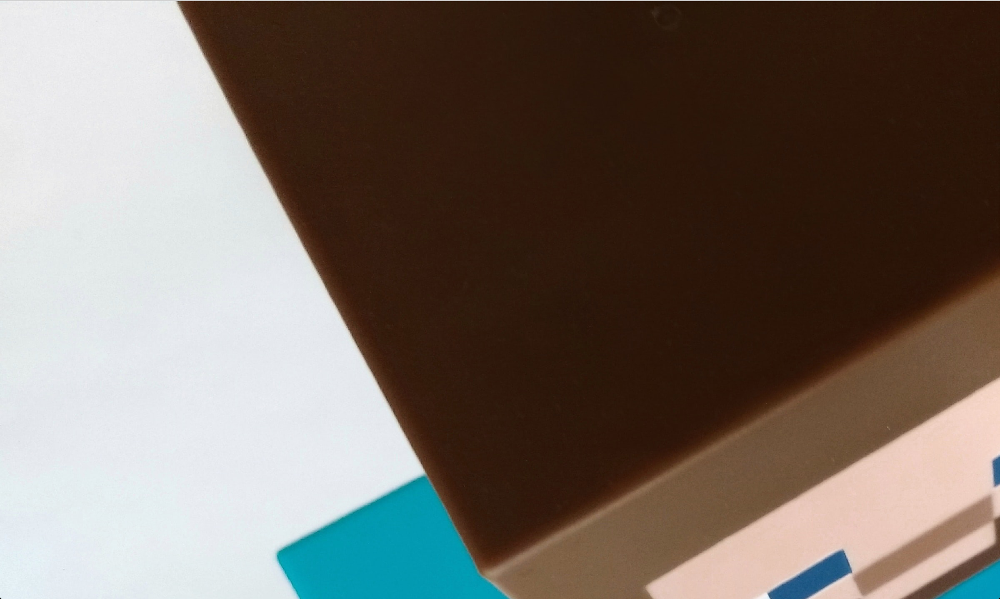
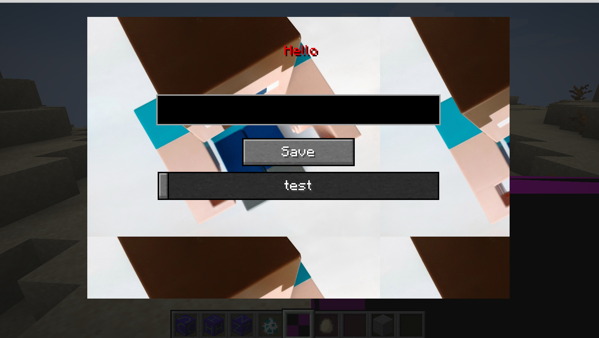

# 第一个Gui

在这一节中，我们将创建一个自定义的Gui，在开始教程之前，我必须要强调一点，打开Gui等操作只能在客户端执行，不能在服务端执行。

与GUI相关的最直接的一个类就是`Screen`类，自然我们要创建一个类并继承`Screen`。

`ObsidianFirstGui.java`:

```java
public class ObsidianFirstGui extends Screen {
    TextFieldWidget textFieldWidget;
    Button button;
    OptionSlider optionSlider;
    ResourceLocation OBSIDIAN_FIRST_GUI_TEXTURE = new ResourceLocation("neutrino", "textures/gui/first_gui.png");
    String content = "Hello";
    SliderPercentageOption sliderPercentageOption;
    Widget sliderBar;

    protected ObsidianFirstGui(ITextComponent titleIn) {
        super(titleIn);
    }

    @Override
    protected void init() {
        this.minecraft.keyboardListener.enableRepeatEvents(true);
        this.textFieldWidget = new TextFieldWidget(this.font, this.width / 2 - 100, 66, 200, 20, "Context");
        this.children.add(this.textFieldWidget);

        this.button = new Button(this.width / 2 - 40, 96, 80, 20, "Save", (button) -> {
        });
        this.addButton(button);

        this.sliderPercentageOption = new SliderPercentageOption("neutrino.sliderbar", 5, 100, 5, (setting) -> {
            return Double.valueOf(0);
        }, (setting, value) -> {
        }, (gameSettings, sliderPercentageOption1) -> "test");
        this.sliderBar = this.sliderPercentageOption.createWidget(Minecraft.getInstance().gameSettings, this.width / 2 - 100, 120, 200);
        this.children.add(this.sliderBar);

        super.init();
    }

    @Override
    public void render(int mouseX, int mouseY, float particleTick) {
        this.renderBackground();
        RenderSystem.color4f(1.0F, 1.0F, 1.0F, 1.0F);
        this.minecraft.getTextureManager().bindTexture(OBSIDIAN_FIRST_GUI_TEXTURE);
        int textureWidth = 208;
        int textureHeight = 156;
        this.blit(this.width / 2 - 150, 10, 0, 0, 300, 200, textureWidth, textureHeight);
        this.drawString(this.font, content, this.width / 2 - 10, 30, 0xeb0505);

        this.textFieldWidget.render(mouseX, mouseY, particleTick);
        this.button.render(mouseX, mouseY, particleTick);
        this.sliderBar.render(mouseX, mouseY, particleTick);
        super.render(mouseX, mouseY, particleTick);
    }
}
```

在这里最重要的是两个方法，`init`和`render`方法。首先，我们先来讲`init`方法。

```java
@Override
protected void init() {
  this.minecraft.keyboardListener.enableRepeatEvents(true);
  this.textFieldWidget = new TextFieldWidget(this.font, this.width / 2 - 100, 66, 200, 20, "Context");
  this.children.add(this.textFieldWidget);

  this.button = new Button(this.width / 2 - 40, 96, 80, 20, "Save", (button) -> {
  });
  this.addButton(button);
  
  this.sliderPercentageOption = new SliderPercentageOption("neutrino.sliderbar", 5, 100, 5, (setting) -> {
    return Double.valueOf(0);
  }, (setting, value) -> {
  }, (gameSettings, sliderPercentageOption1) -> "test");
  this.sliderBar = this.sliderPercentageOption.createWidget(Minecraft.getInstance().gameSettings, this.width / 2 - 100, 120, 200);
  this.children.add(this.sliderBar);
  super.init();
}
```

在这里我们创建了三个「Widget（组件）」——Button（按钮）、TextFieldWidget（文本框）以及Slider（滑条）。Widget 是Minecraft GUI中最小可交互的对象。在GUI中添加Wdget大体上可以分成两步骤：

1. 创建：你需要先创建一个组件，在创建组件时你需要指定它的宽和高、X坐标和Y坐标，对于一个特殊的组件，你还得指定它的回调函数，也就是当你操作组件后它需要执行的内容。比如说，当你按下按钮，你需要执行的内容就是一个回调函数。
2. 添加，为了你的GUI可以使用组件，你需要在创建完组件之后将组件添加到GUI上，对于绝大部分的组件你只需要调用`this.children.add(组件实例)`即可，按钮比较特殊，你需要调用`this.addButton(按钮实例)`。

接下来我们来讲解一下窗口布局，对于我们的这个Screen类来说，你可以通过`this.width`和`this.height`来获取宽度和高度。请注意，在GUI中，X轴是从左上角向下，Y轴是从左上角向右。

因为这里涉及到的方法很多，我就稍微讲解一下，大体上所有的组件创建的都有X、Y位置设定，以及宽和高的设定，大家可以自己看方法签名。

其中值得一讲的是:

```java
this.button = new Button(this.width / 2 - 40, 96, 80, 20, "Save", (button) -> {});
```

这里最后一个参数，这个空的闭包就是按钮的回调函数，如果你希望你的按钮能做什么的话，就在这个闭包内写上逻辑吧。

 ```java
this.sliderPercentageOption = new SliderPercentageOption("neutrino.sliderbar", 5, 100, 5, (setting) -> {
    return Double.valueOf(0);
  }, (setting, value) -> {
  }, (gameSettings, sliderPercentageOption1) -> "test");
 ```

接下来是滚动条，它比较特殊，你得先创建一个`SliderPercentageOption`，然后调用它的`createWidget`的组件，之所以这么做是因为滚动条必须要和一个数据范围相对应。

这里的第五和第六个参数是`getter`和`setter`，这个是用来设置滚动条相对应的数值用的，你可在这里写上非常复杂的逻辑。当你调用它相对应的`set`和`get`方法时，会先执行你设置的这两个方法，然后获取值。这里我们不进行任何的设置，返回值也设置成0，最后一个方法是用来设置滚动条底部文字的，因为要实现滚动条处于不同地方时呈现不同的内容，所以这里也是一个闭包（虽然我们没有用到这个功能），其他参数的意义请自行查看函数签名。

接下来就`render`方法。

```java
@Override
public void render(int mouseX, int mouseY, float particleTick) {
  this.renderBackground();
  RenderSystem.color4f(1.0F, 1.0F, 1.0F, 1.0F);
  this.minecraft.getTextureManager().bindTexture(OBSIDIAN_FIRST_GUI_TEXTURE);
  int textureWidth = 208;
  int textureHeight = 156;
  this.blit(this.width / 2 - 150, 10, 0, 0, 300, 200, textureWidth, textureHeight);
  this.drawString(this.font, content, this.width / 2 - 10, 30, 0xeb0505);

  this.textFieldWidget.render(mouseX, mouseY, particleTick);
  this.button.render(mouseX, mouseY, particleTick);
  this.sliderBar.render(mouseX, mouseY, particleTick);
  super.render(mouseX, mouseY, particleTick);
}
```

我们将在这里渲染背景图片。

首先我们调用了` RenderSystem.color4f(1.0F, 1.0F, 1.0F, 1.0F)`来确保我们渲染出来的图片是正常的，这里的三个值分别代表着RGBA，红绿蓝和透明度。你电脑上所有能看到的颜色都是这4个元素的混合，这里的值规定了颜色的范围，如果RGB三个值不相等会出现偏色的现象，如果小于1会出现某些颜色无法显示，整个画面会变暗变灰。具体的效果大家可以自行调式使用。

你需要用`this.minecraft.getTextureManager().bindTexture(OBSIDIAN_FIRST_GUI_TEXTURE);`绑定你需要渲染的图片，这里用`ResouceLocation`指明了你得图片在资源包中的位置，在我们的例子里是:

```java
ResourceLocation OBSIDIAN_FIRST_GUI_TEXTURE = new ResourceLocation("neutrino", "textures/gui/first_gui.png");
```

其中第一个参数请填入你的`ModId`，后面的内容就是具体的位置。

然后调用blit方法来正式渲染。

Blit方法的参数还没有被指定，你可以查看这个[gigaherz](https://gist.github.com/gigaherz)提供的[文件](https://gist.github.com/gigaherz/f61fe604f38e27afad4d1553bc6cf311)来获取翻译好的函数签名。

我们用的函数签名如下。

```java
blit(int x0, int y0, int z, float u0, float v0, int width, int height, int textureHeight, int textureWidth)
```


这几个参数的作用如上图。

其中没有讲到的`U`和`V`（相当于是XY，用UV是计算机图形学的一个传统）是用来指定你背景图片在实际图片中的左上角位置的。之所以要这么做，是因为对于GPU来说切换图片是一个非常耗时的工作，所以如果可能的话，你应该把所以要用的的元素放在同一张图片中，然后通过指定不同的UV，来指定它的位置。

当你的`textureHeight`和`textureWidth`小于`width`和`height`时，渲染结果如下。


当你的`textureHeight`和`textureWidth`大于`width`和`height`时，渲染结果如下。



然后我们调用如下方法，绘制了文字。

```java
 this.drawString(this.font, content, this.width / 2 - 10, 30, 0xeb0505);
```

然后调用如下方法绘制了我们的组件:

```java
this.textFieldWidget.render(mouseX, mouseY, particleTick);
this.button.render(mouseX, mouseY, particleTick);
this.sliderBar.render(mouseX, mouseY, particleTick);
```

至于打开一个只存在在客户端的GUI也很简单，`ObsidianFirstGuiItem`:

```java
public class ObsidianFirstGuiItem extends Item {
    public ObsidianFirstGuiItem() {
        super(new Properties().group(ModGroup.itemGroup));
    }


    @Override
    public ActionResult<ItemStack> onItemRightClick(World worldIn, PlayerEntity playerIn, Hand handIn) {
        if (worldIn.isRemote) {
            DistExecutor.runWhenOn(Dist.CLIENT, () -> () -> {
                OpenGuI.openGUI();
            });
        }
        return super.onItemRightClick(worldIn, playerIn, handIn);
    }
}

```

你只需要先判断是不是在客户端，然后调用一个额外的类来打开GUI，`DistExecutor.runWhenOn`这个函数的第一个参数是用来判断物理端的，因为物理服务器上是没有`Screen`的，所以我们不能在这个类里触发类加载（因为Item类在物理客户端上有），我们得到另一个类里触发类加载，第一参数`Dist.CLIENT`就是用来指定物理端的，第二类参数是一个两层的lambda表达式，在这里面我们调用了`OpenGuI.openGUI()`类来打开gui，`DistExecutor`下有很多用来判断物理端而进行不同操作的函数，大家可以按需选用。

```java
public class OpenGuI {
    public static void openGUI() {
        Minecraft.getInstance().displayGuiScreen(new ObsidianFirstGui(new StringTextComponent("test")));
    }
}
```

因为在之前已经通过`DistExecutor.runWhenOn`来判断过物理端了，所以在`OpenGuI`类中，我们不用担心`Screen`缺失的问题，我们在这里调用`Minecraft.getInstance().displayGuiScreen`方法显示GUI，第二个参数是你GUI的标题，我们这里没有渲染标题，但是还是需要填入一个。

打开游戏你就可以看见我们的GUI被渲染出来了。



[源代码](https://github.com/FledgeXu/NeutrinoSourceCode/tree/master/src/main/java/com/tutorial/neutrino/first_gui)

## 编程小课堂

在Mod开发中请不要使用`Time.sleep`来计时，这种行为非常非常的愚蠢，如果你需要计时，请使用游戏内置的Tick。