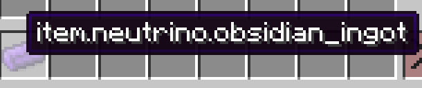
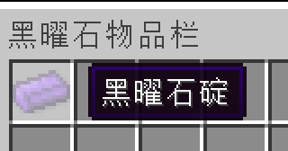

# 语言文件与本地化

在这一节中，我们将学习如何给我的物品添加名称。

在前面的章节，我们创建的物品的名字看上去是一串没有意义的字符，在这一节中我们将给他们加上一个有意义的名字。

在Minecraft中，文件的名字是以语言文件的形式提供的，在1.15的版本，语言文件是个json文件，它大概内容如下:

```json
{
  "language.name": "English",
  "language.region": "United States",
  "language.code": "en_us",
  "narrator.button.accessibility": "Accessibility",
  "narrator.button.language": "Language"
}
```

可以看见一个语言文件其实就是一个「键值对」，其中的「键」是一个游戏中的编号，其中的「值」就是具体的翻译。这么做的原因是Minecraft要支持非常多国家和地区的语言，各个语言如果直接硬编码进游戏里显然是不具备可维护性的。在默认情况下，如果你没有给在游戏中给需要翻译的对象添加相对应的翻译，那么它默认显示的就是这个翻译的「键」。

以我们的黑曜石碇举例:

 

目前我们还没有为它添加名字，它所显示的`item.neutrino.obsidian_ingot`就是默认的键值。当然大家也可以自定义键值，Item类里有相对应的方法可以实现这点，正如我之前所说的，在Minecraft源代码里和通过函数名猜测功能是Mod开发必备的能力，所以这里相当于一个小测试，请大家自己寻找可以修改这个键的办法。

但是在有些时候，游戏无法默认地给我的内容自动添加键，这时我们就得自己创建一个键，Minecraft提供了一个叫做`I18n.format`的方法让我自己创建，具体的使用方式，我们之后会讲到。

接下来让我创建语言文件吧。

首先在`neutrino`文件夹下创建一个叫做`lang`的文件夹，创建成功后目录树如下:

```
resources
├── META-INF
│   └── mods.toml
├── assets
│   └── neutrino
│       ├── lang
│       ├── models
│       │   └── item
│       │       ├── obsidian_apple.json
│       │       ├── obsidian_ingot.json
│       │       └── obsidian_sword.json
│       └── textures
│           └── item
│               ├── obsidian_apple.png
│               ├── obsidian_ingot.png
│               └── obsidian_sword.png
└── pack.mcmeta
```

这里我们以简体中文举例举例。

首先创建一个叫做`zh_cn.json`的文件，内容如下。

```json
{
  "item.neutrino.obsidian_ingot": "黑曜石锭",
  "item.neutrino.obsidian_apple":"黑曜石苹果",
  "item.neutrino.obsidian_sword":"黑曜石剑",
  "itemGroup.obsidian_group": "黑曜石物品栏"
}
```

然后启动游戏，调成简体中文，你应该就可以看见我们的物品有了翻译。

作为一个简体中文的使用者，你的mod里至少应该有`zh_cn.json`，`en_us.json`和`zh_tw.json`这三个语言文件，所有可用的语言文件列表请在Wiki的[语言#可用语言](https://minecraft-zh.gamepedia.com/index.php?title=语言&variant=zh#可用语言)内查看。