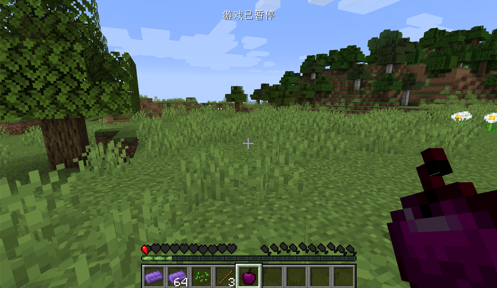

# 食物

在这一节中我们将会在Minecraft世界中添加一个新的食物：黑曜石苹果，吃了这个苹果以后你可以回复饥饿，但是会中毒。和很多人想象的不一样，食物并不是单独的一个东西，对于Minecraft来说，食物只是一种特殊的物品而已。

同样的我们先来创建一个类，让这个类继承`Item`

```java
public class ObsidianApple extends Item {
    private static EffectInstance effectInstance = new EffectInstance(Effects.POISON, 3 * 20, 1);
    private static Food food = (new Food.Builder())
            .saturation(10)
            .hunger(20)
            .effect(effectInstance, 1)
            .build();

    public ObsidianApple() {
        super(new Properties().food(food).group(ItemGroup.FOOD));
    }
}

```

我们一行一行的解释。

首先我们创建了一个`EffectInstance`，什么是`EffectInstance`？`EffectInstance`正如他名字暗示的那样是一个药水效果的实例。我们先来思考一下，原版的在玩家身上的药水效果都有哪些属性：效果的种类、时间以及药水等级。而`EffectInstance`就是这三种属性的一个集合。从`new EffectInstance(Effects.POISON, 3 * 20, 1)`之中可以看到我们填入的三种属性分别是：原版的中毒药水效果（原版所有的药水效果都在`Effects`类内）、持续时间是`3*20`tick，药水等级为`1`。

接下来我们创建了一个`Food`类型的变量，这个变量规定了这个这个食物的一些属性，比如：`saturation`方法设置了饱食度，`hunger`设置了回复的饥饿度，`effect`方法设置了吃食物时可能会有的药水效果，其中第二个参数代表触发效果的可能性（想想原版的生鸡肉），这里我们设置成`1`代表100%触发。这里其实用到称为「建造者模式」的设计模式，有兴趣的同学可以自己查阅。

接下去就是构造方法，想必大家已经很熟悉了，唯一新的一点就是`.food(food)`，这个方法表明了物品是一个食物，最后我们把这个物品放在了「食物」创造模式物品栏里。

然后我们注册我们的食物，注册名是`obsidian_apple`:

```java
public static RegistryObject<Item> obsidianApple = ITEMS.register("obsidian_apple", () -> {
        return new ObsidianApple();
});
```

然后添加模型`obsdian_ingot.json`:

```json
{
  "parent": "item/generated",
  "textures": {
    "layer0": "neutrino:item/obsidian_apple"
  }
}
```

然后是材质`obsidian_apple.png`


拿出你的苹果试着吃吃看吧。



[源代码](https://github.com/FledgeXu/NeutrinoSourceCode/tree/master/src/main/java/com/tutorial/neutrino/food)

