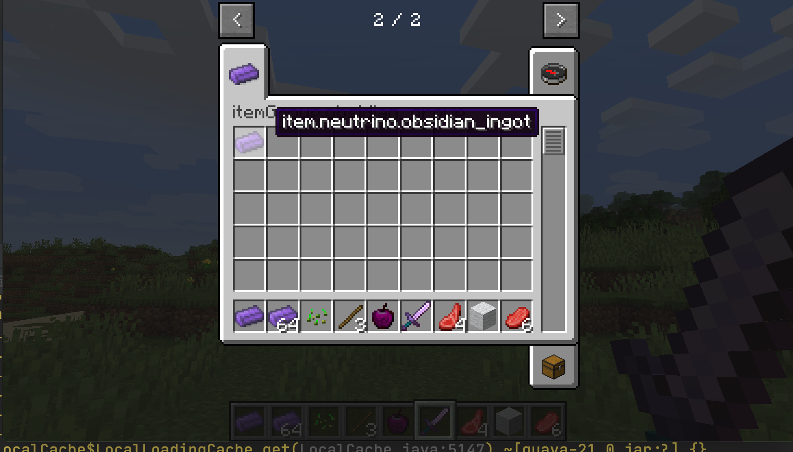

# 自定义创造模式物品栏

在这一节中，我们将研究如何创建一个属于自己的创造模式物品栏，非常简单。

首先创建一个类，让它继承`ItemGroup`，`ItemGroup`代表的就是创造模式物品栏，因为我们需要创建一个属于自己的创造模式物品栏，自然需要继承它。

内容如下:

```java
public class ObsidianGroup extends ItemGroup {
    public ObsidianGroup() {
        super("obsidian_group");
    }

    @Override
    public ItemStack createIcon() {
        return new ItemStack(ItemRegistry.obsidianIngot.get());
    }
}
```

第一个方法用于设置创造模式物品栏的标题名，第二个提供了创造模式物品栏的图标，这里我们用了黑曜石碇作为图标，请注意这个函数的返回值类型是`ItemStack`，而不是`Item`。

然后我们需要在实例化这个类，创建`ModGroup`

```java
public class ModGroup {
    public static ItemGroup itemGroup = new ObsidianGroup();
}
```

在这里我们用来存放`ItemGroup`以及它的子类（比如我们之前创建好`ObsidianGroup`）的实例，这里的每一个实例都代表了游戏中的一个标签栏。

创建完成以后想要调用这个物品栏也非常简单，我们以黑曜石碇举例。

```java
public class ObsidianIngot extends Item {
    public ObsidianIngot() {
        super(new Properties().group(ModGroup.itemGroup));
    }
}
```

此时打开游戏我们的黑曜石碇应该就在指定的物品栏里了。



[源代码](https://github.com/FledgeXu/NeutrinoSourceCode/tree/master/src/main/java/com/tutorial/neutrino/group)

## 编程小课堂

如果在编程中遇见了自己不会的事情，第一件事不应该是想着问别人，而是上网搜索，你遇见的绝大部问题别人都已经遇见过了，如果你没有搜索就问别人，是在同时浪费你自己和别人的时间。