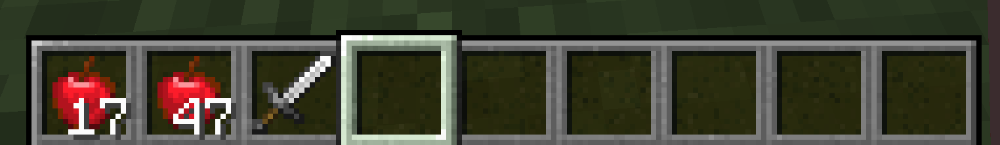

# Item和ItemStack
在这里，我想讲一下Item和ItemStack的区分。我们先从ItemStack开始一步一步思考为什么它们需要区分开。

ItemStack顾名思义就是「物品堆」。实际上在游戏中，所有物品槽里放着的物品都是单独的ItemStack。

比如在这种情况下，就有三个ItemStack。

但是这就引出了一个问题，虽然一组苹果和第二组苹果数量不同，但是这个数量其实并不影响他们的实际表现。它们同样可以被吃，吃了以后回复的效果也是相同的。

于是这些相当于「属性」或者「默认行为」是相同的，这些相同的就应该被抽出来，这就是Item。

还是以上图举例，这里就只有两种Item：苹果和铁剑。

你可以想象ItemStack就是Item的一个包装，它比起Item额外提供了数量，NBT标签等属性。

这里值得注意的是，ItemStack的数量为0，虽然代表是空了，这不代表它就变成null了，所以在你必须得用ItemStack下的`isEmpty()`方法来判断是否为空。

ItemStack中所包含的Item其实是同一个实例，原因非常简单，如果不是同一个实例，会无谓地产生非常多相同的实例，处于优化的考虑，当然是共用一个实例合适，这同时意味着你可通过`result.getItem() == Items.AIR`来判断ItemStack存放了哪一个Item。

至于更加详细的解释，[harbinger](https://harbinger.covertdragon.team/chapter-04/item-stack.html)已经写的很清楚了。

