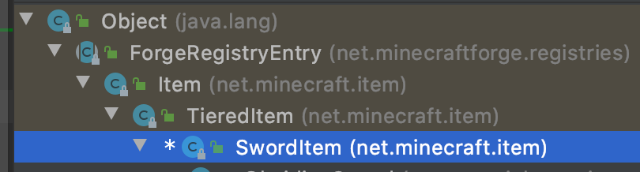
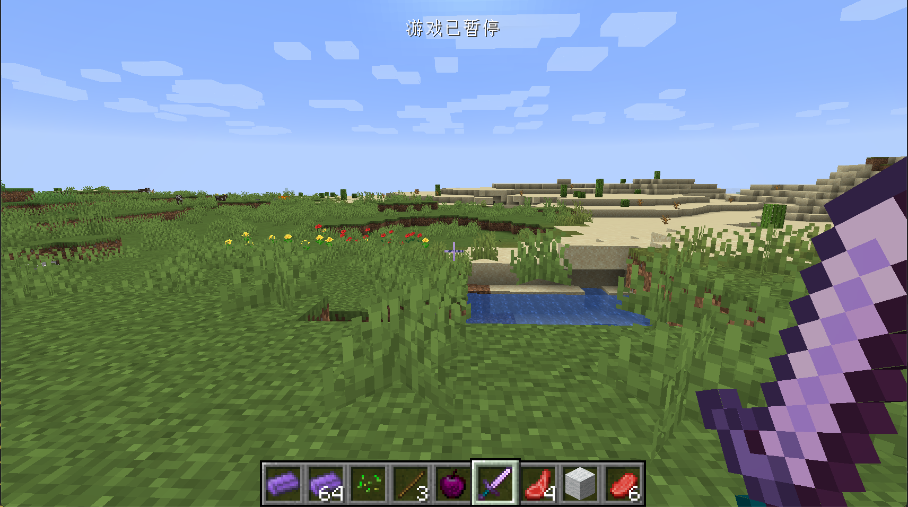

# 近战武器

在这一节中，我们将讲解如何创建一个新的剑，这里我们以黑曜石剑举例。

同样的，我们先创建一个`ObsidianSword`，但是这次的继承的类有些不一样，这次我们直接继承原版的`SwordItem`类，如果你查看继承关系图，你就可以发现，`SwordItem`是`Item`的子类。



内容如下:

```java
public class ObsidianSword extends SwordItem {
    private static IItemTier iItemTier = new IItemTier() {
        @Override
        public int getMaxUses() {
            return 2000;
        }

        @Override
        public float getEfficiency() {
            return 10.0F;
        }

        @Override
        public float getAttackDamage() {
            return 4.0F;
        }

        @Override
        public int getHarvestLevel() {
            return 3;
        }

        @Override
        public int getEnchantability() {
            return 30;
        }

        @Override
        public Ingredient getRepairMaterial() {
            return Ingredient.fromItems(ItemRegistry.obsidianIngot.get());
        }
    };

    public ObsidianSword() {
        super(iItemTier, 3, -2.4F, new Item.Properties().group(ItemGroup.COMBAT));
    }
}
```

同样的，这个内容看上去非常地多，但其实并没有你想象得那么复杂。

首先我们实现一个`IItemTier`接口的匿名内部类。首先什么是`IItemTier`呢？Tier的英文意思是「层、等级」，你可以把`IItemTier`理解成一种材质，比如钻石剑、钻石镐都是钻石做的，同样的，铁剑、铁镐都是铁做的。

那么为什么要自己实现这个匿名内部类呢？原因是原版的`net.minecraft.item.IItemTier`是用enum实现的，我们没法自己向里面添加内容，所以只能自己实现了，原版的所有属性也都在这个类里，大家可以参考。至于这个匿名内部类里的各种方法，我在这里就不多加解释了，有了之前几个物品的经验，相信读者阅读到这里时已经有了通过函数名猜测函数功能的能力了。关于构造函数里的`3`和`-2.4F`的作用也请读者参考原版物品的实现（原版所有物品的实例都写在`net.minecraft.item.Items`类中）猜测功能。

接下去注册物品

```java
public static RegistryObject<Item> obsidianSword = ITEMS.register("obsidian_sword", () -> {
  return new ObsidianSword();
});
```

添加模型文件：

```json
{
  "parent": "item/generated",
  "textures": {
    "layer0": "neutrino:item/obsidian_sword"
  }
}
```

以及材质


创建完成之后打开游戏看看吧。



[源代码地址](https://github.com/FledgeXu/NeutrinoSourceCode/tree/master/src/main/java/com/tutorial/neutrino/melee_weapons)

## 开发小课堂

在开发的过程中你得熟练使用开发工具，在这里我们的工具是IntelliJ IDEA。有两个快捷键对于理解代码有非常大的帮助。第一个快捷键是`Ctrl+N(Windows)`，这个快捷键可以让你搜索指定的类，这样你就可寻找原版类里在哪里，有什么内容了。另一个快捷键就是`Ctrl+H`当你把鼠标指针放在一个类上时，按下这个快捷键，会在右侧显示这个类的继承关系，也可查看某个接口的具体实现，大家可以自己上网搜索IDEA常用快捷键学习使用。

另外一个技巧是，当你看到某个方法，想要知道这个方法在哪里调用时，可以右键然后点击`Find Usages（查找使用）`，你就可以看见所有调用这个方法的代码了。

还有如果你想查看某个类的源代码，只需要按住`Ctrl`键，点击那个类就可以进入到那个类内部查看它的源代码。