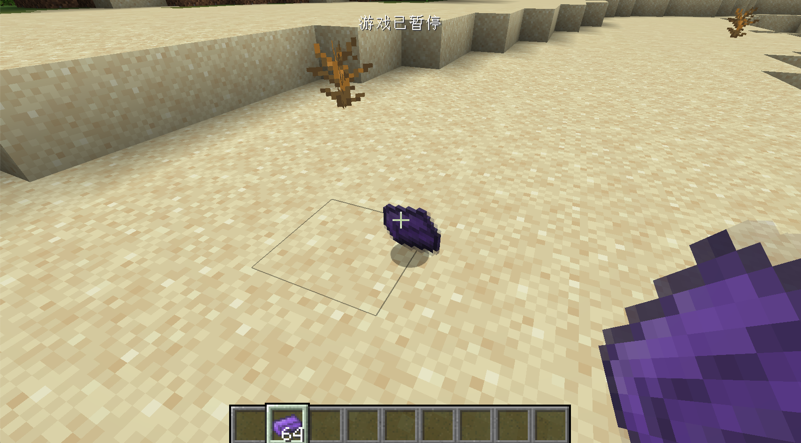

# 物品材质与模型

在上一节中我们已经成功添加了第一个物品，当然那个物品还很丑，在这一节中我们将会为它添加模型和材质。

首先按照如下目录在`resources`下创建文件夹。

```
resources
├── META-INF
│   └── mods.toml
├── assets
│   └── neutrino
│       ├── models
│       │   └── item
│       └── textures
│           └── item
└── pack.mcmeta
```

其实`assets`下就是一个属于Mod的材质包，具体的目录结构等，读者可以自行寻找当前游戏版本的材质包制作教程学习。

接下来我们来添加模型文件，首先在在`models`下的`item`里，创建一个和你添加的物品，有着相同注册名的json文件，在我们的例子里就是`obsidian_ingot.json`。

内容如下:

```json
{
  "parent": "item/generated",
  "textures": {
    "layer0": "neutrino:item/obsidian_ingot"
  }
}
```

这里的内容非常简单：`"parent": "item/generated”`指定了这个模型的「父模型」是什么，而`"layer0": "neutrino:item/obsidian_ingot”`指定了具体的材质。`neutrino:`代表这个是在我们自己的`assets`文件下，`item/obsidian_ingot`代表了是`textures/item/obsidian_ingot.png`这张图片。

模型文件的详细格式大家可以自行阅读[Wiki]([https://minecraft-zh.gamepedia.com/index.php?title=%E6%A8%A1%E5%9E%8B&variant=zh](https://minecraft-zh.gamepedia.com/index.php?title=模型&variant=zh))。

接下来我们在`textures/item/obsidian_ingot.png`下放入我们制作好的材质文件，请注意材质文件的比例是1:1，并且最好不要大于32x32像素。


**这里的加载流程是：游戏先根据的你注册名获取相对应的模型文件，然后通过模型文件中的`textures`加载对应的材质文件。**

创建完成的目录树如下：

```
resources
├── META-INF
│   └── mods.toml
├── assets
│   └── neutrino
│       ├── models
│       │   └── item
│       │       └── obsidian_ingot.json
│       └── textures
│           └── item
│               └── obsidian_ingot.png
└── pack.mcmeta

```

启动游戏之后你就可以看见我们有了模型和材质的物品了。



## 开发小课堂

一个方便的工具用来制作方块和物品等模型：[BlockBench](https://blockbench.net/)。