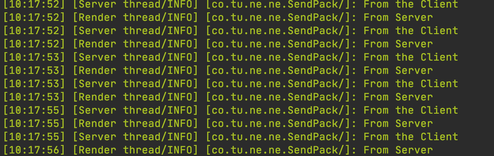

# 自定义网络包

在这节中我们将要来学习如何自定义数据包。在之前的内容中我们已经讲过了如何利用Minecraft原版内置的功能来实现数据的同步，但是这些功能或多或少都有限制。在某些时候我们不得不自己来解决数据同步，在这时我们就得使用自定义数据包了。幸运的是Forge已经提供给我了一个类让我们能够简单而且方便的自定义数据包，这个类就是`SimpleChannel`，我们将来学习如何使用它。

这一节的内容可能有些无聊，因为我们作出的物品并不能在游戏中产生实际的效果，但是这不代表的这节的内容不重要，让我们开始吧。

首先我们讲一下发包的过程，具体过程如下:

```
构建数据包=>序列化成字节流 ====通过本地、局域网传输或者因特网传输===> 反序列化成实例 => 实现操作
```

在这个过程中，前两项是在你的要发包的端执行的，后两项是在你要接受包的端执行的。

无论你是想从客户端往服务端发包，还是从服务端往数据端发包，你首先要做的第一件事就是，构建数据包，这个数据包就是你要发送的具体消息。接下来是序列化成字节流，因为在网络中所有的数据都是以字节流的形式传输的，你的数据包也不例外，而又因为数据包的内容是你自己定义的，你得自己实现序列化操作。

接下来数据流已经传输到了接受包的一端，你在接受时，接受的同样也是字节流，你需要从字节流中获取数据恢复数据，重建你的数据包。让你的数据包恢复成功，接下来你就可以利用这些数据来执行操作了。

在Mod开发里，所有的数据包都是通过`SimpleChannel`管理的，正如这个名字暗示的那样，我们构建的数据包将通过一个个自定义的「Channle（频道」传输。

接下了我们来创建数据包`Networking`:

```java
public class Networking {
    public static SimpleChannel INSTANCE;
    private static int ID = 0;

    public static int nextID() {
        return ID++;
    }

    public static void registerMessage() {
        INSTANCE = NetworkRegistry.newSimpleChannel(
                new ResourceLocation("neutrino" + ":first_networking"),
                () -> {
                    return "1.0";
                },
                (s) -> {
                    return true;
                },
                (s) -> {
                    return true;
                });
        INSTANCE.registerMessage(
                nextID(),
                SendPack.class,
                (pack, buffer) -> {
                    pack.toBytes(buffer);
                },
                (buffer) -> {
                    return new SendPack(buffer);
                },
                (pack,ctx) ->{
                    pack.handler(ctx);
                }
        );
    }
}
```


```java
INSTANCE = NetworkRegistry.newSimpleChannel(
  new ResourceLocation("neutrino" + ":first_networking"),
  () -> {
    return "1.0";
  },
  (s) -> {
    return true;
  },
  (s) -> {
    return true;
  });
```

首先我们创建了一个SimpleChannel的实例，这个实例就是我们之后发包时需要操作的对象。

他有如下几个参数，第一参数`ResourceLocation`时这个`SimpleChannle`的唯一表示符，因为一个mod里可以有许多个传送数据用的`SimplieChannle`，所以需要这个标识符。第二个参数是个闭包，第三、四个参数是用来控制能否向服务端，或者向客户传输数据的，这里我们需要向两端传输数据，所以返回值都是`true`。如上我们的频道就已经构建完成了。

接下来我们来注册数据包。

```java
INSTANCE.registerMessage(
  nextID(),
  SendPack.class,
  (pack, buffer) -> {
    pack.toBytes(buffer);
  },
  (buffer) -> {
    return new SendPack(buffer);
  },
  (pack,ctx) ->{
    pack.handler(ctx);
  }
);
```

这个注册方法有5个参数，我们一一来说名，第一个参数是数据包的序号，这个数据序号不能重复，所以我们写了一个自增的函数来提供序号。第二个是一个类，这个类就是我们要自定义数据包的类，第三个参数是用来让我们序列化（把数据包实例转换成字节流）我们的数据包，这里我们不需要返回任何值，其中的pack参数就是我们第二个参数中提供的类的一个实例。第四个参数是用来反序列化数据包的（从字节流构建数据包实例），这里的我们直接调用了一个特殊的构造方法，然后返回了实例。最后一个参数是用来当接受到数据进行一系列操作的，这里的ctx是用来进行线程安全操作用的，至于是什么我们之后再讲。

当然想上面那样写实在过于麻烦，其实你可以省略成下面的形式。

```java
public class Networking {
    public static SimpleChannel INSTANCE;
    private static int ID = 0;

    public static int nextID() {
        return ID++;
    }

    public static void registerMessage() {
        INSTANCE = NetworkRegistry.newSimpleChannel(
                new ResourceLocation("neutrino" + ":first_networking"),
                () -> "1.0",
                (s) -> true,
                (s) -> true
        );
        INSTANCE.registerMessage(
                nextID(),
                SendPack.class,
                SendPack::toBytes,
                SendPack::new,
                SendPack::handler
        );
    }
}
```

但是为了读者的理解方便，我还是保留上面的形式。

接下来就是我们自定义的数据包了`SendPack.java`:

```java
public class SendPack {
    private String message;
    private static final Logger LOGGER = LogManager.getLogger();

    public SendPack(PacketBuffer buffer) {
        message = buffer.readString();
    }

    public SendPack(String message) {
        this.message = message;
    }

    public void toBytes(PacketBuffer buf) {
        buf.writeString(this.message);
    }

    public void handler(Supplier<NetworkEvent.Context> ctx) {
        ctx.get().enqueueWork(() -> {
            LOGGER.info(this.message);
        });
        ctx.get().setPacketHandled(true);
    }
}

```

首先`toBytes`和`SendPack(PacketBuffer buffer)`这个构造构造函数是刚好是一对相反的方法，它们的作用我们之前已经提及就不加赘述了。值得一说的是`PacketBuffer`下面提供了非常多方便的函数来序列化基本类型，以及在有多个变量序列化时，你得保证这两个函数中调用这些变量的顺序是相同的。

然后就是`handler`方法，这个方法作用就是在接收端接收到数据以后，如何使用这些数据。请注意，这里的执行操作你必须放在`  ctx.get().enqueueWork`这个方法内，以闭包的形式执行。并且在执行完成后需要加上`ctx.get().setPacketHandled(true);`表示执行成功。之所以这么做的原因是，接受网络数据处在一个独立的进程中，所以网络包的执行需要等待时机，在线程安全的情况下执行。在这里我们只是简单的创建了一个Logger然后调用这个Logger输出了内容。

最后还剩下的构造方法是是用来构建发送数据用的。

当然光创建了Channel和网络数据包还不够，我们在游戏启动时创建它。

`CommonEventHandler.java`:

```java
@Mod.EventBusSubscriber(bus = Mod.EventBusSubscriber.Bus.MOD)
public class CommonEventHandler {
    @SubscribeEvent
    public static void onCommonSetup(FMLCommonSetupEvent event) {
        Networking.registerMessage();
    }
}
```

你需要在`Mod`总线中的`FMLCommonSetupEvent`这个生命周期方法中创建你的Channel。

接下来看一个实例，如何从客户端向服务端发送数据，以及从服务端向客户端发送数据。

`ObsidianMessage`:

```java
public class ObsidianMessage extends Item {
    public ObsidianMessage() {
        super(new Properties().group(ModGroup.itemGroup));
    }

    @Override
    public ActionResult<ItemStack> onItemRightClick(World worldIn, PlayerEntity playerIn, Hand handIn) {
        if (worldIn.isRemote) {
            Networking.INSTANCE.sendToServer(new SendPack("From the Client"));
        }
        if (!worldIn.isRemote) {
            Networking.INSTANCE.send(
                    PacketDistributor.PLAYER.with(
                            () -> {
                                return (ServerPlayerEntity) playerIn;
                            }
                    ),
                    new SendPack("From Server"));
        }
        return super.onItemRightClick(worldIn, playerIn, handIn);
    }
}
```

可以看到这里重要的是`onItemRightClick`方法。

在这个方法里，主要分成了服务端和客户端两个逻辑。

在服务端逻辑里非常简单我们通过`Networking.INSTANCE.sendToServer`方法向服务端发送了数据，其中`new SendPack("From the Client”)`就是数据包的具体内容。

在服务端里稍微有些复杂，因为一个服务端有可能有多个客户端链接，所以你必须要明确你需要向哪一个客户端发送消息。

```java
PacketDistributor.PLAYER.with(
  () -> {
    return (ServerPlayerEntity) playerIn;
  }
)
```

作用正是这个，我们确定了要向右击了这个物品的玩家发送消息。`PacketDistributor`类下除了有`PLAYER`这个类型还有很多其他的发送数据的方式，大家可自行探索。

打开游戏，右击物品，你应该就能看见客户端和服务端接收到对方的消息了。



注：「Server Thread」是服务端，「Render Thread」是客户端。

[源代码](https://github.com/FledgeXu/NeutrinoSourceCode/tree/master/src/main/java/com/tutorial/neutrino/network)

## 编程小课堂

在任何开始接触一个你不属性的编程项目，你要做的第一件事永远是通读这个项目的文档（如果有的话），对于我们来说就是[Forge的文档](http://mcforge.readthedocs.io/en/latest/)，介于读者可能看不懂英文文档Forge文档也有中文翻译的，请自行搜索。