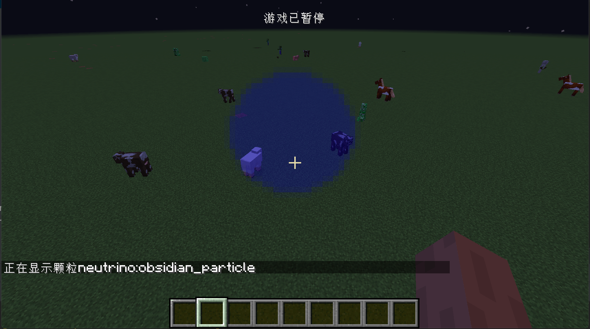

# 粒子效果

在这节中我们将要来创建一个新的例子效果。

首先我们来创建例子效果类。

```java
public class ObsidianParticle extends SpriteTexturedParticle {
    protected ObsidianParticle(World world, double x, double y, double z, Vec3d speed, Color color, float diameter) {
        super(world, x, y, z, speed.x, speed.y, speed.z);
        maxAge = 100;
        motionX = speed.x;
        motionY = speed.y;
        motionZ = speed.z;
        setColor(color.getRed() / 255F, color.getGreen() / 255F, color.getBlue() / 255F);
        this.setAlphaF(color.getAlpha());
        final float PARTICLE_SCALE_FOR_ONE_METRE = 0.5F;
        particleScale = PARTICLE_SCALE_FOR_ONE_METRE * diameter;
        this.canCollide = true;
    }

    @Override
    public IParticleRenderType getRenderType() {
        return IParticleRenderType.PARTICLE_SHEET_TRANSLUCENT;
    }
}
```

可以看到，这里我们继承了`SpriteTexturedParticle`，虽然粒子效果的基类是`Particle`但是，在绝大部分时候你需要继承的都是`SpriteTexturedParticle`。这个类的意思是将使用一张材质作为粒子效果的显示。

```java
motionX = speed.x;
motionY = speed.y;
motionZ = speed.z;
```

在这里我们设置的粒子效果的运动速度，在默认情况下`TexturedParticle`类的构造方法会随机给进行随机人扰动，在这里我们不希望有这个随机的扰动，所以手动设置的了速度。

```java
setColor(color.getRed() / 255F, color.getGreen() / 255F, color.getBlue() / 255F);
this.setAlphaF(color.getAlpha());
```

这两行则是设置了颜色和透明度

```java
final float PARTICLE_SCALE_FOR_ONE_METRE = 0.5F;
particleScale = PARTICLE_SCALE_FOR_ONE_METRE * diameter;
```

这里我们设置了粒子效果的大小。

```java
this.canCollide = true;
```

这里我们设置了粒子效果可以被碰撞。

```java
@Override
public IParticleRenderType getRenderType() {
  return IParticleRenderType.PARTICLE_SHEET_TRANSLUCENT;
}
```

这里我们设置了粒子效果是以半透明的方式渲染。

可以看见，创建一个例子效果需要非常多的数据，Minecraft额外提供了一个接口用来，存放和处理这些创建例子效果的数据,这个接口就是`IParticleData`。

另外，这里在这个类中，我们还初始化里一个`IDeserializer<ObsidianParticleData>`这里的两个方法是用来解析`/particle`这里命令行的参数用的，具体的方式，代码非常的好懂，这里就不多说了。

```java
public class ObsidianParticleData implements IParticleData {
    private Vec3d speed;
    private Color color;
    private float diameter;
    public static final IDeserializer<ObsidianParticleData> DESERIALIZER = new IDeserializer<ObsidianParticleData>() {

        @Override
        public ObsidianParticleData deserialize(ParticleType<ObsidianParticleData> particleTypeIn, StringReader reader) throws CommandSyntaxException {
            final int MIN_COLOUR = 0;
            final int MAX_COLOUR = 255;
            reader.expect(' ');
            double speedX = reader.readDouble();
            reader.expect(' ');
            double speedY = reader.readDouble();
            reader.expect(' ');
            double speedZ = reader.readDouble();
            reader.expect(' ');
            int red = MathHelper.clamp(reader.readInt(), MIN_COLOUR, MAX_COLOUR);
            reader.expect(' ');
            int green = MathHelper.clamp(reader.readInt(), MIN_COLOUR, MAX_COLOUR);
            reader.expect(' ');
            int blue = MathHelper.clamp(reader.readInt(), MIN_COLOUR, MAX_COLOUR);
            reader.expect(' ');
            int alpha = MathHelper.clamp(reader.readInt(), 1, MAX_COLOUR);
            reader.expect(' ');
            float diameter = reader.readFloat();
            return new ObsidianParticleData(new Vec3d(speedX, speedY, speedZ), new Color(red, green, blue, alpha), diameter);
        }

        @Override
        public ObsidianParticleData read(ParticleType<ObsidianParticleData> particleTypeIn, PacketBuffer buffer) {
            final int MIN_COLOUR = 0;
            final int MAX_COLOUR = 255;
            double speedX = buffer.readDouble();
            double speedY = buffer.readDouble();
            double speedZ = buffer.readDouble();
            int red = MathHelper.clamp(buffer.readInt(), MIN_COLOUR, MAX_COLOUR);
            int green = MathHelper.clamp(buffer.readInt(), MIN_COLOUR, MAX_COLOUR);
            int blue = MathHelper.clamp(buffer.readInt(), MIN_COLOUR, MAX_COLOUR);
            int alpha = MathHelper.clamp(buffer.readInt(), 1, MAX_COLOUR);
            float diameter = buffer.readFloat();
            return new ObsidianParticleData(new Vec3d(speedX, speedY, speedZ), new Color(red, green, blue, alpha), diameter);
        }
    };

    public ObsidianParticleData(Vec3d speed, Color color, float diameter) {
        this.speed = speed;
        this.color = color;
        this.diameter = diameter;
    }

    @Override
    public ParticleType<?> getType() {
        return ParticleRegistry.obsidianParticle.get();
    }

    @Override
    public void write(PacketBuffer buffer) {
        buffer.writeDouble(this.speed.x);
        buffer.writeDouble(this.speed.y);
        buffer.writeDouble(this.speed.z);
        buffer.writeInt(this.color.getRed());
        buffer.writeInt(this.color.getGreen());
        buffer.writeInt(this.color.getBlue());
        buffer.writeInt(this.color.getAlpha());
        buffer.writeFloat(this.diameter);
    }

    @Override
    public String getParameters() {
        return String.format(Locale.ROOT, "%s %.2f %i %i %i %i %.2d %.2d %.2d",
                this.getType().getRegistryName(), diameter, color.getRed(), color.getGreen(), color.getBlue(), color.getAlpha(), speed.getX(), speed.getY(), speed.getZ());
    }

    public Vec3d getSpeed() {
        return speed;
    }

    public Color getColor() {
        return color;
    }

    public float getDiameter() {
        return diameter;
    }
}
```

结下来，我们需要一个`ParticleType`

```java
public class ObsidianParticleType extends ParticleType<ObsidianParticleData> {
    public ObsidianParticleType() {
        super(false, ObsidianParticleData.DESERIALIZER);
    }
}
```

第一参数是用来控制粒子效果在视角看不到的时候会不会渲染，这里我们选择不渲染。第二个参数就是我们的命令行解析器。

然后让我们来注册它。

```java
public class ParticleRegistry {
    public static final DeferredRegister<ParticleType<?>> PARTICLE_TYPES = new DeferredRegister<>(ForgeRegistries.PARTICLE_TYPES, "neutrino");
    public static RegistryObject<ParticleType<ObsidianParticleData>> obsidianParticle = PARTICLE_TYPES.register("obsidian_particle", () -> {
        return new ObsidianParticleType();
    });
}
```

我命还需要一个`IParticleFactory`，用来在客户端显示创建我们的例子效果。

```java
public class ObsidianParticleFactory implements IParticleFactory<ObsidianParticleData> {
    private final IAnimatedSprite sprites;

    public ObsidianParticleFactory(IAnimatedSprite sprite) {
        this.sprites = sprite;
    }

    @Nullable
    @Override
    public Particle makeParticle(ObsidianParticleData typeIn, World worldIn, double x, double y, double z, double xSpeed, double ySpeed, double zSpeed) {
        ObsidianParticle particle = new ObsidianParticle(worldIn, x, y, z, typeIn.getSpeed(), typeIn.getColor(), typeIn.getDiameter());
        particle.selectSpriteRandomly(sprites);
        return particle;
    }
}
```

这里的`makeParticle`就是通过`IParticleData`的数据创建例子效果的地方。

```java
particle.selectSpriteRandomly(sprites);
```

这句话的意思是随机加载我们例子效果`json`文件里的一个材质。

同样的，这个也需要注册，别忘了`value = Dist.CLIENT`。

```java
@Mod.EventBusSubscriber(bus = Mod.EventBusSubscriber.Bus.MOD, value = Dist.CLIENT)
public class ParticleFactoryRegistry {

    @SubscribeEvent
    public static void onParticleFactoryRegistration(ParticleFactoryRegisterEvent event) {
        Minecraft.getInstance().particles.registerFactory(ParticleRegistry.obsidianParticle.get(), (sprite) -> {
            return new ObsidianParticleFactory(sprite);
        });
    }
}
```

接下来我们需要创建为我们粒子效果指定材质，请注意，如果你没有指定材质，游戏是无法启动的。

```java
.
├── META-INF
│   └── mods.toml
├── assets
│   └── neutrino
│       ├── blockstates
│       ├── lang
│       ├── models
│       ├── particles
│       │   └── obsidian_particle.json
│       ├── sounds
│       ├── sounds.json
│       └── textures
│           ├── block
│           ├── entity
│           ├── gui
│           ├── item
│           └── particle
│               └── obsidian_particle.png
├── data
└── pack.mcmeta
```

像如上的目录创建`particles`文件夹，和`textures/particle`文件夹。

然后在`particles`文件里创建和你注册名相同的json文件，里面内容如下:

```json
{
  "textures": [
    "neutrino:obsidian_particle"
  ]
}
```

这里我们指定里粒子效果的材质。

然后在`textures/particle`下添加我们的材质。

启动游戏，输入如下命令，就可以生成我们的粒子效果了。

```
/particle neutrino:obsidian_particle 0 0 0 0 0 255 100 3
```



[源代码](https://github.com/FledgeXu/NeutrinoSourceCode/tree/master/src/main/java/com/tutorial/neutrino/particle)