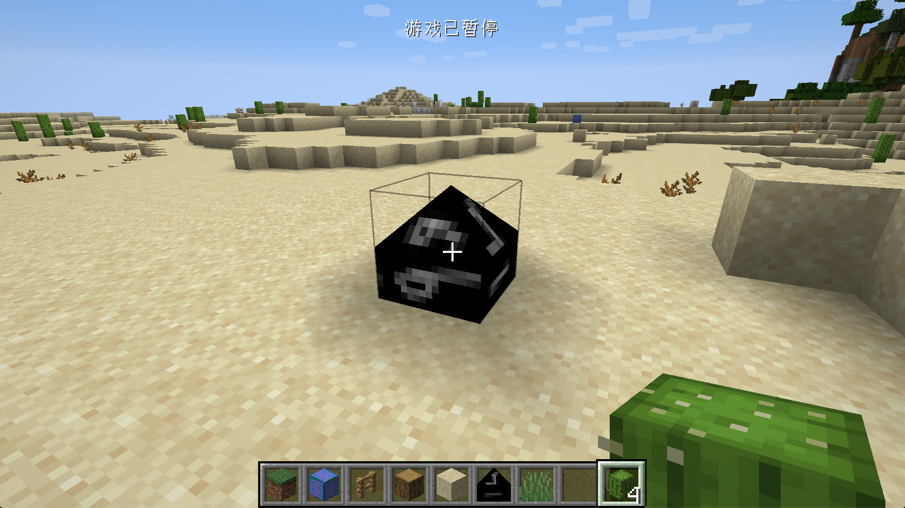
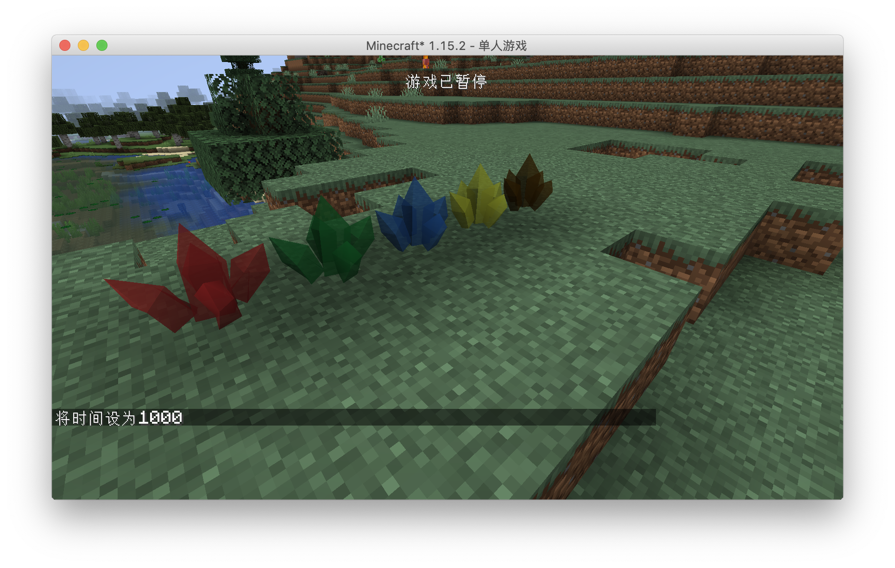
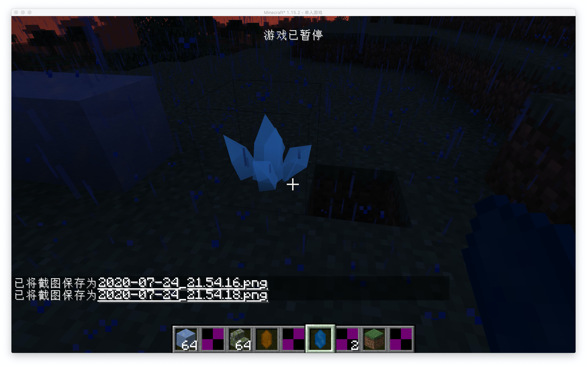

# OBJ 模型

在这一节我我们将学习如何给方块添加OBJ物品模型，在开始添加OBJ模型之前强烈建议读者先阅读关于OBJ和MTL文件格式的定义以及相关名词的意义，这里有个简短的[说明](https://segmentfault.com/a/1190000021126476)

首先创建我们的方块`ObsidianOBJ.java`：

```java
public class ObsidianOBJ extends Block {
    public ObsidianOBJ() {
        super(Properties.create(Material.ROCK).hardnessAndResistance(5).notSolid());
    }
}
```

和之前创建的方法一致，因为我们创建的模型并不是实心的，所以加上了`notSolid`方法。

方块注册:

```java
public static RegistryObject<Block> obsidanObj = BLOCKS.register("obsidian_obj", () -> {
  return new ObsidianOBJ();
});
```

物品注册：

```java
public static RegistryObject<Item> obsidianObj = ITEMS.register("obsidian_obj", () -> {
  return new BlockItem(BlockRegistry.obsidanObj.get(), new Item.Properties().group(ModGroup.itemGroup));
});
```

方块状态文件`obsidian_obj.json`

```json
{
  "variants": {
    "": { "model": "neutrino:block/obsidian_obj" }
  }
}
```

模型的Json模型文件`obsidian_obj.json`

```json
{
  "loader": "forge:obj",
  "model": "neutrino:models/block/obsidian_obj.obj",
  "flip-v": true
}
```

可以看到，从这里开始就有些特殊了，首先我们用`loader`指定了我们要加载的模型是`obj`格式的，然后在`model`里具体指定了我们的OBJ模型，最后将`flip-v`设置成为`true`，这么做的原因是minecraft里的材质和你在blender等工具里的材质是上下颠倒的，所以你得手动翻转你的材质。

接下来是OBJ模型`obsidian_obj.obj`，这里只标注需要修改的地方：

```
mtllib obsidian_obj.mtl
```

你必须在这里指明你要使用的mtl文件的名字。

接下来是mtl文件``obsidian_obj.mtl`，同样的我在这里只标注需要修改的地方。

```
map_Kd neutrino:block/obsidian_obj
```

你必须这样的方式来指定你模型文件的材质。

你可在这里获取[OBJ文件](obj.assets/obsidian_obj.obj)和[mtl文件](obj.assets/obsidian_obj.mtl)。

最后是我们的材质`obsidian_obj.png`:




可以看到我们我们的OBJ模型已经成功加载出来了。当然我们在这里还没有设置正确的碰撞箱，这就交给读者自己实现了。

物品同样也是可以使用OBJ模型的，请读者自行探索。

[源代码](https://github.com/FledgeXu/NeutrinoSourceCode/tree/master/src/main/java/com/tutorial/neutrino/obj)

---

**常见坑的处理方法**

## 环境光遮蔽

在默认情况下，你可能会发现你的模型有着像下图一样不自然的黑色阴影，这是因为环境光遮蔽导致的，你可以通过复写`Block`类下的`getAmbientOcclusionLightValue`方法来修改方块的环境光遮蔽，其中默认是`0.2`，最大值为`1`，数值越大环境光遮蔽越小。



## 夜晚不自然的高光

有时候你会发现你的模型在夜晚也会发出类似这样不自然的高光，这是由于`mtl`文件中多余的属性导致的，对于Mod开发建议只保留`map_Kd`属性，具体可以看IE的[mtl文件](https://github.com/BluSunrize/ImmersiveEngineering/blob/1.14/src/main/resources/assets/immersiveengineering/models/block/balloon.mtl)。



---

## 开发小课堂

如果你在使用Blender制作OBJ模型，请将你的模型中心点设置为`X:0.5m,Y-0.5m,Z:0.5`，这样你就不需要在json文件中进行额外的偏移计算了。Minecraft一个满方块在Blender里刚好是`1m*1m*1m`。

