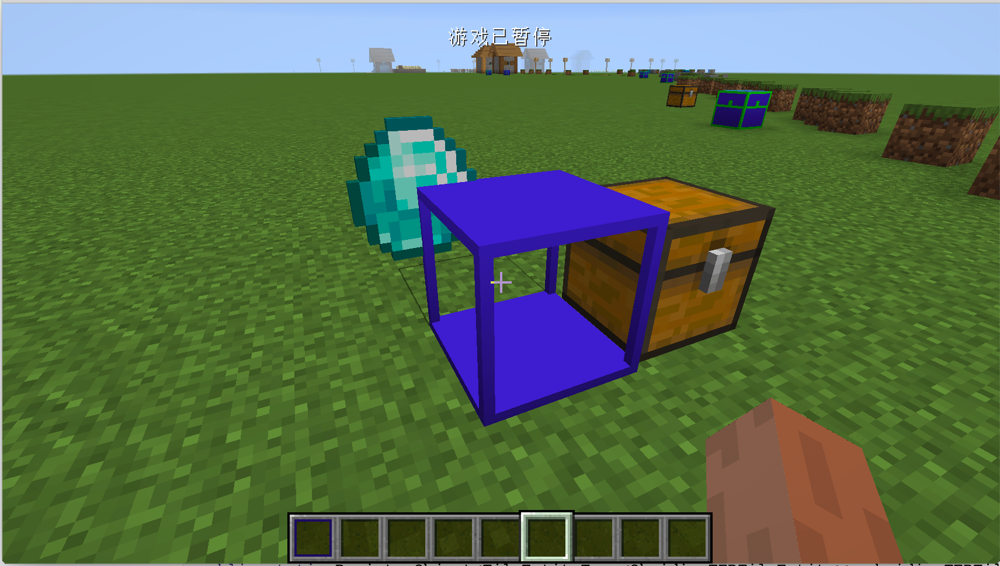

# TileEntityRenderer(方块实体渲染器)

在这节中，我们将来学习一个非常重要的渲染方式`TileEntityRenderer`简称`TER`。在开始之前我们首先需要知道`TER`的作用是什么。让我回想一下原版中的箱子、附魔台。它们都有特殊的动画，而`TER`的作用就是让你也可以实现这些动画。

首先我们从方块开始

```java
public class ObsidianTERBlock extends Block {

    private static VoxelShape shape;

    static {
        VoxelShape base = Block.makeCuboidShape(0, 0, 0, 16, 1, 16);
        VoxelShape column1 = Block.makeCuboidShape(0, 1, 0, 1, 15, 1);
        VoxelShape column2 = Block.makeCuboidShape(15, 1, 0, 16, 15, 1);
        VoxelShape column3 = Block.makeCuboidShape(0, 1, 15, 1, 15, 16);
        VoxelShape column4 = Block.makeCuboidShape(15, 1, 15, 16, 15, 16);
        VoxelShape top = Block.makeCuboidShape(0, 15, 0, 16, 16, 16);
        shape = VoxelShapes.or(base, column1, column2, column3, column4, top);
    }

    public ObsidianTERBlock() {
        super(Properties.create(Material.ROCK).notSolid().hardnessAndResistance(5));
    }

    @Override
    public VoxelShape getShape(BlockState state, IBlockReader worldIn, BlockPos pos, ISelectionContext context) {
        return shape;
    }

    @Override
    public boolean hasTileEntity(BlockState state) {
        return true;
    }

    @Nullable
    @Override
    public TileEntity createTileEntity(BlockState state, IBlockReader world) {
        return new ObsidianTERTileEntity();
    }

}
```

方块的内容非常简单，基本上就是抄了我们之前写好的黑曜石框架，然后给它添加了一个方块实体。

接下来我们来看方块实体的具体内容。

 ```java
public class ObsidianTERTileEntity extends TileEntity {
    public ObsidianTERTileEntity() {
        super(TileEntityTypeRegistry.obsidianTERTileEntity.get());
    }
}
 ```

因为我们用不到任何东西，所以这个方块实体是空的，仅仅用来和我们之后创建的`TileEntityRenderer`作关联。

接下来就是最为关键的`TER`部分了

```java
public class ObsidianTER extends TileEntityRenderer<ObsidianTERTileEntity> {

    public ObsidianTER(TileEntityRendererDispatcher rendererDispatcherIn) {
        super(rendererDispatcherIn);
    }

    @Override
    public void render(ObsidianTERTileEntity tileEntityIn, float partialTicks, MatrixStack matrixStackIn, IRenderTypeBuffer bufferIn, int combinedLightIn, int combinedOverlayIn) {
        matrixStackIn.push();
        matrixStackIn.translate(1, 0, 0);
        BlockRendererDispatcher blockRenderer = Minecraft.getInstance().getBlockRendererDispatcher();
        BlockState state = Blocks.CHEST.getDefaultState();
        blockRenderer.renderBlock(state, matrixStackIn, bufferIn, combinedLightIn, combinedOverlayIn, EmptyModelData.INSTANCE);
        matrixStackIn.pop();

        matrixStackIn.push();
        matrixStackIn.translate(0, 1, 0);
        ItemRenderer itemRenderer = Minecraft.getInstance().getItemRenderer();
        ItemStack stack = new ItemStack(Items.DIAMOND);
        IBakedModel ibakedmodel = itemRenderer.getItemModelWithOverrides(stack, tileEntityIn.getWorld(), null);
        itemRenderer.renderItem(stack, ItemCameraTransforms.TransformType.FIXED, true, matrixStackIn, bufferIn, combinedLightIn, combinedOverlayIn, ibakedmodel);
        matrixStackIn.pop();
    }
}
```

可以看到我们的`ObsidianTER`直接继承了`TileEntityRenderer`，其中泛型填的是你之前创建好的方块实体，

而其中的`render`方法，就是你的渲染方法。

因为这一块涉及到很多的计算机图形学相关的知识，这里我就不演示如何自定义渲染了，有兴趣的读者可以查看Mcjty做的相关的[教程](https://www.bilibili.com/video/BV1QE41137P9?p=14)和[代码](https://github.com/McJty/YouTubeModding14/blob/master/src/main/java/com/mcjty/mytutorial/blocks/MagicRenderer.java)。

这里我们只演示如何额外的渲染出物品和方块。

首先你应该用` matrixStackIn.push()`和`matrixStackIn.pop()`包裹起你的渲染代码。因为你对渲染做的所有移动、旋转和放大操作都会储存在`matrixStackIn`中，而`push`和`pop`的作用就是保存和恢复之前渲染的状态。如果你不进行这些操作有可能会污染其他的渲染器。

```java
matrixStackIn.translate(1, 0, 0);
```

这个设置了你要渲染对象的移动

与此相对应的还有

```java
matrixStackIn.rotate();
matrixStackIn.scale();
```

分别用于旋转和缩放。

```java
BlockRendererDispatcher blockRenderer = Minecraft.getInstance().getBlockRendererDispatcher();
ItemRenderer itemRenderer = Minecraft.getInstance().getItemRenderer();
```

这两句都是用来获取物品和方块的渲染器。

```java
BlockState state = Blocks.CHEST.getDefaultState();
ItemStack stack = new ItemStack(Items.DIAMOND);
```

这两个变量的作用是用来指定你要渲染的方块和物品，我们这里将要渲染箱子的方块模型和钻石的物品模型。

```java
IBakedModel ibakedmodel = itemRenderer.getItemModelWithOverrides(stack, tileEntityIn.getWorld(), null);
```

这句的作用是获取能物品的`IBakedModel`，之后用于渲染。

```java
blockRenderer.renderBlock(state, matrixStackIn, bufferIn, combinedLightIn, combinedOverlayIn, EmptyModelData.INSTANCE);
itemRenderer.renderItem(stack, ItemCameraTransforms.TransformType.FIXED, true, matrixStackIn, bufferIn, combinedLightIn, combinedOverlayIn, ibakedmodel);
```

在这里就是渲染指令，我们可以通过这两句话调用物品和方块默认的渲染方法。具体怎么渲染我们不用关心。

然后我们需要绑定我们的`TER`

```java
@Mod.EventBusSubscriber(bus = Mod.EventBusSubscriber.Bus.MOD)
public class ClientEventHandler {
    @SubscribeEvent
    public static void onClientEvent(FMLClientSetupEvent event) {
        ClientRegistry.bindTileEntityRenderer(TileEntityTypeRegistry.obsidianTERTileEntity.get(), (tileEntityRendererDispatcher -> {
            return new ObsidianTER(tileEntityRendererDispatcher);
        }));
    }
}
```

可以看见我们在Mod总线中的`FMLClientSetupEvent`（客户端配置）事件中，调用`ClientRegistry.bindTileEntityRenderer`方法把我们的`TER`绑定到我们的方块实体上。

当然别忘了注册你的方块实体

```java
public static RegistryObject<TileEntityType<ObsidianTERTileEntity>> obsidianTERTileEntity = TILE_ENTITY_TYPE_DEFERRED_REGISTER.register("obsidian_ter_tileentity", () -> {
  return TileEntityType.Builder.create(() -> {
    return new ObsidianTERTileEntity();
  }, BlockRegistry.obsidianTERBlock.get()).build(null);
});
```

打开游戏放下方块，你应该就能看见一个特殊的方块了。



[源代码](https://github.com/FledgeXu/NeutrinoSourceCode/tree/master/src/main/java/com/tutorial/neutrino/ter)

