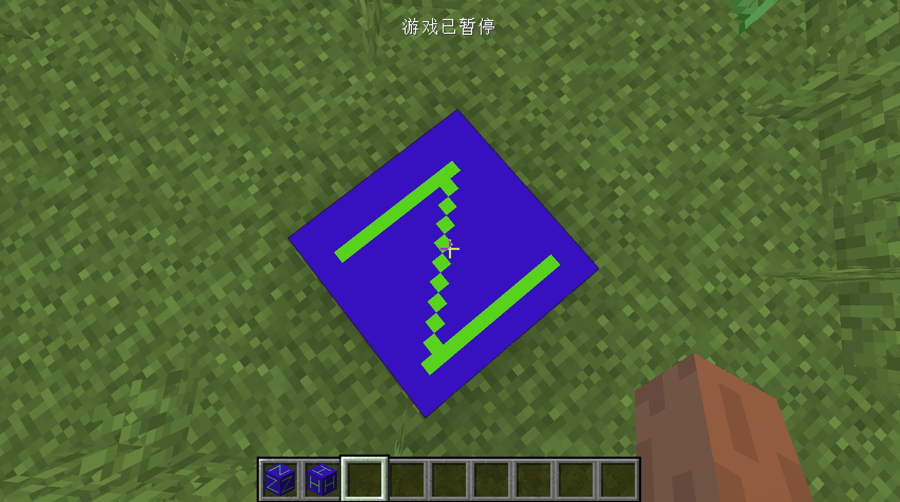

# 方块实体内置的数据同步

在这节中，我们将学习方块实体中内置的数据同步功能。

还记得我们之前讲过的服务端和客户端自己的数据同步吗？幸运的是，TileEntity给我们内置了两组数据同步的方法，不幸的是这个两组方法只能实现从服务端到客户端的数据同步，而且只能同步少量的数据。

在这节中，我们讲学习制作一个每隔几秒中就会播放僵尸吼叫声的方块，我们先从方块开始;

`ObsidianZombieBlock`

```java
public class ObsidianZombieBlock extends Block {
    public ObsidianZombieBlock() {
        super(Properties.create(Material.ROCK).hardnessAndResistance(5));
    }

    @Override
    public boolean hasTileEntity(BlockState state) {
        return true;
    }

    @Nullable
    @Override
    public TileEntity createTileEntity(BlockState state, IBlockReader world) {
        return new ObsidianZombieTileEntity();
    }
}
```

然后是`ObsidianZombieTileEntity`。

```java
public class ObsidianZombieTileEntity extends TileEntity implements ITickableTileEntity {
    private boolean flag = false;
    private int MAX_TIME = 5 * 20;
    private int timer = 0;


    public ObsidianZombieTileEntity() {
        super(TileEntityTypeRegistry.obsidianZombieTileentity.get());
    }

    @Override
    public void tick() {
        if (world.isRemote && flag) {
            PlayerEntity player = world.getClosestPlayer(pos.getX(), pos.getY(), pos.getZ(), 10, false);
            this.world.playSound(player, pos, SoundEvents.ENTITY_ZOMBIE_AMBIENT, SoundCategory.AMBIENT, 1.0f, 1.0f);
            flag = false;
        }
        if (!world.isRemote) {
            if (timer == MAX_TIME) {
                flag = true;
                world.notifyBlockUpdate(pos, getBlockState(), getBlockState(), Constants.BlockFlags.BLOCK_UPDATE);
                flag = true;
                timer = 0;
            }
            timer++;
        }
    }

    @Nullable
    @Override
    public SUpdateTileEntityPacket getUpdatePacket() {
        return new SUpdateTileEntityPacket(pos, 1, getUpdateTag());
    }

    @Override
    public void onDataPacket(NetworkManager net, SUpdateTileEntityPacket pkt) {
        handleUpdateTag(pkt.getNbtCompound());
    }

    @Override
    public CompoundNBT getUpdateTag() {
        CompoundNBT compoundNBT = super.getUpdateTag();
        compoundNBT.putBoolean("flag", flag);
        return compoundNBT;
    }

    @Override
    public void handleUpdateTag(CompoundNBT tag) {
        flag = tag.getBoolean("flag");
    }
}
```

首先我们来讲解两组同步数据用的方法。

- `getUpdatePacket`
- `onDataPacket`

这两个方法是在正常游戏过程中会被使用的数据同步方法，它们的名字可能会有些迷惑性，因为`getUpdatePacket`是服务端发送数据包用的方法，而`onDataPacket`才是客户端接受数据包的方法。

接下来是:

- `getUpdateTag`
- `handleUpdateTag`

这两个方法是在区块刚被载入时被调用的方法，之所以有这两个方法存在，是因为有些装饰性的方块实体并不需要经常性地同步数据，比如告示牌，只需要在区块被载入时同步一次就行。

为了让你的方块实体能在游戏被载入的时候能自动同步数据，你需要先实现`getUpdateTag`和`handleUpdateTag`，然后在`getUpdatePacket`和`onDataPacket`中调用它们即可。

如你你需要触发数据同步，你需要在服务端调用`world.notifyBlockUpdate`方法。

当然就和数据保存一样，这些方法默认的序列化和反序列化方式是NBT标签。

```java
@Override
public CompoundNBT getUpdateTag() {
  CompoundNBT compoundNBT = super.getUpdateTag();
  compoundNBT.putBoolean("flag", flag);
   return compoundNBT;
}

@Override
public void handleUpdateTag(CompoundNBT tag) {
  flag = tag.getBoolean("flag");
}
```

可以看到，用NBT标签传输了数据。

```java
@Override
public SUpdateTileEntityPacket getUpdatePacket() {
  return new SUpdateTileEntityPacket(pos, 1, getUpdateTag());
}

@Override
public void onDataPacket(NetworkManager net, SUpdateTileEntityPacket pkt) {
  handleUpdateTag(pkt.getNbtCompound());
}
```

在这里我们只是简单的调用了之前的两个方法而已，`SUpdateTileEntityPacket`的第二个参数的序列号值，大家可以随便填写。

然后就是我们的主要逻辑`tick`方法:

```java
@Override
public void tick() {
  if (world.isRemote && flag) {
    PlayerEntity player = world.getClosestPlayer(pos.getX(), pos.getY(), pos.getZ(), 10, false);
    this.world.playSound(player, pos, SoundEvents.ENTITY_ZOMBIE_AMBIENT, SoundCategory.AMBIENT, 1.0f, 1.0f);
    flag = false;
  }
  if (!world.isRemote) {
    if (timer == MAX_TIME) {
      flag = true;
      world.notifyBlockUpdate(pos, getBlockState(), getBlockState(), Constants.BlockFlags.BLOCK_UPDATE);
      flag = true;
      timer = 0;
    }
    timer++;
  }
}
```

为了大家方便理解，我这里用了两个`if`语句将客户端和服务端的逻辑区分开来

首先是是客户端:

```java
if (world.isRemote && flag) {
  PlayerEntity player = world.getClosestPlayer(pos.getX(), pos.getY(), pos.getZ(), 10, false);
  this.world.playSound(player, pos, SoundEvents.ENTITY_ZOMBIE_AMBIENT, SoundCategory.AMBIENT, 1.0f, 1.0f);
  flag = false;
}
```

首先我们判断是否在客户端，并且flag的值是否为真（为真代表要播放声音），然后获取了最近的玩家，使用了`this.world.playSound`方法播放了声音，请注意，播放声音可以同时在客户端和服务端执行，如果你在服务端执行会自动发一个数据包到客户端，让客户端播放声音。

`playSound`的第一个和第二个变量很好懂，第三个变量是需要播放的声音，第三个变量是决定这个声音大小是受到哪一个声音控制分类控制的。

接下来是服务端:

```java
if (!world.isRemote) {
  if (timer == MAX_TIME) {
    flag = true;
    world.notifyBlockUpdate(pos, getBlockState(), getBlockState(), Constants.BlockFlags.BLOCK_UPDATE);
    flag = true;
    timer = 0;
  }
  timer++;
}
```

服务端和之前一样基本上就是一个计数器，唯一特殊的地方就是我们调用了` world.notifyBlockUpdate`方法，因为我们不需要更新`blockstate`，所以第二和第三个参数保持相同就行，最后一个参数是需要什么等级的更新，Forge提供给我们了`Constants`类，里面有详细的说明。

然后就是添加材质和模型之类的事了，有兴趣的读者可以自己看源代码。

打开游戏放置完方块，等待一会你应该就能听见僵尸的吼叫声了。



[源代码](https://github.com/FledgeXu/NeutrinoSourceCode/tree/master/src/main/java/com/tutorial/neutrino/tileentitydatasync)

