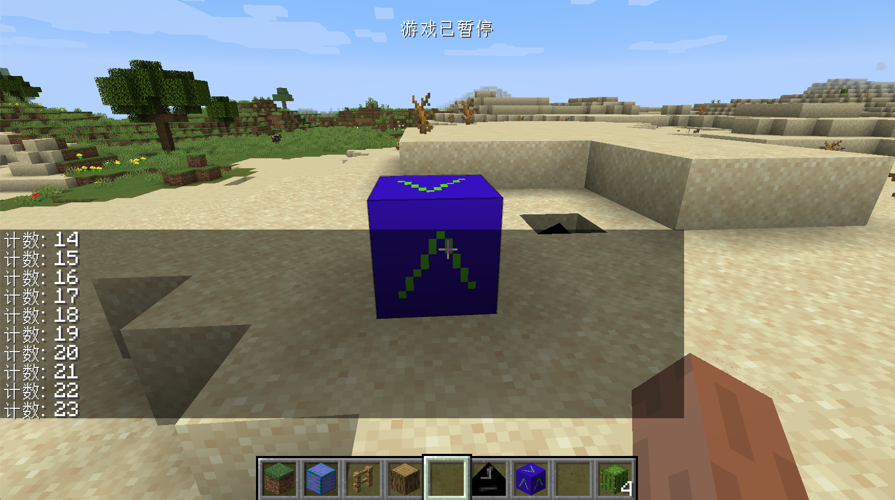

# 第一个方块实体和其数据保存

在这节中，我们将学习如何创建一个属于自己的方块实体，我们以计数器为例，它唯一的作用就是当你右击方块时它会加一，然后向你的聊天框里发送相对应的值。

首先我们来创建我们的方块，`ObsidianCounter.java`：

```java
public class ObsidianCounter extends Block {
    public ObsidianCounter() {
        super(Properties.create(Material.ROCK).hardnessAndResistance(5));
    }

    @Override
    public boolean hasTileEntity(BlockState state) {
        return true;
    }

    @Nullable
    @Override
    public TileEntity createTileEntity(BlockState state, IBlockReader world) {
        return new ObsidianCounterTileEntity();
    }

    @Override
    public ActionResultType onBlockActivated(BlockState state, World worldIn, BlockPos pos, PlayerEntity player, Hand handIn, BlockRayTraceResult hit) {
        if (!worldIn.isRemote && handIn == Hand.MAIN_HAND) {
            ObsidianCounterTileEntity obsidianCounterTileEntity = (ObsidianCounterTileEntity) worldIn.getTileEntity(pos);
            int counter = obsidianCounterTileEntity.increase();
            TranslationTextComponent translationTextComponent = new TranslationTextComponent("message.neutrino.counter", counter);
            player.sendStatusMessage(translationTextComponent, false);
        }
        return ActionResultType.SUCCESS;
    }
}
```

注册部分我们就不详细说了，这里我们来讲一讲几个函数。首先要讲的是`hasTileEntity`和`createTileEntity`这一组函数（**请注意，这里的两个方法没有被`@Deprecated`，，也就是在你重写之后它没有被「划横线」。我们需要重写的是`IForgeBlock`接口下的方法，请注意不要重写错了方法**），这组函数让你的方块可以绑定一个方块实体，`hasTileEntity`返回值设置为`true`，说明我们这个方块拥有一个方块实体，`createTileEntity`这个函数决定了我们方块的方块实体具体是哪一个，在我们的例子里是`ObsidianCounterTileEntity`。

我们先略过`onBlockActivated`方法，来看我们的方块实体里具体是什么内容。

`ObsidianCounterTileEntity`:

```java
public class ObsidianCounterTileEntity extends TileEntity {
    private int counter = 0;

    public ObsidianCounterTileEntity() {
        super(TileEntityTypeRegistry.obsidianCounterTileEntity.get());
    }


    public int increase() {
        counter++;
        return counter;
    }
}
```

可以看到，这个方块实体里的内容非常的简单，只有一个构造方法和一个`increase`方法。`increase`方法和我们要实现的具体内容有关，这里先按下不表，我们先来看构造方法。

```java
super(TileEntityTypeRegistry.obsidianCounterTileEntity.get());
```

这里的构造方法，我们向我们的父类传入了一个`TilEnttityType`，那么这个`TilEntityType`又是什么东西呢？这个`TileEntityType`故名思义是方块实体的「类型」，这个「类型」规定了我们的方块实体要怎么创建出来，以及它和哪些方块绑定，接下来我们就来看看我们的`TilEntityType`是怎么被创建出来和被注册的吧。

接着我们创建了一个新的类叫做`TileEntityTypeRegistry`:

```java
public class TileEntityTypeRegistry {
    public static final DeferredRegister<TileEntityType<?>> TILE_ENTITY_TYPE_DEFERRED_REGISTER = new DeferredRegister<>(ForgeRegistries.TILE_ENTITIES, "neutrino");
    public static RegistryObject<TileEntityType<ObsidianCounterTileEntity>> obsidianCounterTileEntity = TILE_ENTITY_TYPE_DEFERRED_REGISTER.register("obsidian_counter_tileentity", () -> {
        return TileEntityType.Builder.create(() -> {
            return new ObsidianCounterTileEntity();
        }, BlockRegistry.obsidianCounterBlock.get()).build(null);
    });
}
```

首先是类型，因为`TileEntityType`是一个含有泛型的类，它的泛型里可以装各种各样的`TileEntity`，所以我们在定义`TILE_ENTITY_TYPE_DEFERRED_REGISTER`时，`DeferredRegister`内的类型是`TileEntityType<?>`，这里的问号代表`TILE_ENTITY_TYPE_DEFERRED_REGISTER`里可以注册例如`TileEntityType<AEntity>`、 `TileEntityType<BEntity>`等各种`TileEntityType`。

然后是我们变量的类型，因为我们是要给`ObsidianCounterTileEntity`注册`TileEntityType`，所以我们需要的类型自然是`TileEntityType<ObsidianCounterTileEntity>`。

这里面最为复杂的应该就是具体的注册过程了，但是其实并不难理解，和之前一样就是注册名和一个注册物，我们可以把这个复杂的语句拆拆分开来。

```java
TILE_ENTITY_TYPE_DEFERRED_REGISTER.register("obsidian_counter_tileentity",()->{return ...});
```

如果我们省略里面的一系列复杂的内容，这个代码的核心就是这么一句话，这个相信大家都能理解，这里的重点就是就是我们省略的「…」。

之前省略的内容如下:

```java
TileEntityType.Builder.create(() -> {
  return new ObsidianCounterTileEntity();},
  BlockRegistry.obsidianCounterBlock.get()
).build(null);
```

可以看见，这里我们先是调用了`TileEntityType.Builder.create`方法，这是Minecraft提供的一个创建`TileEntityType`的方法，然后调用了`build`方法。我们先来看`build`方法里的参数，在`build`里我们传入了一个`null`，其实这个地方可以填入一个叫做`datafix`的实例，这个实例是用来做不同版本之前存档转换的。这里我们没有这个需求（大部分mod估计也不会实现），所以就填入了一个`null`。

然后我们回过头来看`TileEntityType.Builder.create`中的两个参数，第一个参数是一个`supplier`，这个`supplier`的返回值就是我们写到的`TileEntity`实例，第二个类型是与之相关联的方块，这里我们填入我们注册好的`ObsidianCounterBlock`的实例，至于方块的注册，相信看到这里的读者已经有能力自己解决了。

当然之前的写法看上去非常复杂，我们可以写得简略一些，如下所示:

```java
public static RegistryObject<TileEntityType<ObsidianCounterTileEntity>> obsidianCounterTileEntity = TILE_ENTITY_TYPE_DEFERRED_REGISTER.register("obsidian_counter_tileentity", () -> TileEntityType.Builder.create(() -> new ObsidianCounterTileEntity(), BlockRegistry.obsidianCounterBlock.get()).build(null));
```

这样内容一下子就少了很多，但是为了读者的理解方便，我还是使用了上面的写法，当然别忘了在你的Mod主类中，把`TILE_ENTITY_TYPE_DEFERRED_REGISTER`注册到Mod总线中。

然后我们就可以来看看我们的逻辑了

```java
@Override
public ActionResultType onBlockActivated(BlockState state, World worldIn, BlockPos pos, PlayerEntity player, Hand handIn, BlockRayTraceResult hit) {
  if (!worldIn.isRemote && handIn == Hand.MAIN_HAND) {
    ObsidianCounterTileEntity obsidianCounterTileEntity = (ObsidianCounterTileEntity) worldIn.getTileEntity(pos);
    int counter = obsidianCounterTileEntity.increase();
    TranslationTextComponent translationTextComponent = new TranslationTextComponent("message.neutrino.counter", counter);
    player.sendStatusMessage(translationTextComponent, false);
  }
  return ActionResultType.SUCCESS;
}
```

首先是方块的`onBlockActivated`方法，请注意这里有两个同名但是不同返回值的`onBlockActivated`方法，在重写方法时不要重写错了。

```java
if (!worldIn.isRemote && handIn == Hand.MAIN_HAND)
```

首先我们判断了我们的方法是否在服务端调用，记住任何涉及到数据处理的逻辑都应该在服务端执行，此外我们还判断了传入的`handIn`是不是「主手」，之所以要进行这个判断，是因为这个方法两个手都会执行一次。

```java
ObsidianCounterTileEntity obsidianCounterTileEntity = (ObsidianCounterTileEntity) worldIn.getTileEntity(pos);
```

我们在这里通过调用`worldIn.getTileEntity`方法，获取到我们方块所对应的`TileEntity`，一定要通过这个方法调用的原因是，一个方块哪怕绑定了TileEntity，你也不能保证，这个`TileEntity`是一定存在的。

```java
int counter = obsidianCounterTileEntity.increase();
```

然后我们在这里通过调用我们`obsidianCounterTileEntity`的`increase`方法，增加并获取了值。

```java
public int increase() {
  counter++;
  return counter;
}
```

`increase`方法内容非常简单，相信大家都能看懂。

```java
TranslationTextComponent translationTextComponent = new TranslationTextComponent("message.neutrino.counter", counter);
```

然后是这条语句，首先我们创建了一个`TranslationTextComponent`，这里就是我们要发送到玩家聊天框里的内容。正如它的名字暗示的那样，这个是一个翻译文本，所以它应该是一个「键」而不是具体的内容，`"message.tour14.counter"`就是「键」值，后面我们还传入了我们获取到的计数值，这样做的原因，我们先按下不表。

首先我们在语言文件里添加如下内容（以简体中文举例）。

```json
 "message.neutrino.counter": "计数: %d"
```

可以看到这里有一个`%d`，这时候为什么要传入我们的值的理由就很清楚了，其实就是通过`%d`，把我们的`counter`变量的值格式化之后显示了出来。

```java
player.sendStatusMessage(translationTextComponent, false);
```

最后我们调用这条语句，向玩家发送了消息，请注意因为我们之前判断过`!worldIn.isRemote`，所以虽然这段代码是在服务端执行的，但是因为具体的消息是在客户端显示的，所以我们要通过发包的方式给客户端发送消息，幸好Minecraft给我们提供了这个方法可以发送数据，所以我们不用自己实现。



可以看到我们的方块已经可以成功的计数了。

但是这个方块还有一个bug，当你退出当前的存档重新进入时，你会发现我们的计数器又从0开始计数了，接下来我们来修复这个问题。

之所以出现这个bug，是因为当存档运行时，计数器的值在内存中存在并且可以正常运作，但是当游戏关闭时，因为这些内存中重要的数据没有保存到你的硬盘上，所以下次打开游戏时，无法重新加载和恢复这些数据。之前我们的TileEntity并没有实现这个保存和恢复功能，接下来我们就要为其添加这个功能。

添加完成后的`ObsidianCounterTileEntity`内容如下:

```java
public class ObsidianCounterTileEntity extends TileEntity {
    private int counter = 0;

    public ObsidianCounterTileEntity() {
        super(TileEntityTypeRegistry.obsidianCounterTileEntity.get());
    }


    public int increase() {
        counter++;
        markDirty();
        return counter;
    }

    @Override
    public void read(CompoundNBT compound) {
        counter = compound.getInt("counter");
        super.read(compound);
    }

    @Override
    public CompoundNBT write(CompoundNBT compound) {
        compound.putInt("counter", counter);
        return super.write(compound);
    }
}
```

可以看见，相比起之前的代码，我们覆写了`write`和`read`方法，这两个方法就是用来实现数据的保存和恢复的。在Minecraft里，所有的数据最终都应该以NBT格式保存（除非你自己实现保存方法），在代码里NBT标签就是以`CompoundNBT`体现的。NBT标签也是一个「键值对」结构，每一个值都有一个对应的名字。其中的`put`开头的方法都是向NBT标签里写入值，`get`开头的方法就是获取值。除去`CompoudNBT`以外，还有`ListNBT`类来代表数组类型的NBT标签。

这里的`write`就是数据保存的方法，它的传入值就是之前别的类已经保存好的NBT标签，它的返回值就是最终要保存到硬盘上的NBT标签（还有别的类要写入），在一般情况下，以都应该调用`return super.write(compound);`来做最终的返回。

`read`方法正好相反，我们在这里调用了`counter = compound.getInt("counter”);`方法，恢复我们计数器的数据。同样的你应该调用`super.read(compound);`来做最终的返回。

还有一个非常重要的是

```java
public int increase() {
  counter++;
  markDirty();
  return counter;
}
```

我们在这里加入了`markDirty()`方法，这个方法的意思是标记了我们数据被修改，让游戏知道在关闭的时候要保存调用保存方法。这样做是因为相对于CPU的执行速度，硬盘的保存和读写速度是非常慢的，所以如果频繁的进行保存和读写操作会严重拖慢游戏的速度，一个合理的方法就是标记我们需要保存的数据，然后在一个统一的时间点一起保存，`markDirty()`的作用正是如此。

[源代码](https://github.com/FledgeXu/NeutrinoSourceCode/tree/master/src/main/java/com/tutorial/neutrino/first_tileentity)

## 编程小课堂

对于CPU来说每个指令大概需要 0.38ns，以此作为基本单位 1s的话，从从磁盘读取 1MB 的连续数据需要 20ms，对比 CPU 的时间是 20 个月，所以磁盘读写速度是非常慢的。

