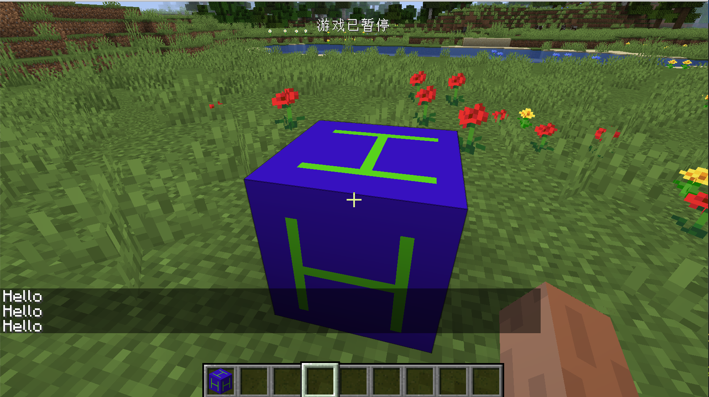

# ITickableTileEntity

在这一节中，我们来学习TileEntity中最为重要的一个接口：`ITickableTileEntity`。

这一节我们将以制作一个会自动打招呼的方块为例，来体现这个接口的功能。

`ObsidianHelloBlock`:

```java
public class ObsidianHelloBlock extends Block {
    public ObsidianHelloBlock() {
        super(Properties.create(Material.ROCK).hardnessAndResistance(5));
    }

    @Override
    public boolean hasTileEntity(BlockState state) {
        return true;
    }

    @Nullable
    @Override
    public TileEntity createTileEntity(BlockState state, IBlockReader world) {
        return new ObsidianHelloTileEntity();
    }
}
```

`ObsidianHelloTileEntity`:

```java
public class ObsidianHelloTileEntity extends TileEntity implements ITickableTileEntity {
    private static final int MAX_TIME = 5 * 20;
    private int timer = 0;

    public ObsidianHelloTileEntity() {
        super(TileEntityTypeRegistry.obsidianHelloTileentity.get());
    }

    @Override
    public void tick() {
        if (!world.isRemote) {
            if (timer == MAX_TIME) {
                PlayerEntity player = world.getClosestPlayer(pos.getX(), pos.getY(), pos.getZ(), 10, false);
                StringTextComponent stringTextComponent = new StringTextComponent("Hello");
                if(player!=null){
                    player.sendMessage(stringTextComponent);
                }
                timer = 0;
            }
            timer++;
        }
    }
}
```

实际上这个方块实体的代码要比我们做的第一个方块实体的代码简单许多。可以看到我们在这里实现了`ITickableTileEntity`接口，这个接口只有一个方法需要实现，就是`tick`方法，故名思义，这个会在每个游戏tick执行一次，我们这里做了一计数器，然后通过`world.getClosestPlayer`方法获取到了这个方块位置周围10格内最近的玩家，然后创建了`StringTextComponent`消息（~~之所以用这个消息的原因是因为我懒得写lang文件~~），最后调用了`player.sendMessage`将消息发送给了玩家，`sendMessage` 接受的是`ITextComponent`接口，minecraft已经有很多实现这个接口的常用的类。

注册`TileEntityType`：

```java
public static RegistryObject<TileEntityType<ObsidianHelloTileEntity>> obsidianHelloTileentity = TILE_ENTITY_TYPE_DEFERRED_REGISTER.register("obsidian_hello_tileentity", () -> {
  return TileEntityType.Builder.create(() -> {
  return new ObsidianHelloTileEntity();}, 
  BlockRegistry.obsidianHelloBlock.get()).build(null);
});
```

其他的注册和模型文件的创建这里就省略了，相信读者已经有能力自主完成。

打开游戏，靠近方块:



可以看见我们的方块在和我们打招呼呢。

[源代码](https://github.com/FledgeXu/NeutrinoSourceCode/tree/master/src/main/java/com/tutorial/neutrino/tickabletileentity)

## 开发小课堂

在很多时候，当函数要求传入的变量的类型是接口时，基本都已经有实现好的类可以使用，大家可以尝试查看这个接口的继承树来寻找可以使用的类。