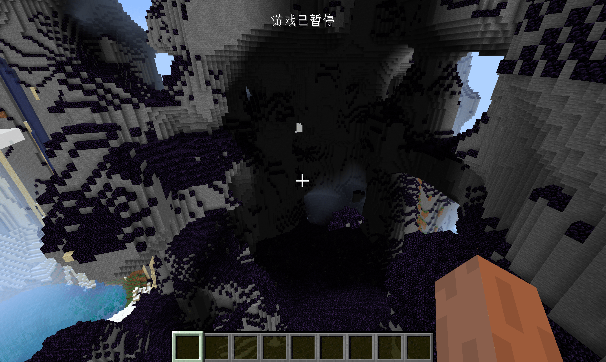

# 自定义生物群系和世界类型

在这节中，我们将来学习如何添加一个自定义的生物群系，

和结构类似，首先我们的新建一个类，继承原版的生物群系。

```java
public class ObsidianBiome extends Biome {
    protected ObsidianBiome(Builder biomeBuilder) {
        super(biomeBuilder);
        this.addFeature(GenerationStage.Decoration.UNDERGROUND_ORES, Feature.ORE.withConfiguration(new OreFeatureConfig(OreFeatureConfig.FillerBlockType.NATURAL_STONE, Blocks.GOLD_ORE.getDefaultState(), 9)).withPlacement(Placement.COUNT_RANGE.configure(new CountRangeConfig(20, 32, 32, 80))));
        this.addSpawn(EntityClassification.AMBIENT, new SpawnListEntry(EntityType.WITHER_SKELETON, 30, 5, 10));
        DefaultBiomeFeatures.addCarvers(this);
    }
}
```

可以看到这里的内容非常的简单，不过就是给我的的生物群系添加`Feature`子类的，之前已经写过自然生成的大家对这些方法并不陌生。唯一一个值得说的是`DefaultBiomeFeatures`，原版在这里定义了一些预先设置好的`Feature`、`Structure`、`Carvers`和`Spawn`，大家可以直接调用里面自带的方法。

接下来就是注册我们的生物群系

```java
public class BiomeRegistry {
    public static final DeferredRegister<Biome> BIOMES = new DeferredRegister<>(ForgeRegistries.BIOMES, "neutrino");
    public static RegistryObject<ObsidianBiome> obsidianBiome = BIOMES.register("obsidian_biome", () -> {
        return new ObsidianBiome(new Biome.Builder().category(Biome.Category.PLAINS)
                .surfaceBuilder(SurfaceBuilder.DEFAULT,
                        new SurfaceBuilderConfig(Blocks.OBSIDIAN.getDefaultState(), Blocks.STONE.getDefaultState(), Blocks.END_STONE.getDefaultState())
                )
                .scale(3f)
                .downfall(0.5f)
                .precipitation(Biome.RainType.SNOW)
                .depth(1f)
                .temperature(0.7f)
                .waterColor(0x0c0a15)
                .waterFogColor(0x632ebf)
        );
    });
}
```

这里的内容也类似，因为这里的参数过多，很多参数也没发简单的解释，这里就不多加解释为什么了。我建议大家自行参照原版的实现填写内容。

当然别忘了在Mod主类中，将`BIOMES`注册到Mod总线中。

创建完成之后，接下来就是将我们的生物群系添加到主世界的世界生成中。

```java
@Mod.EventBusSubscriber(bus = Mod.EventBusSubscriber.Bus.MOD)
public class CommonSetupEvent {
    @SubscribeEvent
    public static void onCommonSetup(FMLCommonSetupEvent event) {
        BiomeManager.addBiome(BiomeManager.BiomeType.COOL, new BiomeManager.BiomeEntry(BiomeRegistry.obsidianBiome.get(), 1000));
    }
}
```

这里我们在`FMLCommonSetupEvent`世界中，调用`BiomeManager.addBiome`添加了我们的生物群系，`BiomeManager.BiomeEntry`构造方法的第二个参数是权重，这里我们填的高点让我们的生物群系更容易被找到。

打开游戏寻找一下，应该就能看见我们的生物群系了。



但是寻找生物群系有时候是非常麻烦的事情，我们可以创建一个`WorldType`来帮助我们调试生物群系。所谓的`WorldType`就是原版中的`默认`、`超平坦`、`巨大化`等。

当然，创建一个自定义的也非常简单

```java
public class ObsidianWorldType extends WorldType {
    public ObsidianWorldType() {
        super("neutrino_type");
    }

    @Override
    public ChunkGenerator<?> createChunkGenerator(World world) {
        OverworldGenSettings settings = new OverworldGenSettings();
        SingleBiomeProvider singleBiomeProvider = new SingleBiomeProvider(new SingleBiomeProviderSettings(world.getWorldInfo()).setBiome(BiomeRegistry.obsidianBiome.get()));
        return new OverworldChunkGenerator(world, singleBiomeProvider, settings);
    }
}
```

这里我们直接继承了`WorldType`类。

它的构造方法里需要填入一个名字，请注意这个名字不能超过16个字符

然后就是他的`createChunkGenerator`方法，这里需要返回一个`ChunkGenerator`，因为我们希望能像原版主世界的一样的地形起伏，所以返回的是`OverworldChunkGenerator`。因为我们只需要生成一种生物群系，所以在这里用了 `SingleBiomeProvider`(单一生物群系提供器)。还有一个`OverworldGenSettings`就没什么好讲的了。

创建完成之后，我们只需要在你的主类中，创建一个变量实例化它就行。

 ```java
@Mod("neutrino")
public class Neutrino {
    public static final ObsidianWorldType obsidianWorldType = new ObsidianWorldType();
    public Neutrino() {
    ...代码省略...
 ```

此时打开游戏，你应该就能看见新的世界类型了


创建一个存档试试吧。

[源代码](https://github.com/FledgeXu/NeutrinoSourceCode/tree/master/src/main/java/com/tutorial/neutrino/biome)

