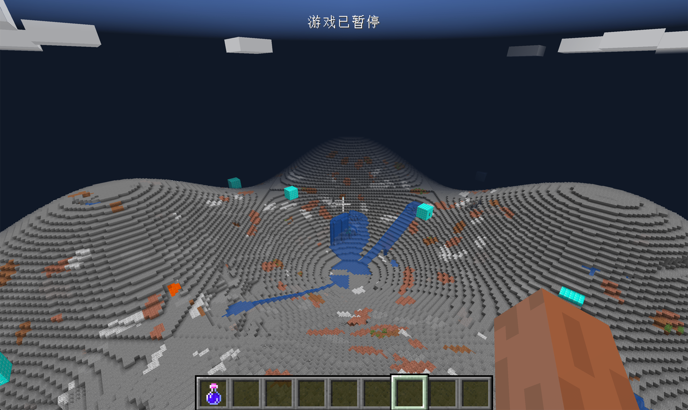

# 自定义维度与区块生成器以及生物群系提供器

首先先原谅我起了这么长的一个标题。在这节中，我们将要来学习如何生成一个维度，在这个过程中我们还会学习到如何写区块生成器以及生物群系提供器。

在开始我们的代码之前，我们得先来理一下维度生成的过程是什么样子的。

首先我们有一个`Dimension`，他规定了维度的高度、天空的颜色等。在`Dimension`中有一个`ChunkGenerator`，它负责根据特定的算法决定了维度的地形。在`ChunkGenerator`里有个`BiomeProvider`，它决定了特定地方是什么生物群系。然后Minecraft会根据生物群系添加类似于生物，结构等东西。

知道了这个过程我们就可以来创建我们的维度了。Forge在这个过程之上还提供了一个叫做`ModDimension`来自动的帮我们做了类似于数据保存与恢复，客户端和服务端创建维度时发包等操作。所以我们首先需要新建一个自己的`ModDimension`。

```java
public class ObsidianModDimensions extends ModDimension {
    @Override
    public BiFunction<World, DimensionType, ? extends Dimension> getFactory() {
        return (world, type) -> {
            return new ObsidianDimension(world, type);
        };
    }
}
```

可以看到这里的内容非常简单，只是返回了一个我们自己的维度而已。

接下来来看维度的具体内容。

```java
public class ObsidianDimension extends Dimension {
    public ObsidianDimension(World world, DimensionType dimensionType) {
        super(world, dimensionType, 0f);
    }


    @Override
    public ChunkGenerator<?> createChunkGenerator() {
        return new ObsidianChunkGenerator(world, new ObsidianBiomeProvider());
    }

    @Nullable
    @Override
    public BlockPos findSpawn(ChunkPos chunkPosIn, boolean checkValid) {
        return null;
    }

    @Nullable
    @Override
    public BlockPos findSpawn(int posX, int posZ, boolean checkValid) {
        return null;
    }

    @Override
    public int getActualHeight() {
        return 256;
    }

    @Override
    public float calculateCelestialAngle(long worldTime, float partialTicks) {
        int j = 6000;
        float f1 = (j + partialTicks) / 24000.0F - 0.25F;

        if (f1 < 0.0F) {
            f1 += 1.0F;
        }

        if (f1 > 1.0F) {
            f1 -= 1.0F;
        }

        float f2 = f1;
        f1 = 1.0F - (float) ((Math.cos(f1 * Math.PI) + 1.0D) / 2.0D);
        f1 = f2 + (f1 - f2) / 3.0F;
        return f1;
    }

    @Override
    public boolean isSurfaceWorld() {
        return true;
    }

    @Override
    public boolean hasSkyLight() {
        return true;
    }

    @Override
    public Vec3d getFogColor(float celestialAngle, float partialTicks) {
        return new Vec3d(0, 0, 0);
    }

    @Override
    public boolean canRespawnHere() {
        return false;
    }

    @Override
    public boolean doesXZShowFog(int x, int z) {
        return false;
    }

}
```

我们首先来看维度的构造方法，

```java
public ObsidianDimension(World world, DimensionType dimensionType) {
  super(world, dimensionType, 0f);
}
```

这里的`0F`具体变量名我还不能确定，应该是类似于`particalTick`之类的，这里填入0就行。

其他除了`createChunkGenerator`方法之外的所有方法都是用来配置维度的属性。稍微值得一提的是`calculateCelestialAngle`，这是用来计算星体在天空中的角度用的。

```java
@Override
public ChunkGenerator<?> createChunkGenerator() {
  return new ObsidianChunkGenerator(world, new ObsidianBiomeProvider());
}
```

我们在`createChunkGenerator`创建并返回了我们自定义的`ChunkGenerator`，并且给它了一个自定义的`BiomeProvider`，接下来我们来看看，这两个是如何实现的。

首先是我们自定义的`ChunkGenerator`

```java
public class ObsidianChunkGenerator extends ChunkGenerator<GenerationSettings> {
    public ObsidianChunkGenerator(IWorld world, BiomeProvider provider) {
        super(world, provider, createDefault());
    }
    public static GenerationSettings createDefault() {
        GenerationSettings config = new GenerationSettings();
        config.setDefaultBlock(Blocks.DIAMOND_BLOCK.getDefaultState());
        config.setDefaultFluid(Blocks.LAVA.getDefaultState());
        return config;
    }

    @Override
    public void generateSurface(WorldGenRegion region, IChunk chunk) {
        BlockState bedrock = Blocks.BEDROCK.getDefaultState();
        BlockState stone = Blocks.STONE.getDefaultState();
        ChunkPos chunkpos = chunk.getPos();

        BlockPos.Mutable pos = new BlockPos.Mutable();

        int x;
        int z;

        for (x = 0; x < 16; x++) {
            for (z = 0; z < 16; z++) {
                chunk.setBlockState(pos.setPos(x, 0, z), bedrock, false);
            }
        }

        for (x = 0; x < 16; x++) {
            for (z = 0; z < 16; z++) {
                int realx = chunkpos.x * 16 + x;
                int realz = chunkpos.z * 16 + z;
                int height = (int) (65 + Math.sin(realx / 20.0f) * 10 + Math.cos(realz / 20.0f) * 10);
                for (int y = 1; y < height; y++) {
                    chunk.setBlockState(pos.setPos(x, y, z), stone, false);
                }
            }
        }
    }

    @Override
    public int getGroundHeight() {
        return world.getSeaLevel() + 1;
    }

    @Override
    public void makeBase(IWorld worldIn, IChunk chunkIn) {

    }

    @Override
    public int func_222529_a(int p_222529_1_, int p_222529_2_, Heightmap.Type heightmapType) {
        return 0;
    }
}
```

我们的类继承了`ChunkGenerator<GenerationSettings>`这里的`GenerationSettings`说明了我们的需要一个`GenerationSettings`。这里我们直接继承了`ChunkGenerator`，并且自己实现了地形生成算法，如果你想要原版的地形生成算法，你可以选择继承`NoiseChunkGenerator`。

我们来看构造方法。

 ```java
public ObsidianChunkGenerator(IWorld world, BiomeProvider provider) {
  super(world, provider, createDefault());
}
public static GenerationSettings createDefault() {
  GenerationSettings config = new GenerationSettings();
  config.setDefaultBlock(Blocks.DIAMOND_BLOCK.getDefaultState());
  config.setDefaultFluid(Blocks.LAVA.getDefaultState());
  return config;
}
 ```

可以看到，我们直接调用`createDefault`创建了一个默认的`GenerationSettings`，然后设置了默认的方块和流体。这是一个最为简单的`GenerationSettings`了，如果你想要对你的维度进行更加复杂的配置，你可以选择继承并创建一个你自己的`GenerationSettings`。

接下来我们在`generateSurface`写了一个简单的地形生成算法，无非就是按照Sin函数周期的生成地形而已。其他的函数保持默认。

接下来是我们的`BiomeProvider`

```java
public class ObsidianBiomeProvider extends BiomeProvider {
    private static final List<Biome> BIOMES = new ArrayList<>(Arrays.asList(Biomes.PLAINS, Biomes.OCEAN));
    private Random random;

    protected ObsidianBiomeProvider() {
        super(new HashSet<>(BIOMES));
        random = new Random();
    }

    @Override
    public Biome getNoiseBiome(int x, int y, int z) {
        return BIOMES.get(random.nextInt(2));
    }
}
```

这里的内容也非常简单，无非是声明这个维度有的生物群系而已。

```java
@Override
public Biome getNoiseBiome(int x, int y, int z) {
  return BIOMES.get(random.nextInt(2));
}
```

这个是用来给指定位置返回生物群系用的，这里我们就随机从两个声明的生物群系中返回了一个。

这样我们的类就创建完毕了，接下来就是注册。

首先你得注册`ModDimensions`。

```java
public class ModDimensionRegistry {
    public static final DeferredRegister<ModDimension> MOD_DIMENSION = new DeferredRegister<>(ForgeRegistries.MOD_DIMENSIONS, "neutrino");
    public static RegistryObject<ObsidianModDimensions> obsidianModDimension = MOD_DIMENSION.register("obsidian_mod_dimension", () -> {
        return new ObsidianModDimensions();
    });
}
```

同样的，我我们用了`DeferredRegister`，就不多说了，别忘了将`MOD_DIMENSION` 在你的Mod主类里添加到Mod总线上。

接下是是注册我们的`Dimensions`:

```java
@Mod.EventBusSubscriber
public class DimensionsEventHandler {
    public static final ResourceLocation DIMENSION_ID = new ResourceLocation("neutrino", "obsidian");
    public static DimensionType DIMENSION_TYPE;

    @SubscribeEvent
    public static void onDimensionsRegistry(RegisterDimensionsEvent event) {
        if (DimensionType.byName(DIMENSION_ID) == null) {
            DIMENSION_TYPE = DimensionManager.registerDimension(DIMENSION_ID, ModDimensionRegistry.obsidianModDimension.get(), null, true);
        }
    }
}
```

可以看见我们监听了Forge总线上的`RegisterDimensionsEvent`事件，然后调用`DimensionManager.registerDimension`注册注册了我们的维度。这里的if语句是为了避免我们重复注册维度导致游戏崩溃。

这里的`DIMENSION_ID`代表的是你`Dimension`的名字请保证是唯一的，`DIMENSION_TYPE`之后如果你需要可以用来获取你注册的`Dimension`，这里我们不会用到它，当还是保留作为演示。

至此我们的维度就创建完毕了。

创建一个世界，输入Forge提供的切换维度的命令。

```
/forge setdimension Dev neurino:obsdian
```

就可以进入我们创建的维度了。



因为我们没有设置天空颜色之类的，所以看上很奇怪，但是这就是我们的维度了。

[源代码](https://github.com/FledgeXu/NeutrinoSourceCode/tree/master/src/main/java/com/tutorial/neutrino/dimensions)