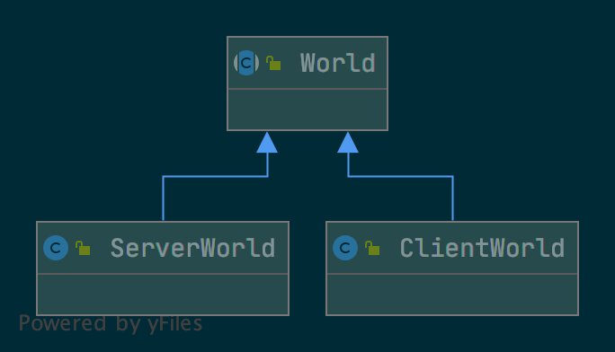
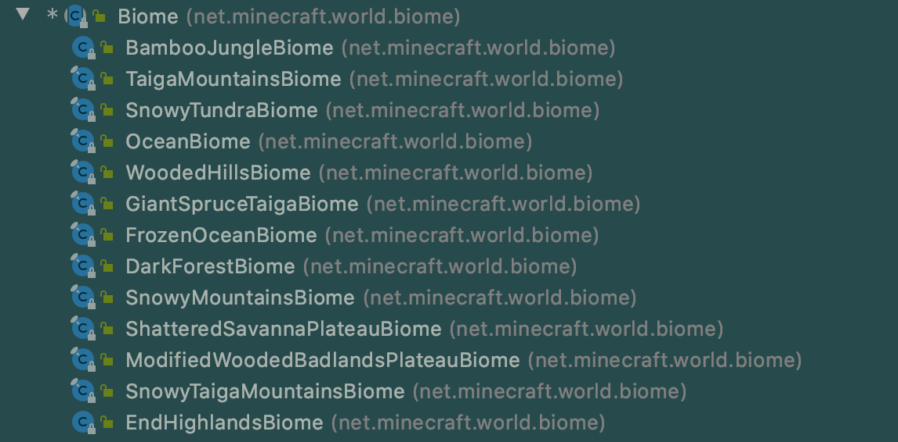

# 世界生成

在这节中，我们将要来学习Minecraft中非常迷人的一部分：「世界生成」。Minecraft的世界生成可以说是Minecraft 能如此的受欢迎的一个基础所在。而我们接下来就要学习如何一步一步的自定义我们的世界生成。

在1.13之后Minecraft重写了世界生成相关的代码，世界生成和修改变得容易的很多，在开始之前我们得要明确一些类和它相对应的作用。

首先一个类是`World`，其实和世界生成直接相关的是它的子类`ServerWorld`（因为世界生成的计算都是服务端进行的）。这个是代表的你的存档游戏运行环境，在`World`类下面有个`WorldInfo worldInfo`的变量，里面存放了类似于当前的存档`WorldType`（超平坦、巨大化、普通）等信息。

下属于`World`类的是`Dimension`（维度），在一个世界里可以有很多个维度，比如在我们正常游戏时，就会接触到三个`Dimension`：`EndDimension`、`NetherDimension`和`OverworldDimension`，也就是末地、下届和主世界三个维度。

在`Dimension`之下就是是`ChunkGenerator`，正如它的名字所暗示的那样，这个类和其子类的作用就是在Minecraft中产生一个接一个的`Chunk`区块，而Minecraft这连绵不断的地形生成也正是它产生的。在正常游戏时末地、下届和主世界的区块生成分别对应着`EndChunkGenerator`、`NetherChunkGenerator`和`OverworldChunkGenerator`。如果你查看它们的继承关系的话就会发现它们都继承了`NoiseChunkGenerator`这个类就是Minecraft利用柏林噪音实现了地形生成算法的地方。

接下来在`ChunkGenerator`之下的就是就是`Biome` （生态群系）。你在游戏中能见到的所有生态群系都是这个类的子类，这个类规定了生态群系的种种特征。之所以`Biome`是在`ChunkGenerator`之下，是因为一个`Chunk`中可以同时存在好几个生态群系（当`Chunk`在生态群系的边界时）。

可以看到在同一个区块里可以同时存在多个生物群系。

以下是继承图的节选。

最后在`Biome`之下的是生物群系的四种属性`Feature`、`Carver`、`Structure`以及`Spawn`。他们的代表的东西如下图:

| 特性        | 作用                                                     |
| ----------- | -------------------------------------------------------- |
| `Feature`   | 地下的岩浆湖、矿物、废弃矿洞、地面上的花等               |
| `Carver`    | 地下的洞穴等                                             |
| `Structure` | 村庄、林地府邸等（注：`Structure`其实是`Feature`的子类） |
| `Spawn`     | 在这个生物群系下会生成的生物                             |

---

在你阅读世界生成相关的代码时可能会看见类似于`NetherGenSettings`名字末尾带个`Settings`的类，不用太害怕这种类，他们的作用只是为了配置一些属性。一个种是类似于`OverworldBiomeProvider`这样名字后面带一个`Provider`的类，这其实是一种叫做`Provider model(提供者模型)`的设计模式，当你看到这种类，只需要知道这些类最后会产生出他们去掉名字中`Provider`部分的类。