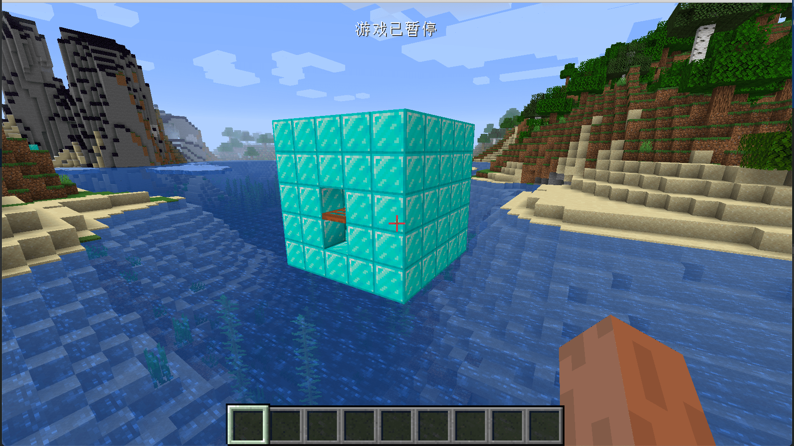

# 结构生成

在这节中我们将来学习如何创建一个自定义的结构，并且在世界中自动生成它。我们将以钻石小屋作为例子。

首先既然我们的要自定义的是一个结构，那么也就需要创建一个结构，内容如下:

```java
public class DiamondHouseStructure extends Structure<NoFeatureConfig> {
    public DiamondHouseStructure(Function<Dynamic<?>, ? extends NoFeatureConfig> configFactoryIn) {
        super(configFactoryIn);
    }

    @Override
    public boolean canBeGenerated(BiomeManager biomeManagerIn, ChunkGenerator<?> generatorIn, Random randIn, int chunkX, int chunkZ, Biome biomeIn) {
        if (randIn.nextFloat() < 0.03) {
            return true;
        }
        return false;
    }

    @Override
    public IStartFactory getStartFactory() {
        return (structure, chunkPosX, chunkPosZ, bounds, references, seed) -> {
            return new Start(structure, chunkPosX, chunkPosZ, bounds, references, seed);
        };
    }

    @Override
    public String getStructureName() {
        return "neutrino_house";
    }

    @Override
    public int getSize() {
        return 3;
    }

    public static class Start extends StructureStart {

        public Start(Structure<?> structure, int chunkPosX, int chunkPosZ, MutableBoundingBox bounds, int references, long seed) {
            super(structure, chunkPosX, chunkPosZ, bounds, references, seed);
        }

        @Override
        public void init(ChunkGenerator<?> generator, TemplateManager templateManagerIn, int chunkX, int chunkZ, Biome biomeIn) {
            DiamondHouseStructurePiece diamondHouseStructurePiece = new DiamondHouseStructurePiece(this.rand, chunkX * 16, chunkZ * 16);
            this.components.add(diamondHouseStructurePiece);
            this.recalculateStructureSize();
        }
    }
}
```

首先可以看见我们的`DiamondHouseStructure`继承了`Structure<NoFeatureConfig>`，这里的`NoFeatureConfig`表明了我们的结构是不需要配置文件的。

其中`canBeGenerated`代表了结构会生成的可能性，这里我们设置为3%。`getStructureName`代表了结构的名字，`getSize`具体作用不明，大部分原版结构值都为3。

接下来是`Start`类。

```java
public static class Start extends StructureStart {

  public Start(Structure<?> structure, int chunkPosX, int chunkPosZ, MutableBoundingBox bounds, int references, long seed) {
    super(structure, chunkPosX, chunkPosZ, bounds, references, seed);
  }

  @Override
  public void init(ChunkGenerator<?> generator, TemplateManager templateManagerIn, int chunkX, int chunkZ, Biome biomeIn) {
    DiamondHouseStructurePiece diamondHouseStructurePiece = new DiamondHouseStructurePiece(this.rand, chunkX * 16, chunkZ * 16);
    this.components.add(diamondHouseStructurePiece);
    this.recalculateStructureSize();
  }
} 
```

这个类的`init`方法就是你添加`StructurePiece`（结构组件）的地方，所谓的`StructurePiece`就是一个结构的组成部分，一个村庄可以有不同的房子组成，每一个房子都是`村庄`这个结构的`StructurePiece`。当然我们在`getStartFactory`这个方法里，返回了构造这个类的方法。

接下来我们来看`init`方法。

在`init`方法里最要的是这两句话:

```java
DiamondHouseStructurePiece diamondHouseStructurePiece = new DiamondHouseStructurePiece(this.rand, chunkX * 16, chunkZ * 16);
this.components.add(diamondHouseStructurePiece);
```

首先我们创建了一个自定义的`StructurePiece`，然后将它添加到了`Structure`自带的`components`中，也就是给我们的结构添加了一个结构组件。

最后的`recalculateStructureSize`，用于重新计算结构的边界大小，需要填写。

接下来我们来看看`DiamondHouseStructurePiece`具体的内容。

```java
public class DiamondHouseStructurePiece extends ScatteredStructurePiece {
    private static final DiamondHouseStructurePiece.Selector BUILD_STONE_SELECTOR = new DiamondHouseStructurePiece.Selector();

    protected DiamondHouseStructurePiece(Random random, int x, int z) {
        super(CommonEventHandler.diamondHouseStructurePieceType, random, x, 64, z, 12, 10, 15);
    }

    protected DiamondHouseStructurePiece(TemplateManager templateManager, CompoundNBT nbt) {
        super(CommonEventHandler.diamondHouseStructurePieceType, nbt);
    }

    @Override
    public boolean create(IWorld worldIn, ChunkGenerator<?> chunkGeneratorIn, Random randomIn, MutableBoundingBox mutableBoundingBoxIn, ChunkPos chunkPosIn) {
        this.fillWithRandomizedBlocks(worldIn, mutableBoundingBoxIn, 0, 0, 0, 4, 4, 4, false, randomIn, BUILD_STONE_SELECTOR);
        this.fillWithAir(worldIn, mutableBoundingBoxIn, 1, 1, 1, 3, 3, 3);
        this.setBlockState(worldIn, Blocks.ACACIA_TRAPDOOR.getDefaultState().rotate(Rotation.CLOCKWISE_90), 2, 2, 0, mutableBoundingBoxIn);
        this.fillWithAir(worldIn, mutableBoundingBoxIn, 2, 1, 0, 2, 1, 0);
        return true;
    }

    static class Selector extends StructurePiece.BlockSelector {
        private Selector() {
        }

        public void selectBlocks(Random rand, int x, int y, int z, boolean wall) {
            this.blockstate = Blocks.DIAMOND_BLOCK.getDefaultState();
        }
    }
}
```

可以看到`DiamondHouseStructurePiece`继承了`ScatteredStructurePiece`类，这个类是`StructurePiece`子类，`StructurePiece`还有其他的子类，大家可以按需选用，比如其中的`TemplateStructurePiece`就可以让你从指定的NBT文件中加载模型。

我们回到我们的类，可以看到在构造方法里有一个`CommonEventHandler.diamondHouseStructurePieceType`，这个是我们之后需要注册的内容。

这里面最为重要的就是`create`，这里也是你「画」建筑的地方。`StructurePiece`提供了一系列的方法，来填充和绘制方块，大家自己看这些函数的签名就能知道其作用了。

这里还有一个内部类是`Selector` 它继承了`StructurePiece.BlockSelector`，它的让你可以随机的设置方块的种类的方块的状态，比如原版的丛林神庙，它的墙面的方块种类就是不唯一的，你可以通过这个类的`selectBlocks`实现同样的效果。

到此，我们的结构算是创建好了，接下来注册它

首先我们注册`Structure`。

```java
public class FeatureRegistry {
    public static final DeferredRegister<Feature<?>> FEATURES = new DeferredRegister<>(ForgeRegistries.FEATURES, "neutrino");
    public static RegistryObject<Structure<NoFeatureConfig>> obsidianBlock = FEATURES.register("house", () -> {
        return new DiamondHouseStructure(Dynamic -> {
            return NoFeatureConfig.deserialize(Dynamic);
        });
    });
}
```

这里和物品、方块的注册没什么太大的区别，值得注意的是，因为`Structure`其实只是一种特殊的`Feature`，所以我们填的是`DeferredRegister<Feature<?>>`。

然后又因为我们的`DiamondHouseStructure`是没有配置文件的，所以传入了一个`NoFeatureConfig.deserialize`。

同样的，别忘了在你的Mod主类中将`FEATURES`注册到Mod总线中。

接下来我们看`StructurePiece`的注册。

```java
@Mod.EventBusSubscriber(bus = Mod.EventBusSubscriber.Bus.MOD)
public class CommonEventHandler {
    public static IStructurePieceType diamondHouseStructurePieceType;
    @SubscribeEvent
    public static void onCommonSetup(FMLCommonSetupEvent event) {
        diamondHouseStructurePieceType = Registry.register(Registry.STRUCTURE_PIECE, "house", (templateManager, nbt) -> {
            return new DiamondHouseStructurePiece(templateManager, nbt);
        });
        for (Biome biome : ForgeRegistries.BIOMES) {
            biome.addStructure(FeatureRegistry.obsidianBlock.get().withConfiguration(IFeatureConfig.NO_FEATURE_CONFIG));
            biome.addFeature(GenerationStage.Decoration.SURFACE_STRUCTURES, FeatureRegistry.obsidianBlock.get().withConfiguration(IFeatureConfig.NO_FEATURE_CONFIG).withPlacement(Placement.NOPE.configure(IPlacementConfig.NO_PLACEMENT_CONFIG)));
        }
    }
}
```

这里也很简单，首先我们在外边创建一个一个变量，注意类型是`IStructurePieceType`，然后在`FMLCommonSetupEvent`事件中调用`Registry.register`方法注册，因为我们要注册的是`StructurePiece`，所以第一个参数填入的是`Registry.STRUCTURE_PIECE`。

然后就和矿物生成的步骤类似添加结构。但是这里请注意，我们需要调用两个方法首先我们得调用`addStructure`添加结构，然后调用`addFeature`让这个结构可以生成，因为我们的`Structure`是`NoFeatureConfig`的，所以`withConfiguration`和`withPlacement`都填入相对应的`NoFeatureConfig`就行。

到此，结构已经注册和添加完毕，打开游戏，新建一个存档看看，你应该就能发现世界中自然生成的钻石小屋了。



[源代码](https://github.com/FledgeXu/NeutrinoSourceCode/tree/master/src/main/java/com/tutorial/neutrino/strcutre)

## 编程小课堂

当你不知道应该如何使用一个类时，可以去Github上搜索看看如何使用，一般情况下都能找到别人使用的例子。